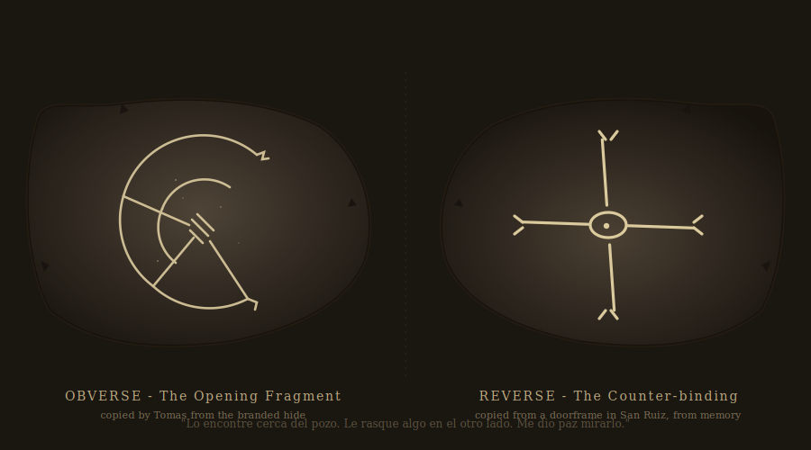

# CHAPTER 1 — EL CONTRATO → EL POZO

### *The Contract → The Pit*

**Arc Goal**: Sell the false premise → reveal unsettling pattern → first supernatural event
**Emotional Arc**: Curiosity → Unease → Dread
**Key Seed**: Geometry. Everything connects. Nothing is random.

---

## THE WORLD

**Setting**: Argentine Pampas, Province of Buenos Aires, circa 1821.
The land here is flat to the horizon in every direction — a sea of dry grass and dust, broken only by a line of quebracho trees to the west and a water tower rusting on the ridge. It is the height of summer. The air shimmers. Flies are everywhere.

Estancia La Esperanza occupies roughly 4,000 hectares. It was prosperous once. The adobe main house is large, the corrals solid, the workers' quarters still occupied. But there is a stillness over the south pasture that wasn't there last season, and the cattle that graze there have stopped giving good milk.

**Tone cues**: Heat, dust, isolation. The Pampas swallows sound. Voices carry differently here — too far sometimes, not far enough at others. The horizon is always the same distance away no matter how far you walk.

---

## SCENE 1 — THE ESTANCIA (THE HIRE)

### Setting Description

> *The estancia house is low and long, whitewashed walls cracked by seasons of sun and cold. A covered corridor runs the length of the front — a zagúan — with dried herbs hanging in bundles and a cattle skull mounted above the doorframe. The courtyard inside smells of cowhide and leather dressing. A ceiling fan turns slowly overhead, moved by no visible mechanism. Don Eusebio receives you standing, not seated — a man accustomed to giving the impression of work.*

Practical details for the Keeper:

- The zagúan skull has faint scratched marks on it — barely visible. Players who examine it closely and succeed on **Spot Hidden** will notice they resemble the marks on the hide they are shown later. Do not draw attention to this.
- There is a locked study door visible from the main room. Tomás instinctively glances at it when Don Eusebio mentions the "tribal raids." The door leads to Don Eusebio's private study (not accessible this chapter).
- A young servant girl, **Concepción** (13, quiet, large eyes), brings water without being asked and leaves without meeting anyone's gaze. She is the orphaned daughter of a house servant who died of fever two years ago; Don Eusebio has kept her on. She sleeps in a small room behind the kitchen.
  - **Important** (Keeper): Concepción has been walking toward the south pasture at night for three weeks. Don Eusebio has caught her twice and brought her back. He has not told anyone. She has a partial alignment to the geometry — subtler than Silvio's, because she is younger and the entity's touch has been lighter — but she can feel where the pit is, the way a bird feels which way is south. She will play a critical role at the end of this chapter.
  - **Tells a perceptive investigator** (Spot Hidden, or any character paying attention to her): her feet are dusty and slightly scratched despite it being morning. Her eyes track to the southern wall of the sala when Don Eusebio mentions the south pasture. She does not flinch at the mention of the dead cattle. She has seen worse in her sleep.
  - **The hum (always offered, no roll required)**: As she pours water into the second investigator's glass, she hums under her breath — five notes, a low repeating pattern, no melody an investigator will recognize. She does not seem aware she is doing it. It stops when Don Eusebio enters the room and resumes when he leaves. *No mechanical effect.* **Note this fact to the players plainly and let them choose to remember it or not.** It will pay off in C7. (If they ignore it, the C7 payoff is darker; if they notice it, the C7 payoff is heavier. Either is correct.)

---

### NPC: DON EUSEBIO VALDEZ

**Role**: The client. The source of the false premise. The true culprit.

**Appearance**: 62 years old. Silver-haired, tanned the color of old leather. A thick mustache, yellow-white. His hands are the most notable feature — large, calloused, but with ink stains on the right index finger that he doesn't explain. He dresses well: white linen shirt, bombachas de campo, polished riding boots. He smells faintly of tobacco and something else — a dry mineral smell, like struck flint.

**Voice**: Deep, deliberate, accustomed to being believed. He does not raise it. He pauses before important words as if selecting them from a tray.

**Mannerisms**:

- Maintains eye contact slightly too long when lying.
- Taps his right index finger twice on the table when he wants to change the subject.
- Refers to the indigenous people as *"esa gente"* (those people) — never by tribal name.
- Keeps glancing east, toward the south pasture, when the topic nears what happened there.

**The Lie He Tells**:
Don Eusebio presents the situation as a straightforward job: tribal raids — Tehuelche or Mapuche, he is vague — have been killing and mutilating his cattle. He wants investigators to find evidence, document the damage, and assist the rural police (*policía de campaña*) in confronting the responsible parties. He will pay well. He acts aggrieved and practical simultaneously, as a man who has seen trouble before and knows how to handle it.

**The Truth He Hides**:
Don Eusebio found a handwritten manuscript three years ago, tucked inside a wall cavity during house renovations — a colonial-era text attributed to a Jesuit priest who had gone mad in the region. The manuscript described a ritual of "opening" — a way to make the land *fértil* again, to pull abundance from the earth itself. Don Eusebio, a practical man who nonetheless holds deep superstitions, followed the instructions partially. He did not complete the closing sequences. He did not understand that the ritual was not a blessing — it was a summons. The geometry he drew in the south pasture opened something. The cattle deaths are not raids. They are feeding. And he knows it. He has known it since the third week, when he heard the sound from below the pit.

**Motivation**: Cover his tracks. Use the investigators as a buffer between himself and whatever is out there. If they discover the tribal counter-rituals (Chapters 2–3), he hopes they will stop them — which is the worst possible outcome for everyone.

**Secret**: He performed the ritual himself. The manuscript is in the locked study. The ink stains are from the ritual diagrams he keeps recopying.

---

**Possible Questions & Answers — Don Eusebio**

*"How many cattle have been killed?"*

> "Thirty-one head over six weeks. All in the south pasture. I moved the rest north — they won't go back." *(True.)*

*"Have you reported this to the authorities?"*

> "The rural police came, looked around, told me to keep records. Useless. They won't go near the south pasture after dark." *(True. He doesn't mention why they won't go near it.)*

*"What makes you think it's the tribes?"*

> "Tracks. Footprints around the dead animals. And this." *(He produces the branded hide — see below.)* "Their markings. I've seen similar on their blankets." *(Partially false. The footprints are real. The hide attribution is fabricated.)*

*"Can we speak with your workers?"*

> "Of course. Though they're simple folk — they'll give you superstitions, not facts." *(He says this with slight contempt. He is hoping they won't.)*

*"What's in the locked room?"*

> "My study. Personal papers. Nothing relevant to your work." *(He does not offer to open it. If pressed: he says he will retrieve anything specific they need — stall tactic.)*

*"Have you heard anything unusual at night?"*

> *(A pause. A single tap of the finger.)* "The cattle make noise when frightened. That's all." *(Lie.)*

*"Has anyone been hurt? Workers?"*

> "No. The animals don't come near the house." *(True, and he says it with quiet relief that makes it briefly, horribly sincere.)*

---

**The Evidence He Provides**:

1. **The Branded Hide**: A patch of cowhide, roughly 40cm × 30cm, cut cleanly from a dead animal. On the inner surface, scratched with what appears to be a stick or bone tool, is a symbol — a series of intersecting lines forming an angular, roughly circular pattern. Don Eusebio says it resembles tribal decorative work. In fact, it is a fragment of the opening diagram from his manuscript.

> **Visual handout**: see `assets/cow-hide-geometry.svg`. Print at A3 portrait. The brand is *not* the small registered ranch-mark in the upper-left corner (that one reads *EV - 1820*, Eusebio Valdez, legitimate); the brand is the large central scar with charred halo. The southern arc of the diagram is *missing* on this hide — it was burned onto a different animal. This is by design; Don Eusebio distributed the geometry across his herd so no single hide carries the whole shape. Place this on the table when he produces the hide; let the players notice the legitimate brand alongside the wrong one.

2. **The Directions**: He gives rough bearings to the south pasture and mentions that tracks have been found "heading toward the tribal lands" to the east. He is directing them away from the pit.

---

### NPC: TOMÁS ARREDONDO

**Role**: The foreman. Afraid. A partial truth-teller.

**Appearance**: 43, mestizo, stocky. Weather-cracked lips, dark eyes that shift. He wears a faded red chiripa and carries a facón on his belt that he has not drawn in years. His right hand trembles slightly — not all the time, only when he is thinking about the south pasture.

**Voice**: Quiet, fast when nervous. He speaks in runs of words and then stops abruptly, as if hearing something behind his own sentences.

**Mannerisms**:

- Crosses himself when he doesn't think anyone is watching. He has done it so often it is nearly automatic.
- Spits on the ground before entering the south pasture area. An old Pampas ward.
- Will not use the phrase *"luz mala"* out loud. He calls it *"ella"* — "she" — or simply goes silent.

**Motivation**: Protect himself and his family (a wife and two children in the workers' quarters). He is loyal to Don Eusebio out of economic necessity, not affection. If investigators make him feel safe — genuinely safe — he will tell them more. If they push too hard, he shuts down completely.

**What He Knows**:

- The tracks don't behave right. They start and stop. They loop.
- He saw La Luz Mala three weeks ago, at a distance. He ran.
- The pit has been there longer than the cattle deaths. He found it a year ago, assumed it was old. After the first killing, he didn't go back.
- Don Eusebio made him stay away from his study for two weeks last spring. He heard scratching sounds at night he thought were rats.

---

**Possible Questions & Answers — Tomás**

*"How long have you worked here?"*

> "Eleven years. Since before the south section was cleared." *(He glances toward Don Eusebio, then away.)*

*"Have you seen the tracks yourself?"*

> "Yes. They're not right." *(Stops. You wait.)* "The shape is right. Foot size, the way they press — human weight. But they stop. In the middle of open ground. No holes, no wind. They just stop." *(He looks at the ground.)*

*"What do you think is doing it?"*

> "I think…" *(Long pause.)* "I think something is very wrong with the south pasture and I think we should not go there after dark." *(He does not answer the question.)*

*"Have you seen anything unusual at night?"*

> *(He is still for a moment.)* "I don't go out at night." *(He meets your eyes for the first time. He means this absolutely.)*

*"Do you believe the tribes are responsible?"*

> *(He looks at his hands.)* "I don't know who told Don Eusebio that." *(He won't say more on it directly. Successful Psychology roll reveals this is the closest he will come to contradicting his employer.)*

*"What's in the south pasture?"*

> "A low place. A depression. Don Eusebio says it's a dry drainage. I found it before the cattle started dying. It wasn't… it wasn't always like that." *(If pressed: he shakes his head. "I don't go near it.")*

---

**Roleplaying Hook — Tomás**:
If investigators treat Tomás with genuine respect — as a skilled worker whose knowledge matters, not a servant — he will, before they leave, press a small object into one of their hands. It is a *vizcachera* stone, a flat river rock. On it he has scratched the same rough angular symbol from the hide. *"Lo encontré cerca del pozo. Meses atrás. Antes de que empezara todo."* — *"I found this near the pit. Months ago. Before everything started."* He doesn't explain further at first.

If the investigator turns the stone over, Tomás says, more quietly:

> *"Le rasqué algo en el otro lado. No sé qué es. Lo vi en una puerta vieja en San Ruiz cuando pasaba por ahí. Me dio paz mirarlo. Lo copié de memoria por si servía."* — *"I scratched something on the other side. I don't know what it is. I saw it on an old doorway in San Ruiz when I passed through. Looking at it gave me peace. I copied it from memory in case it would help."*

The reverse of the stone bears a rough version of the **counter-binding** — Rosa's silver-ornament shape (`assets/binding-symbol.svg`), drawn from Tomás's memory of a doorframe in San Ruiz. He does not know what either side does. He does not know they are *opposed*. **Marked players (post-C3) returning to this stone will see the relationship the moment they look — the obverse opens, the reverse closes; one stone, two sides.** Players who notice it now will reach C2 already half-way to the chapel's revelation. **Spot Hidden** to find the reverse markings if the player does not turn the stone over on their own; he leaves it implicit.

He walks away quickly.

> **Visual handout**: see `assets/tomas-stone.svg`. The two faces of the stone, side by side. Print at A4 landscape. The off-axis lines on the reverse and the irregular central lens are deliberate — Tomás drew it from memory; Rosa's silver ornament (`assets/binding-symbol.svg`) is the *clean* version. Show this stone next to Rosa's ornament in C2 to land the visual rhyme.

---

## SCENE 2 — THE CATTLE FIELD

### Setting Description

> *The south pasture is different from the rest of the land. You feel it before you see it — a subtle wrongness in the air, a thickness. The grass here grows in rings, dark at the center, pale at the edge. The bodies are laid out across two hundred meters of field: thirty-one cattle, all dead at least a week, none touched by scavengers. The flies are present — thick clouds of them — but they don't land. They orbit.*
>
> *The wounds are precise. Long incisions, cleanly made, placed at specific points on each animal — the throat, the left flank, the base of the skull. No tearing. No panic wounds. No sign of struggle in the trampled earth around them. They simply lay down and were opened.*
>
> *The smell is not decay. It is metallic. Sharp. Like copper coins held too long in a clenched fist.*

**Keeper Notes**:

- The bodies are arranged — though not obviously. A **Spot Hidden (Hard)** or any character with a scientific background (Natural History, Medicine, Biology) who examines multiple carcasses and succeeds on **INT roll** realizes: the placement of bodies maps a radial pattern. Like spokes on a wheel. The hub is the pit, to the south.
- The precision of the cuts requires a sharp, straight-edged implement. No tribal knife makes cuts this clean. A **Medicine or First Aid** roll confirms: this is surgical. The cutting was done with perfect pressure control. Nothing panicked. Not even the animal.
- **No feeding**: Something killed 31 animals and consumed nothing. No meat was taken. This is not predation.

**SAN Check**: 0/1 — the sight of the bodies in their unnatural stillness, the orbiting flies.

**Clues available**:

| Clue                   | Skill to Find            | What It Reveals                                                                                                    |
| ---------------------- | ------------------------ | ------------------------------------------------------------------------------------------------------------------ |
| Radial body placement  | Spot Hidden (Hard) / INT | Bodies form a wheel pattern — hub is the pit                                                                       |
| Surgical cut precision | Medicine / First Aid     | Not an animal. Not a blade. Something else.                                                                        |
| Metallic smell         | Smell / Chemistry        | Not organic decay. Mineral. Like ozone or charged metal.                                                           |
| No scavenger activity  | Natural History          | Birds, foxes, even insects avoid the carcasses. Unnatural.                                                         |
| Grass ring patterns    | Botany / Natural History | Growth rings consistent with repeated energy/heat discharge — not recent. This has been happening for a long time. |

---

## SCENE 3 — THE TRACKS → THE PIT

### Setting Description

> *The tracks begin at the northern edge of the pasture. Human-sized, bare feet, the pressure consistent with a person of medium weight. They move south in a straight line for forty meters — then stop. Not disappear into mud or stone. Stop. The impressions end as if the person stepped off the surface of the earth.*
>
> *Further south, they begin again. A different set — wider gait, heavier pressure. These loop: a broad arc, then a tighter spiral, then nothing. There is a third set that simply walks, heel-to-toe, perfectly spaced, in a circle forty meters across. The circle is centered on a slight depression in the ground.*

**Keeper Notes**:

- Three sets of tracks, no physical explanation for how they begin or end mid-field. The looping and circular sets are *not human*. Something was tracing the ritual geometry on the surface. A **Tracking** roll will find all three sets but cannot explain the breaks. A **Hard Tracking** roll confirms: the weight distribution in the circular set is wrong. Too even. No shift in gait for a living body.
- The depression is the pit. It is visible once they reach the end of the radial tracks — a gentle bowl in the earth, perhaps 10 meters across, the grass within it brown and dead.

### Tomás's prayer — *Por la tierra que fue buena*

Before the investigators step down into the pit, Tomás stops at its rim. He removes his hat. He looks at the dead grass within the bowl. He says, quietly, half to himself, half to whoever wants to hear:

> *"Por la tierra que fue buena, y por la tierra que se cansó. Que la tierra descanse, y que nosotros pasemos ligeros."*  — *"For the land that was good, and for the land that grew tired. May the land rest, and may we pass lightly."*

He puts his hat back on. He does not step into the pit himself. *(He will not enter it tonight; he will not enter it tomorrow; he will not enter it until C8, and only then because the closing requires it.)*

> **Atmospheric runner — the prayers (4)**: This is the campaign's first naming of *Por la tierra que fue buena*, a folk Catholic prayer with a pre-Christian root that gauchos say over land that has gone wrong. **Name the prayer aloud at the table.** The players will remember it. It will be said again in C8 by Don Eusebio in the outer ring, and in the C12 Hide ending by Padre Albarrán on the dock before the *Hic manet*. See `flowmap.md`, *The Three Named Prayers*.

---

## SCENE 4 — THE BURIAL PIT

### Setting Description

> *The depression is shallower than you expected — perhaps a meter at its deepest. The soil at the bottom is dark, almost black, despite the dry season. The smell here is different: older. Beneath the copper sharpness is something else, something that sits at the back of the throat like wet stone and cold water.*
>
> *The cattle carcasses in the pit are layered. Older below, fresher above. Six layers by rough count — meaning this began months before the obvious kills in the field. The blood from each layer has run down in lines that trace across the soil in perfectly repeating arcs. It is not random. The lines intersect. They form a shape.*
>
> *The wind drops.*
>
> *The flies go silent.*
>
> *And then — at the bottom of the chest, like a heartbeat that is not yours — a low vibration. Not loud. Not exactly a sound at all. The kind of vibration a chapel bell makes after the strike, when the air still remembers.*

> **Atmospheric runner — the low vibration (3c)**: This is the first appearance of the campaign's continuous-presence sound (see `flowmap.md`, *Atmospheric Runners*). Any investigator who *names* it aloud at the table — *"do you hear that?"*, *"there's a vibration"*, *"feel that in your sternum?"* — gets **one banked Sanity point** that can be cashed against any later Sanity loss in the chapter. Awareness is protective. Do not announce this rule to the players; let the first PC who notices be quietly rewarded after the chapter, and let the table figure out the pattern over the next two chapters.

**Keeper Notes**:

- The blood pattern on the pit floor is the lower half of the same angular-circular symbol from the branded hide and Tomás's stone. Players with the hide or stone and a **Spot Hidden** check can match the fragments. They do not yet have the full image.
- The layering of carcasses confirms: Don Eusebio has been conducting this ritual for roughly eight months. Each layer represents one "feeding event." The pace has accelerated.
- If investigators dig: beneath the bottom carcass layer, they find the *original* ritual diagram scratched into the raw earth. Faded, but recognizable. Someone drew this deliberately. Recently enough that the soil around the scratches is not fully settled.

**SAN Check**: 0/1 — the layered carcasses, the sense of deliberate arrangement.

---

## SCENE 5 — LA LUZ MALA

### The Entity: La Luz Mala

**What it is (for the Keeper only)**: La Luz Mala — *The Bad Light* — is Argentine rural folklore: a flickering flame seen at night over open ground, often near places where unbaptized children or sinners are buried. In local belief, it is the soul of the unblessed, or a sign of buried gold, or simply an ill omen.

In your game, La Luz Mala is not a ghost. It is a *sensor* — a probe or pseudopod of the entity that Don Eusebio's ritual has drawn closer to this reality. It does not perceive in any human sense. It is drawn to the ritual geometry, to breath (CO₂), to movement that disrupts the geometry's integrity. It is not attacking. It is *measuring*.

**Appearance**: A pale yellowish-white light, roughly the size of a lantern flame, hovering 30–50cm above the ground. It moves in arcs. It never travels in a straight line. When it changes direction, it does so at precise angles — never curved turns. Up close, if a player holds very still: the light has no center. It is the same brightness all the way through. It casts no shadow.

**Behavior Sequence**:

1. **First sighting**: Appears at the northern rim of the pit as the investigators examine the blood pattern. Distance: approximately 30 meters.
2. **Approach**: Moves in a wide arc around the pit's perimeter — not toward the investigators directly. As if traveling a known path.
3. **Reaction to breath/movement**: If an investigator breathes heavily or moves sharply (combat stance, running), the light *stops*. Orients. The angular movement becomes smaller, more precise. It is noting something.
4. **Reaction to the branded hide/Tomás's stone**: If either is exposed (held up, placed on the ground), the light pauses for 3–4 seconds and then moves toward it in a straight line — the only straight-line movement it makes all encounter. It stops one meter from the object. Then resumes its arc.
5. **Attack immunity**: Firearms, thrown objects, lanterns — anything that strikes the light passes through it. There is no impact. It does not react to violence.
6. **The Trigger — Threatening the Geometry**: If investigators attempt to attack the light, disturb the blood arcs in the pit, move the carcasses, or step across the geometric lines — the La Luz Mala stops its circuit and pulses once, brighter. This is the activation signal. See **The Awakening** below.
7. **Departure**: If the encounter resolves without triggering The Awakening — or once the geometry is broken and the reanimated cattle drop — the light traces a final arc noticeably *larger* than the others, completing the geometric shape of the blood pattern in the pit. Then it descends into the earth at the exact center and is gone.

**SAN Check**: 0/1D4 (the initial sighting and sustained presence)
**CON Check**: on a failure, the investigator feels a deep nausea — not the stomach variety, but a bone-deep wrongness, as if the inner ear is receiving information it cannot process.

---

### The Awakening — Concepción, the Reanimated Cattle, and the Fly Swarm

**THE INTERVENTION (new, primary trigger)**:

This scene is designed to activate whether or not investigators have figured out what "breaking the geometry" means. If they are lost, confused, or passive at the pit, the situation will *come to them* through Concepción — and teach them the lesson in blood and hoofbeats.

**What happens**: As the Luz Mala is still performing its arcs (Step 2–4 of the Behavior Sequence above), two figures appear at the northern edge of the cattle field. One small, one large. They are coming fast. **Spot Hidden** to identify at distance: **Concepción**, barefoot, in her work dress, walking quickly and in a straight line toward the pit. Behind her, running, is **Tomás** — shouting her name, losing distance. She is not running from him. She is walking *to the pit*.

**Read aloud**:

> *You hear Tomás before you see him. His voice carries in that wrong way voices carry in the pampa — too far and not far enough at once. "¡Concepción! ¡Concepción, volvé! ¡Volvé acá, por Dios!" He is running. His hat is gone. He is holding his facón in one hand — not as a threat, as if he forgot he was holding it.*
>
> *The girl walking ahead of him doesn't turn around. She doesn't appear to hear him. She walks straight toward the pit's edge and stops — looks down into it with the expression of someone confirming something she already knew.*
>
> *Then she steps in.*

**SAN Check**: 0/1 — the sight of a 13-year-old walking calmly into a ritual pit full of dead cattle.

---

**What Concepción Does**:

She descends the gentle slope of the pit. She does not slip or hesitate. At the bottom, she kneels on the compacted earth where the blood arcs are drawn — and begins to scrape at them. With her fingernails. With a stone she picks up. Methodically. Not frantic, not in a trance — *working*. Like a child who has been given a task and is determined to finish it.

She is erasing the geometry.

**Why she's doing it**: The entity's light touch on her — the nights she has walked south — gave her something. Not the Wrong Returned's full alignment, but a thinner version: she knows, at a wordless level, that the arcs in the pit are doing something, and that scraping them breaks whatever that is. She cannot articulate it. She does not know what will happen if she succeeds. She is just working.

**What she says, if asked** (she will respond — she is not catatonic, just focused):

> *"Está muy grande ahí abajo. Hay que apagarlo un poco."* — *"It's very big down there. It has to be turned down a little."*

**Keeper note**: This line is a direct foreshadowing of her C7 line (*"It's very big down there, Patrón. Don't be afraid."*). If the campaign reaches C7, Don Eusebio's confession about her will land with double weight.

---

**Tomás's Panic**:

Tomás arrives at the pit's edge seconds after Concepción descends. He is gasping. He is terrified. He does not go into the pit — every instinct in him says not to — and he is equally unable to leave the girl in it alone. He grips the edge and shouts at her. He looks at the investigators with an expression that is pure desperation.

> *"La encontré caminando para acá. La traje de vuelta dos veces esta semana. Esta vez no pude pararla. No puedo entrar ahí — Dios me perdone, no puedo entrar ahí — ¡sáquenla ustedes, por favor, sáquenla!"*
>
> *"I found her walking here. I brought her back twice this week. This time I couldn't stop her. I can't go in there — God forgive me, I can't go in there — YOU get her out, please, get her out!"*

He will not descend into the pit himself. His hand shakes so badly he drops the facón. He is the foreman of this estancia, he has faced pumas with a whip, but he will not go down into that pit. He stays at the edge. His shame at this will surface later (C2 onward).

---

**THE TRIGGER FIRES**:

The moment Concepción scrapes the first full arc apart — roughly 20 seconds after she begins — the entity responds.

**Read aloud**:

> *The Luz Mala stops mid-arc. It holds absolutely still for two full seconds. Then it pulses once — so bright that for an instant you can see Concepción's figure in the pit, her hands dark with dust and blood from scraping, still working.*
>
> *Then the light contracts to a point and shoots downward into the earth.*
>
> *The flies — which had been orbiting at a distance — collapse inward all at once, into a dense black mass near the pit's rim. Tomás shrieks and stumbles backward. And two of the cattle in the field — the closest ones, the ones between you and the pit's northern edge — begin to move.*
>
> *Not slowly. Not stumbling. They rise with the mechanical efficiency of something that has never been stiff, as if they simply forgot to be dead for a moment and are now correcting the oversight. Their wounds are still open. Their eyes are white and dry. They orient — not toward you. Toward the pit. Toward the girl in it.*

**SAN Check**: 1/1D6 (the reanimation — and the realization of what they are targeting)

---

**What This Means for the Encounter**:

Concepción is the target. The reanimated cattle are not defending the geometry in the abstract — they are converging on the person actively erasing it. She has maybe 60 seconds before the first one reaches the pit's edge and descends. Tomás is screaming. The players must act.

**This is now a rescue, not a confrontation**. The players' options have changed:

1. **Pull Concepción out** (STR check; she will not resist — if gripped firmly and pulled, she goes limp and lets herself be carried. But she will try to return if released.)
2. **Protect Concepción while she finishes** (Defending the pit's edge from the cattle while she keeps scraping. This is the lesson the scene is designed to teach: if she finishes, the encounter ends.)
3. **Join her in the work** (Descend into the pit, scrape the arcs alongside her. Doubling the labor finishes the work faster. Investigators in the pit are within the cattle's path.)

**Teaching the lesson**: If investigators are still not connecting the scraping of arcs to the way out, Tomás — in his panic — shouts the obvious once the first cow falls after an arc is completed. *"¡Las marcas! ¡Está borrando las marcas y las vacas se caen! ¡SIGAN BORRANDO!"* — *"The marks! She's erasing the marks and the cows fall! KEEP ERASING!"*

He is not smart. He is not brave. But he is watching, and he sees it happen, and he will say so.

---

#### THE REANIMATED CATTLE (2)

These are not undead in any traditional sense. They are carcasses being operated by the entity's geometric field — marionettes of meat and pressure, sustained as long as the geometry is intact. They do not bleed further. They do not tire. They do not feel pain. They are a *defensive response*, not a predatory one — their purpose is to drive intruders away from the diagram, not to kill.

**Appearance**: Cattle, approximately 400kg each. Their hides are slit open at the ritual cut points and the wounds gape without bleeding. They move with slightly wrong timing — hooves landing a fraction too late, heads turning through arcs rather than flinches. No sound except hooves on dry earth.

**Stats**:

| Attribute | Value                                                                                                    |
| --------- | -------------------------------------------------------------------------------------------------------- |
| STR       | 80                                                                                                       |
| CON       | — *(does not apply — cannot be worn down by injury)*                                                     |
| DEX       | 35                                                                                                       |
| HP        | 12 each *(damage reduces mobility, not function — at 0 HP they collapse but only if geometry is broken)* |
| Armor     | 2 (hide)                                                                                                 |
| Attacks   | Trample (once per round, 2D6+DB) / Gore (1D6+DB, only if target is down)                                 |
| MOV       | 9                                                                                                        |

**Damage Bonus**: +1D6 (mass and momentum)

**Combat behavior**:

- Each reanimated cow attempts to trample one investigator per round — targeting whoever is closest to the pit's center or the blood arcs.
- They do not pursue beyond the outer edge of the body arrangement (approximately 100 meters from the pit). Their purpose is to *clear the diagram*, not to hunt.
- Firearms and bladed weapons deal damage normally, but the cattle do not react to pain or shock. No knockback. No flinching. Shooting one in the head produces no visible effect on its behavior until it reaches 0 HP — and even then, see below.

**Killing them (the catch)**: Reducing a reanimated cow to 0 HP causes it to fold and stop — but *only if the ritual geometry is already disrupted*. If the geometry is intact, a cow at 0 HP simply slows slightly and continues. The geometry is what animates them. Destroy the diagram, and they drop simultaneously — even mid-charge.

---

#### THE FLY SWARM

The swarm condenses from the orbiting cloud within the same round the cattle rise. It moves as a single mass, roughly 2 meters across, dense enough to reduce visibility within it to near zero.

**Appearance**: A humming black-brown column that moves with more direction than any natural swarm. It does not scatter when struck. When it passes over a person, the sound of it is briefly all there is.

**Stats**:

| Attribute | Value                                                                                         |
| --------- | --------------------------------------------------------------------------------------------- |
| HP        | 6 *(the swarm, not individual flies)*                                                         |
| Armor     | Immune to firearms, bladed weapons, and blunt strikes; fire and repellents deal 1D3 per round |
| Attack    | Engulf (automatic if swarm moves onto a target's square)                                      |
| MOV       | 8                                                                                             |

**Engulf effect**: An engulfed investigator loses 1D3 HP per round (biting, suffocation of airways). More critically: all skill checks while engulfed are at **Hard difficulty** — sight is obscured, sound is overwhelmed, concentration is nearly impossible. An engulfed investigator cannot reload a weapon or draw a clue from observation.

**Dispersing the swarm**: Fire (a torch, a lantern thrown into it) forces it to scatter for one round. It reconstitutes at the start of the following round. Breaking the geometry (see below) causes the swarm to disperse permanently and instantly — same as the cattle.

---

#### BREAKING THE GEOMETRY — The Escape Condition

The reanimated cattle and the swarm exist *because* the ritual diagram exists. They are sustained by it. Breaking the geometry ends the encounter immediately.

**Concepción is already doing it.** She is scraping the inner blood arcs by hand. If left undisturbed and uninjured, she will finish in approximately **four rounds**. Every arc she completes drops one active threat (first cow falls after arc 1; second cow falls after arc 2; swarm disperses after arc 3; residual field collapses after arc 4). Players who protect her while she works *are* solving the encounter — they do not need to do anything else.

**If investigators want to speed things up or take over** (for example, if Concepción is being pulled out, knocked down, or targeted):

- **Scrape or obliterate the blood arcs in the pit floor** (a tool, boot heel, or bare hands — one full round of deliberate effort while in the pit; each arc completed drops one threat, as above)
- **Drag, scatter, or destroy at least three of the outer ring carcasses from their positions** (STR checks, one per carcass, difficulty Hard alone / Normal with two investigators cooperating; three completed displacements collapse the field entirely)
- **Disrupt the outer circle of body positions** by moving or overturning them — the geometry requires the full arrangement; a significant gap collapses the field

**If Concepción is removed from the pit before finishing**: The cattle immediately redirect toward whoever is still in the pit working on the arcs. If no one is working, the cattle circle the pit's edge, waiting, and the Luz Mala returns to hover over the center. The encounter does not end. The players must either put Concepción back (she will resume immediately if allowed) or take over the work themselves.

**What happens when the geometry breaks**:

> *The cattle stop as if a string was cut — not falling, exactly, just ceasing in the middle of a stride, then folding. The swarm unravels outward from its center, individual flies scattering in every direction at once, gone within seconds. The light — if still present — completes its final arc immediately, faster than before, and drops into the pit.*
>
> *The silence afterward is different from the silence before. Something that was holding its breath has let go.*

**SAN Check** (geometry break): 0/1 — relief that is more disturbing than the fear that preceded it.

---

**Key Moment**: As the light descends, a player who succeeded on noting the body placement, the blood arcs, and the light's path — or any player who makes an **INT (Hard)** roll — realizes: *the light traveled the same geometry as the blood. As the marks on the hide. The entire pasture is a single diagram. And they just tore part of it apart.*

**End Line (read aloud)**:

> *The light drops below the soil without disturbing it. The flies return, instantly, as if they had never stopped. The wind picks up again. Someone says it before you can think not to:*
>
> *"This wasn't done by animals."*

---

## SCENE 6 — RETURN TO THE ESTANCIA (Don Eusebio Is Gone)

After the geometry collapses, the investigators return to the main house — probably carrying Concepción (she will not speak on the ride back; she falls asleep in the saddle, exhausted, her fingertips raw from the scraping). Tomás follows silently, ashamed that he did not go into the pit. He holds his hat in both hands the entire way.

**Read aloud on arrival**:

> *The main house looks different in the late-afternoon light — or you look at it differently. The corral is half-empty. The palomino that was tethered to the hitching post when you arrived is gone. The saddle and bridle are gone. One of the kitchen women is standing on the veranda with a broom in her hand, doing nothing with it, watching you ride up.*

**What the investigators find**:

- **Don Eusebio is not at the estancia.** He left sometime in the early afternoon, while the investigators were at the pasture. He rode out alone on his palomino, taking a rifle, a saddlebag, and a small leather case from his study. He told no one where he was going. He left no written instructions.
- **The kitchen woman, Dionisia** (52, rough hands, does not make eye contact with strangers), will confirm: *"El patrón se fue solito, como a la una. Tomó pa'l este. No dijo nada."* — *"The patrón left by himself, around one. Headed east. Didn't say anything."*

  > **Between-chapter hook (5a) — Dionisia's sister**: If an investigator stays in the kitchen long enough to share a *mate* with Dionisia (or speaks to her gently in any way), she will say one more thing — quietly, glancing toward the sala to make sure Tomás cannot hear: *"Mi hermana se casó con un hombre de San Ruiz. Pedro Olmedo. Se fueron todos del pueblo el año pasado y no vinieron pa' acá. Mi hermana sí vino, sola, en julio. Pedro no. Si pasan por San Ruiz — no por mí, por ella — pregunten por Pedro Olmedo."* — *"My sister married a man from San Ruiz. Pedro Olmedo. They all left the town last year and didn't come here. My sister came, alone, in July. Pedro didn't. If you pass through San Ruiz — not for me, for her — ask after Pedro Olmedo."*
  >
  > Pedro Olmedo is one of the **villagers who walked into the chapel with kerosene** the night Dolores died (see C2's *Why is the chapel burned?* exchange, where Rosa names two villagers without first names). He never came back because he was used. Dionisia does not know this. She is hoping he is alive somewhere east. **A player who asks Rosa about Pedro Olmedo by name** in C2 will get her *full* story — Rosa knew Pedro, she watched him walk into the chapel, she pulled what was left of him out the next morning. **She will tell that story only if asked by name.** This is the highest-empathy path through C2 and rewards the player who shared a *mate* with Dionisia. It also gives Dionisia a quiet payoff in the C12 epilogue: an investigator who returns and tells her the truth gives her a year of grief she has been postponing. (Whether they tell her gently is the moral test.)
- **Tomás reacts**: He becomes visibly upset. He was not told. He is the foreman — the patrón should have told him. *"¿Para el este? ¿Para qué carajo se fue para el este?"* — *"East? What the hell is he doing going east?"* He knows, and the investigators can hear it in his voice, that east leads to open pampa, then eventually to the old *camino real* that used to pass through San Ruiz. No one has gone east in months.
- **The locked study door is still locked.** If investigators check it: the key is gone. Don Eusebio took it with him.
- **Concepción, placed in her small room behind the kitchen**, sleeps through everything. She will not wake until morning.

**Hooks for lingering investigators**:

- If players search Don Eusebio's desk (not the locked study — the open rolltop in the sala), they find: a half-written letter to a name they do not yet know, *"Don A. Quirce, Calle Florida, Buenos Aires,"* which simply reads *"Urgent. Come quickly. It did not hold. —E."* The letter is not folded. Not sealed. Not sent. (This is the first seed of Aldao Quirce for C6.)
- A rural-police **Track** or wilderness skill: fresh hoofprints leave the estancia's east gate. One horse. A canter, not a gallop — he was in a hurry but not fleeing for his life. He was going somewhere specific.
- Tomás, if asked what is east: *"Antes había un pueblo. San Ruiz. Lo abandonaron. Nadie va para allá."* — *"There used to be a town. San Ruiz. They abandoned it. Nobody goes there."* This is the chapter's hard hook toward Chapter 2. Tomás does not know why the town was abandoned. He will say only that his cousin lived there and left with the others.

**Why Don Eusebio actually left** (Keeper only):

When Tomás came running back to the estancia from the pasture ahead of the investigators, shouting about Concepción, Don Eusebio understood immediately that the investigators had seen too much and that Concepción's alignment was deeper than he had believed possible. He panicked. He wrote the letter to Quirce and did not finish it. He took his horse and rode east — not to flee, but because he needed to check the ridge above the tribal camp to see whether Kuyen and the other curanderas were still performing the counter-ritual. If they were — the pressure on the pit would continue to escalate, and he needed to know how fast. He plans to be back in two or three days. He will not return before the end of Chapter 1.

This is a mistake. His absence is exactly what gives the investigators the room to follow his trail east, find San Ruiz, and learn the truth he has been keeping from them. He has accidentally led them to the next clue.

**Keeper note**: Do not reveal his reasoning to the players. Let them interpret his departure as suspicious — possibly an attempt to escape them. The truth, when they encounter it at the ridge in C3, will be worse.

---

## END OF CHAPTER 1

**What the players should now believe or suspect**:

- The cattle deaths are not tribal raids.
- The pit is significant — possibly a ritual site.
- The strange light is connected to the geometry of the marks and the body placement.
- Don Eusebio knows more than he said, and he has fled (or is hiding from them).
- Concepción is connected to this in a way no 13-year-old girl should be.
- Whatever is happening, scraping the geometry makes it weaker.
- East — toward a place called San Ruiz — is where the next answers are.

**What the players should NOT yet know**:

- Who did this, and why.
- That the tribes are trying to stop it, not cause it.
- What the entity actually is.
- Who "Don A. Quirce" is, or why Don Eusebio was writing to him.
- That Don Eusebio will return in a few days and claim he was "inspecting northern fences."

---

## GM NOTES

**Pacing**: This chapter should feel like a slow-burning investigation. Let players theorize freely. Do not correct wrong theories — let the evidence do that in Chapter 2. The goal is *commitment to a false premise*.

**Geometry is the through-line**: Every clue points to patterns. Don't lecture about them. Let players find the connections themselves. The moment a player says *"these are all the same shape"* — reward it. That insight is the hook.

**Don Eusebio's tells**: He is a skilled liar but not a comfortable one. Players who push him on the locked study or the timeline inconsistencies (the pit is older than the raids he claims started six weeks ago) should get a Psychology check. On a success: he is afraid of something specific. Not of the investigators. Of what will happen if they find the right thing.

**The false lead**: If players follow his directions toward "tribal lands," they find nothing threatening — old campsites, normal traces of movement. This should create doubt. Absence of evidence where there should be evidence is its own clue.

**Concepción** (the servant girl): She is now a major through-line NPC. Her intervention at the pit is the pivot of the chapter. Keepers should make her quiet presence felt earlier so her later walk doesn't come out of nowhere — she should be seen at the edge of rooms, watched observing the investigators, humming under her breath (a tuneless pattern that matches the Luz Mala's rhythm, but no one will notice this until C2 or later). If approached gently before the pit, she will say only: *"Don Eusebio doesn't sleep. He walks at night, to the south."* Then she will not speak of it again. Her words after the pit, if asked, stay consistent: *"Está muy grande ahí abajo."*

**If the players try to protect Concepción going forward**: They should. This is the correct moral instinct and the campaign rewards it. In C4, Don Eusebio will have sent her to Azul "for her safety" — an action the players may, in hindsight, recognize as protective (even if his motives were mixed). Her reappearance in C7 will carry more weight the more the players invested in her here.

**Don Eusebio's disappearance**: This is the primary bridge to Chapter 2. Do not let players get stuck waiting for him to return at the estancia. If they try to stay and wait, have Tomás — who is shaken, angry, and has no patrón to defer to — offer to lend them horses and a guide to follow the trail east. If players are still passive, a rural police runner arrives the next morning with a report of "strange lights seen over the old bell tower of San Ruiz, three nights running." The east pull should become irresistible.

---

## CLUES CARRIED FORWARD

| Object/Knowledge                    | Details                                                                                                                                        |
| ----------------------------------- | ---------------------------------------------------------------------------------------------------------------------------------------------- |
| The branded hide                    | Fragment of the opening ritual diagram                                                                                                         |
| Tomás's stone *(if given)*          | Second fragment — different section                                                                                                            |
| The body placement pattern          | Diagram's outer ring confirmed                                                                                                                 |
| The blood arcs in the pit           | Diagram's inner ring — now partially scraped away (pit will be reactivated by the time of C4)                                                  |
| La Luz Mala's path                  | Diagram's full geometry — if anyone was tracking it                                                                                            |
| Don Eusebio's behavioral tells      | He is hiding something specific; he fears the south pasture at night                                                                           |
| **Don Eusebio's unfinished letter** | Addressed to Don A. Quirce, Calle Florida, Buenos Aires: *"Urgent. Come quickly. It did not hold. —E."* (Unsealed. On his desk. Seed for C6.)  |
| **Don Eusebio's eastward trail**    | Fresh hoofprints leading east from the estancia. Tomás names the destination: San Ruiz, an abandoned town.                                     |
| **Tomás's shame**                   | He did not enter the pit to save Concepción. This will shape his availability and behavior in C2–C4.                                           |
| **Concepción's alignment**          | She walked into the pit and broke the geometry herself. She is not a normal child. She hums the pit's rhythm under her breath. (Payoff in C7.) |
| **The lesson**                      | Breaking the geometry ends the manifestation. This is now learned knowledge — it will come up again in C3 and C8.                              |

