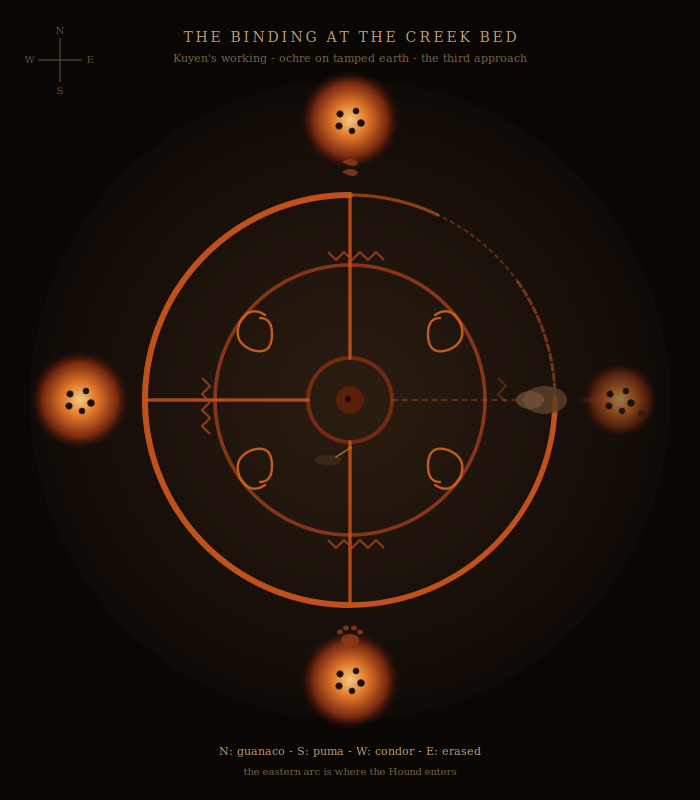

# CHAPTER 3 — EL RITUAL ROTO → EL SABUESO
### *The Broken Ritual → The Hound*

**Arc Goal**: Reveal the truth → player-caused catastrophe → survival set-piece
**Emotional Arc**: Guilt → Horror → Desperate Resolve
**Key Seed**: Consequences are permanent. Knowledge you acted on incorrectly does not become retroactively innocent.

---

## OPENING SITUATION

The investigators know the truth now — or enough of it. They know Don Eusebio opened something. They know Kuyen's people are trying to close it. They know Dolores tried and failed alone. They have the complete binding symbol, or at least its location.

The question is whether they believed Rosa when she said: *"Lo que sea que los vean hacer — déjenlos terminar."* — *"Whatever you see them doing — let them finish."*

The tension of this chapter is built into the investigators' prior decisions. If they reported Kuyen's camp location to Don Eusebio, if they were skeptical of Rosa, if they have been playing the middle — all of that pressure now arrives at once.

**Finding the Encampment**: The tribe is two hours east of San Ruiz on foot. The trail is faint but consistent — fires banked low, careful movement. As investigators approach at night (or dusk — the ritual runs at dusk), they smell woodsmoke and hear chanting: low, rhythmic, not melodic. More like a repetition of angles than of notes.

---

## THE WORLD: THE ENCAMPMENT

**Setting**: A dry creek bed, its banks roughly 2 meters high on each side, creates a natural enclosed space approximately 30 meters across. The tribe — seven people, once more — has arranged itself within this depression in a deliberate configuration. Four fires burn at the cardinal points, small and carefully controlled. At the center of the space, the earth has been cleared and the binding symbol is drawn in white ash and ochre: precise, complete, but with one gap — the eastern segment, exactly as Dolores warned.

> *Los fueguitos arden sin humo. El canto es lo bastante bajo como para que ustedes lo sientan más en el esternón que lo oigan con los oídos. La figura dibujada en la tierra brilla apenas — o lo parece. El aire dentro del cauce está más fresco, por lo menos diez grados. En el centro del espacio, un muchacho está arrodillado con los brazos pegados al cuerpo y los ojos abiertos y fijos en algo que no está ahí. No se mueve. Alrededor de él, otros seis se mueven en una pauta lenta y deliberada — manteniendo la figura, avivando los fueguitos, sosteniendo el canto.*
>
> *El canto tiene una sola línea que se repite, en mapudungun: **"Antu kishu inchiñ ñi pewenmu. Antu kishu, lan amukey."** El que sepa mapudungun lo traduce: "El sol [está] solo en nuestro pewen. El sol solo, el morir no pasa." Las siete voces vuelven a esa línea cada doce alientos. Lo que digan entre medio, la línea vuelve.*
>
> *Una mujer está parada un poco aparte, al borde del oeste. Es la única que los nota llegar.*

> **Visual handout**: see `assets/tribal-binding.svg`. Print at A3 portrait. The eastern arc is *visibly thin and dashed* — that is where the Hound will enter. The four cardinal fires, the animal-track sympathies (guanaco N, puma S, condor W, *erased* E), and the four spiral motifs at the diagonals are the Tehuelche-Mapuche folk geometry — *the same closing aspect* of the dual diagram (`assets/dual-diagram.svg`), but in the visual vocabulary the entity does not yet recognize. **A Marked PC who later sees both handouts side by side will see the relationship instantly. Tonight, they should just feel the eastern wrongness.** Place the handout on the table when investigators reach the creek bed; let them locate the gap themselves.

> **Atmospheric runner — the prayers (4)**: The Mapudungun chant *"Antu kishu inchiñ ñi pewenmu. Antu kishu, lan amukey"* is the campaign's second named prayer (see `flowmap.md`). It will return in C8 (the closing — every NPC in the outer ring will join the line, including Don Eusebio, including Mercedes; they will not know they have learned it) and in C12 (the Destroyed ending — Kuyen leads it as Mercedes reads). **Marked PCs who hear it tonight will dream it for the rest of the campaign in the same cadence.** Name it. Players will remember.

---

## NPC: KUYEN

**Role**: The true defender. The voice of truth. The person the investigators have been, unknowingly, working against.

**Appearance**: 52 years old. Mapuche. Silver-grey hair worn in two braids. A face that is not hard but *still* — the stillness of someone who has been doing something difficult for a long time without stopping. She is dressed practically: heavy wool, riding pants, boots worn through at the toe. At her belt, a small pouch containing ground pigments for symbol-drawing.

**Voice**: Low, controlled. She does not speak quickly or slowly — she speaks at the pace information requires. When she is frightened — which is right now, all the time — her voice drops lower, not higher. She does not perform calm. She is trying to sustain it because there is no alternative.

**Mannerisms**:
- Looks at the ritual circle constantly, even when speaking to you. Her attention is always partly there.
- Does not gesticulate. Her hands are too valuable — they need to be available for the symbol work.
- When she thinks someone is wrong about something, she does not argue. She says: *"No."* Simply. Once. Then explains.

**Motivation**: Complete the binding ritual. Protect her people, especially Nahuel. Close what was opened. She has been doing this for eight months — rotating camps as the entity's pull follows them, reestablishing the circle at each new location, watching her people run thin. She is tired in a way that is not physical.

**What She Knows**:
- Don Eusebio performed the opening ritual eight months ago. She doesn't know he used a manuscript — she assumed it was ignorant land-use, a man digging into the wrong ground.
- The ritual must be performed at the location of the original opening (the pit, ultimately) to close it permanently. They have been performing partial bindings to slow it, moving closer in concentric approach.
- This ritual — tonight — is the second-to-last approach. One more, at the pit itself, will close it. *If tonight succeeds.*
- The eastern gap in the symbol is her greatest remaining problem. She has attempted to extend the binding eastward three times. Each time, the entity disrupts that section specifically. It's as if the geometry is being maintained open from the outside.
- She does not know that Don Eusebio is actively maintaining the opening. She thinks it's residual structural force.

---

**Possible Questions & Answers — Kuyen**

*(These conversations occur before the ritual reaches its critical phase. Once it begins in earnest, she cannot speak to investigators.)*

> **Keeper note (D2)**: Kuyen describes *what she is doing and what she needs*. She does not tell the investigators what *they* should do. If they ask "what do we do?", she returns the question: *"What can you do?"* and waits. This is deliberate. Kuyen has been working without outsiders for eight months and is not about to start solving for them now. The Marked PC (post-ritual, into Arc 2 onward) will be the table's lens. Kuyen is technique and grief; she is not a tour guide.

*"What are you doing?"*
> *"Cerrando. Frenando lo que abrieron. Esta noche hacemos el tercer acercamiento — si sostenemos el círculo por todo el trabajo, quedamos suficientemente cerca para empezar el cierre final en la fuente la semana que viene."* — *"Binding. Slowing what was opened. Tonight we make the third approach — if we hold the circle for the full working, we move close enough to begin the final binding at the source next week."* *(She does not take her eyes off the circle.)*

*"Don Eusebio sent us here to stop you."*
> *"Ya sé."* *(No emotion — or rather, emotion so well-controlled it reads as none.)* *"¿Vinieron a frenarnos?"* *(She looks at you directly now. Her eyes drop briefly to the cuff of an investigator's jacket — to the dust along the seam — and then back up.)* *"Pasaron por el pozo también. Lo veo en ustedes. ¿Vinieron a frenarnos?"* — *"I know. Did you come here to stop us? Walked through the pit too. I see it on you. Did you come here to stop us?"* *(Her question is the same question. The dust is data, not accusation.)*

*"We know now that it wasn't you."*
> *(A long pause. Then:)* *"Rosa."* *(She says it like a name she trusts.)* *"¿Qué saben?"* — *"Rosa. What do you know?"*

*"We have the complete binding symbol."*
> *(She looks at your hands. Carefully.)* *"¿De dónde?"* *(If you describe the chapel:)* *"Dolores."* *(Her composure shifts, briefly, like light changing in a room when a cloud passes.)* *"Tenía razón. Le dije que viniera con nosotros. Me dijo que se la arreglaba sola."* *(She turns back to the circle.)* *"Tenía razón en lo del símbolo. Terca en lo demás."* — *"From where? Dolores. She was right. I told her to come to us. She said she could manage it herself. She was right about the symbol. Stubborn about the rest."*

*"What is the eastern gap? Can we help?"*
> *"El sector del este es donde la apertura tira más fuerte. Perdí tres tratando de aguantar ese puesto la duración entera — no por el ser, por el esfuerzo del cuerpo. Ahora lo aguanta Nahuel. Lleva demasiado tiempo aguantándolo."* *(She glances at him — the kneeling figure at the center.)* *"Si alguno pudiera anclar la marca del este y sostenerla — no pelearle, sólo sostenerla firme, como apretar la mano contra una puerta — alcanzaría."* — *"The eastern section is where the opening pulls strongest. I've lost three people trying to hold that position for the full duration — not to the entity, to the physical strain. Nahuel holds it now. He's been holding it too long. If someone could anchor the eastern mark and sustain it — not fight it, just hold it steady, like pressing a hand against a door — it would give us enough."*

*"What is this thing we're dealing with?"*
> *"Algo sin nombre que yo sepa. Algo que se mueve por los ángulos del espacio como el agua se mueve por las grietas. Estaba acá antes que nosotros. El ritual de apertura le hizo notar este lugar otra vez — ya estaba cerca. Se alimenta de la geometría del ritual mismo. Cuando dibujás la figura para frenarlo, te come los bordes de la figura."* *(She pauses.)* *"Por eso es peligroso el ritual a medias. Un cierre a medias es una puerta entreabierta."* — *"Something without a name that I know. Something that moves through angles in space the way water moves through cracks. It was here before we were here. The opening ritual made it aware of this location again — it was already close. It feeds on the geometry of the ritual itself. When you draw the shape to bind it, it eats at the edges of the shape. This is why the incomplete ritual is dangerous. An incomplete binding is a half-open door."*

*"Can it be killed?"*
> *"No. Se lo puede desplazar. Cerrarle el paso. Como sellar un cuarto — sigue existiendo, pero no puede entrar."* *(Brief pause.)* *"Estamos tratando de sellar el cuarto."* — *"No. It can be displaced. Closed out. Like sealing a room — it still exists, but it cannot enter. We are trying to seal the room."*

*"What happens if you fail tonight?"*
> *"El cierre parcial se cae. El ser cruza el umbral más entero. Y no vamos a tener otra oportunidad en el penúltimo acercamiento — habría que empezar la secuencia desde más atrás. Más semanas. Más gente."* *(She is quiet for a moment.)* *"Y Nahuel — no sé qué le pasa a Nahuel si el desplome cae mientras él es el foco."* — *"The partial binding collapses. The entity passes the threshold more completely. And we will not have another chance at the second-to-last approach — we would have to start the sequence again, further back. More weeks. More people. And Nahuel — I don't know what happens to Nahuel if the collapse occurs while he is the focus."*

**Roleplaying Hook — Kuyen**:
Kuyen does not ask for help. She does not have time for it and she has been working without outside help for eight months. If investigators offer concrete, specific assistance (*"Yo te aguanto la marca del este"* / *"I'll hold the eastern mark"*, *"Decime qué hago"* / *"Tell me what to do"*), she will give them precise, brief instructions. If they offer vague support (*"Queremos ayudar"* / *"We want to help"*), she will say: *"Entonces no estorben."* — *"Then don't interfere,"* and turn back to the circle.

The most powerful moment available here is if an investigator, having understood what's been happening, simply says: *"Trabajábamos para el hombre que hizo esto. Lo siento."* — *"We were working for the man who did this. I'm sorry."* Kuyen will be still for a moment. Then: *"Ya lo sé. Ahora sean útiles."* — *"I know. Now be useful."* This is as close to forgiveness as this arc offers.

---

## NPC: NAHUEL

**Role**: The ritual focus. The vulnerable point. The person most at risk.

**Appearance**: 24 years old. Lean, angular features, dark circles under his eyes so deep they look bruised. He has been the ritual focus for three weeks. He is kneeling at the center of the binding symbol with his arms at his sides and his eyes open, fixed slightly above the horizon. His breathing is shallow. He is still in a way that is not natural — the stillness of someone holding everything back at once.

**What He Is**: The ritual focus is the person who anchors the binding symbol's center — they serve as the connection point between the geometry drawn on the earth and the geometry of the space above it. In essence, they hold the door. It requires sustained, focused attention without breaking — no flinching, no reacting, no emotion that cracks the concentration. Three weeks of this has taken something from Nahuel that may not come back.

**Voice**: When Nahuel speaks — which he shouldn't during the working — his voice is thin, slightly echoed, as if arriving from a short distance. He speaks in present tense about things that happened in the past.

**Signs of Strain**:
- His shadow falls in the wrong direction from the firelight.
- If investigators watch for more than five minutes: he blinks in perfect synchrony with the others in the circle. He is not doing this consciously.
- His hands, though still at his sides, have small geometric patterns traced on the palms in ochre — markers to help him hold the focus shape. They are smudged. He has redrawn them many times.

**What He Knows** (surfacing in fragments when not in focus):
- He can sense the entity at the edge of the working. He describes it as *"cold corners,"* as if the angles of the space around him are slightly wrong. Like a room that is almost rectangular but not quite, and the incorrectness is alive.
- He knows he is close to his limit. He has not told Kuyen this. He doesn't want to worry her.
- He had a dream last night that has recurred: he is standing in the pit at the estancia, and the entity is below him, and it is not threatening — it is *curious*. It finds him interesting in the way a geologist finds an unusual stratum interesting. This frightens him more than aggression would.

**Motivation**: Complete the ritual. Not crack. Protect Kuyen. He will push past his limit to do this — which is exactly the problem.

---

**Possible Questions & Answers — Nahuel**
*(Brief — he cannot speak at length during the working)*

*"Are you all right?"*
> *(Without looking at you:)* *"Pregúntenme después."* — *"Ask me after."* *(He means it as reassurance. It isn't.)*

*"How long have you been doing this?"*
> *"Veintitrés días."* — *"Twenty-three days."* *(He counts them precisely. He has been counting.)*

*"What do you feel?"*
> *(A pause.)* *"Frío. En los ángulos. Como si las esquinas del espacio se estuvieran tirando para algún lado."* *(His jaw tightens briefly.)* *"Está bien. Lo tengo."* — *"Cold. In the angles. Like the corners of the space are being pulled somewhere. It's fine. I have it."*

---

## SCENE 2 — THE DECISION

The ritual is approaching its critical phase. The investigators have perhaps 10–15 minutes of conversation time before the chanting intensifies and the working enters its final stage.

**The key decision point**: What do the investigators do?

This is a Call of Cthulhu scenario. The *likely* outcome — especially if investigators don't have all the information, or if some players are impatient, or if a player decides their investigator would want to "stop the ritual to be safe" — is that someone interferes. Maybe they mean well. Maybe they were still uncertain. Maybe a player simply made the wrong call.

**Interference can take many forms**:
- Stepping into the symbol (breaking the geometry)
- Shouting or making a sudden noise at the wrong moment (shattering Nahuel's concentration)
- Attempting to physically move one of the tribe members
- Firing a weapon at something at the edge of the firelight (the entity is there)
- Most destructively: attempting to "help" by adding their own mark to the eastern gap without instruction, using an incomplete understanding of the symbol

**If interference happens**:

> *Un sonido como si todos los huesos del cuerpo dieran un acorde a la vez — no doloroso, pero total. Los fueguitos se apagan. No en sucesión. A la vez. La oscuridad que sigue no es noche — es la ausencia de algo que estaba conteniendo lo oscuro.*
>
> *El viento sopla del este en una sola ráfaga dura y se queda quieto. Nahuel hace un sonido — no un grito, un sonido como una palabra interrumpida — y cae de costado. La figura, que estaba brillando apenas, parpadea. Varias de las líneas de ocre simplemente dejan de existir, como si nunca las hubieran dibujado.*
>
> *Después: un olor. Frío y mineral y enorme. Y cuatro de los de la tribu — los de las posiciones de afuera — simplemente se sientan. A la vez. Y no se vuelven a mover.*

**SAN Check**: 0/1D4 (the collapse of the ritual, the darkness, the sound)

Then: silence. Five seconds. Ten.

> *Algo sale de la oscuridad del este. La palabra "sale" está mal — llega a través del ángulo entre dos cosas, del mismo modo que aparece una sombra cuando una nube pasa por delante del sol. Tiene forma del modo en que tienen forma los bordes de un objeto muy grande en luz tenue: ven dónde termina, pero no qué es.*

**SAN Check**: 1/1D6 — the first full manifestation of the entity.

Four tribe members are dead before anyone can act. They did not bleed. They are simply no longer organized in the way living things are organized. Their bodies are in positions that should not be sustainable.

---

## THE ENTITY: EL SABUESO

*(The Hound — never named out loud in-game)*

**What it is (for the Keeper only)**: This entity is not a Hound of Tindalos in the classic sense, though it shares some qualities. It is something that exists primarily in the geometry of space — in the angles, in the relationships between surfaces. The ritual drew it because the ritual *is* geometry. It is drawn to complex spatial patterns the way a shark is drawn to blood: automatically, without aggression as humans understand it. It does not want to eat anyone. It does not want anything. It moves through the angles of space and consumes the integrity of those angles as it goes.

**Appearance**: The Hound should never be fully described. The horror of it is that it exists in peripheral vision and at angles. Direct observation produces less information, not more. Things investigators notice:
- It is large. The scale is wrong for the space.
- It exists where surfaces meet — at corners, at edges, where light and shadow create a boundary. It does not occupy open space. It occupies the angles between things.
- When it moves, the space around it becomes geometrically incorrect. Walls that should be parallel are not. Shadows fall wrong. The ground level seems uncertain.
- Its movement is not predatory. It moves toward complex geometry — the binding symbol, the clustered investigators, the fires' light-and-shadow intersections. It is cataloguing, not hunting. The death it causes is incidental — a side effect of its presence in the physical world.
- Sound: a low, continuous vibration at the lower limit of hearing that makes the eyes water.

**Mechanical Presence (3 rounds)**:

The Hound is present for the Climax encounter. Its goal is not to kill every investigator — it is to move through the space and consume the remaining geometry of the binding symbol. If it completes its movement, the working is fully destroyed and it passes fully into this location.

Kuyen and Nahuel (if he can be revived or sustained) are attempting to restore the circle and complete the final stage. They need 3 rounds to do it. The investigators' job is to ensure they survive 3 rounds.

---

## SCENE 3 — HOLD THE CIRCLE (3 ROUNDS)

### Objective
Protect Kuyen and Nahuel. Keep the circle's geometry intact for 3 rounds. The Hound cannot be killed — it can be harassed, distracted, and slowed. Think less "combat" and more "holding a position under siege."

**Round Structure**:

---

**ROUND 1 — CHAOS**

> *Todo está pasando al mismo tiempo. Dos de los muertos de la tribu están entre ustedes y la Kuyen. Nahuel está de costado en la tierra. El Sabueso está en el borde este de la figura — donde estaba el hueco — y le está haciendo algo a las líneas de ocre. No las destruye. Les come la certeza. La Kuyen ya se está moviendo, sacando pigmento de la bolsa, hablando en mapudungun bajo y rápido.*

**Player options**:
- **Guard Kuyen or Nahuel** (STR or CON check to physically shield, absorb, or deflect the entity's incidental presence — the reality distortion around it)
- **Help Nahuel recover** (Medicine check to stabilize him / Persuade or Psychology to bring him back to functional focus)
- **Break the angles** — improvised: knock over the fire markers, throw equipment, do anything to interrupt the straight lines and right-angle surfaces the entity prefers. This works — briefly, imperfectly.
- **Attack the entity** (weapons pass through it with no effect; however, fire causes it to retract from a surface — it avoids the geometry fire creates. Throwing a burning brand toward it will push it back one meter for one round)

**End of Round 1**: The Hound retreats to the outer edge of the symbol's effective range. Kuyen is restoring the first lines. Nahuel is conscious but barely. He says: *"Lo aguanto. Dame algo para agarrarme."* — *"I can hold it. Give me something to hold."* He needs an anchor — a person to grip, an object with meaning, something physical to ground the focus. An investigator can volunteer.

---

**ROUND 2 — PRESSURE**

> *El Sabueso prueba el ángulo del norte. Uno de los marcadores del fuego — una piedra — simplemente... se mueve. No rápido. Como si el ángulo de la tierra hubiera virado levemente debajo de ella. La línea que anclaba se desvanece. La Kuyen hace un ruido seco y se mueve a restaurarla.*
>
> *En el borde este, el hueco en la figura está casi — casi — visible. El espacio ahí está mal. Demasiado claro. Como una ventana hacia algo.*

**Player options**:
- **Anchor Nahuel** (if an investigator is holding him: automatic success for his contribution this round — the physical connection grounds his focus)
- **Restore the eastern gap** (if investigators have the complete binding symbol — from Dolores's clay drawing or Rosa's knowledge — they can attempt to restore the eastern section. Occult or Cthulhu Mythos check. On success: the gap closes. The Hound reacts — a shift in its attention, a brief disorientation. Kuyen sees this and adjusts. One round of clear progress.)
- **Cover the north breach** (the moved stone — physically replace it. Simple action but requires getting close to the entity's current position. DEX check or SAN check from proximity)
- **Maintain any weapon pressure** on the Hound's position (delays its advance, costs ammo/resources)

**End of Round 2**: The symbol is approximately 70% restored. Nahuel is holding. The Hound is at the edge of the light — pressed back but present. The window at the east is smaller. The pressure is enormous.

---

**ROUND 3 — CLIMAX (NEAR BREACH)**

> *El Sabueso se mueve hacia el centro. No carga — fluye, por los ángulos, por los bordes de las cosas. Nahuel grita — no de dolor, de esfuerzo. Las manos de la Kuyen se mueven más rápido de lo posible. La última sección de la pared del este sigue abierta.*
>
> *Todo depende de los próximos diez segundos.*

This is the moment everything resolves based on player action.

**Kuyen's call**: She shouts — the first time she has raised her voice — *"¡El este! ¡Que alguien sostenga el este!"* — *"The east! Someone hold the east!"*

**Options**:

1. **An investigator holds the eastern position**: They plant themselves at the eastern gap, on the line, and hold it — physically, intentionally. No skill check: pure decision. The entity's incidental presence causes SAN 0/1D6 and CON check (on failure: 1D6 hit points from reality distortion). But the line holds. Kuyen completes the symbol.

2. **An investigator successfully restores the eastern symbol**: Occult or Mythos check (now at Hard due to pressure). On success: the gap closes geometrically, without a human anchor. The most efficient resolution, but requires knowledge.

3. **Partial success**: The symbol is restored but Nahuel cannot sustain the focus — he breaks, physically and mentally, slumping. The ritual can still complete but Kuyen must both finish the symbol and anchor the center alone. She does it. But the cost is visible on her face when it's over.

4. **Failure**: The symbol is not restored in time. The Hound passes through the gap. The ritual collapses entirely. The entity does not massacre everyone — it passes through and the area becomes a permanent focal point. The arc's ending is not death but defeat: a worse starting position for Arc 2, a mark on those present, and the knowledge that they failed.

---

**SUCCESS ENDING**:

> *La Kuyen dibuja la última línea. Nahuel exhala — un sonido como un edificio que se asienta después de un temblor. Los fueguitos se prenden a la vez, los cuatro, llenos y brillantes. El Sabueso está en el borde de la luz — y después no está. No se retira. Deja de ocupar el espacio del mismo modo que una palabra deja de existir cuando uno deja de decirla. La figura de ocre en la tierra brilla tres segundos: un ámbar tibio, no una luz fría. Después se apaga.*
>
> *La Kuyen se sienta en la tierra. No habla por un buen rato. Cuando habla:*
>
> *"Lo estábamos frenando."*
>
> *(Mira a los muertos. Después a los investigadores.)*
>
> *"Ustedes lo ayudaron a crecer. Eso lo entienden."*
>
> *(No es acusación. Es la constancia de un hecho. Necesita que ustedes lo entiendan.)*

**SAN Check** (aftermath): 1/1D6 — the death of four tribe members, the partial success, the weight of consequence.

---

## THE MARK (If hit by the entity and survive)

Any investigator who was in contact with the Hound's geometric distortion field and survived rolls **2d6 at key moments of stress in future chapters**. Double 1: the entity's attention briefly returns — not fully manifested, but present, for 1D3 rounds. The investigator is aware of being *noticed*.

This is not a curse. It is a consequence. The world remembers what you touched.

### What the Mark grants — read this aloud at the end of C3

The Marked PCs do not just have a sword over their heads. Starting now, **they perceive geometry the way other people perceive grammar**. Run the following short scene on the morning after C3, before C4 begins, with the Marked PC alone:

> *Te despertás antes del amanecer. Te pica la herida. Salís del campamento a despejar la cabeza. Mirás la piedra en la que te sentaste ayer. Es una piedra. Mirás el círculo de cocina que usaron los tehuelche anoche. Es — algo. Está *organizado*. Las piedras alrededor del fogón no son un círculo, exactamente. Están dispuestas sobre tres radios de un arco que, si lo trazaras, cerraría en un punto unas cuatro varas más allá del fogón. Esto no lo aprendiste. Lo ves. Es tan obvio para vos como el color de la piedra.*

From this point forward, when a Marked PC enters a ritually-charged space (the chapel in C2 if revisited, the Salamanca ruins in C5, Quirce's study in C6, the Manzana de las Luces in C10, the dock in C12), the GM should describe the geometry of the space *to that player privately*, in spatial terms, not in occult vocabulary. The Marked PC then translates for the table — or doesn't.

**The mechanical face of this**:
- Cthulhu Mythos checks about pattern in real space (not text, not language) are at **one difficulty step lower** for Marked PCs.
- A Marked PC can attempt a **Hard Spot Hidden** to read whether a ritual is *opening, closing, or sealing* by the geometry alone.
- The Hound's approach (the 2d6 trigger) is preceded, for the Marked PC, by a *visible distortion* in the geometry of the room — they see it before the dice are rolled. This gives them one beat of warning to act, lie down, run, or speak.

**The cost**:
- Each scene in which the Marked PC actively uses geometric perception ("I look hard at the diagram"), the 2d6 trigger threshold raises from "double 1" to "double 1 or double 2" *for that scene only*.
- Players who lean on the Mark heavily across the campaign will pay for it in C12 — see chapter-12 endings.

**Why this exists**: Without this, every diagram, ritual, and binding has to be explained by an NPC (Rosa, Kuyen, Mercedes). With this, the Marked PCs are the campaign's interpretive engine, and the NPCs can stop solving puzzles for the table. **This is the campaign's central design solution to the players-can't-read-the-geometry problem.** See `assets/geometric-perception-cues.md` for the per-chapter trigger sheet.

---

## AFTERMATH

**What Kuyen says**:
After a long silence, if investigators stay:
> *"El ritual estaba casi completo. Nos faltaban dos acercamientos para llegar a la fuente. Ahora — empezamos el acercamiento final desde acá. Un trabajo más, en el pozo. Si quieren ser útiles: métannos al pozo. El Valdez no nos va a dejar acercarnos."* — *"The ritual was almost complete. We needed two more approaches to reach the source. Now — we start the final approach from here. One more working, at the pit. If you want to be useful: get us into the pit. The Valdez man will not let us near it."*

She does not ask for apology. She does not forgive or not forgive. She assesses the situation and identifies the next necessary action. This is her.

**What Nahuel says**:
If he is conscious:
> *"Me miró. Cuando el círculo se rompió."* *(He is looking at his hands.)* *"Pensé que iba a sentirse como ser borrado. Sólo se sintió como... ser clasificado. Como si fuera interesante."* — *"It looked at me. When the circle broke. I thought it would feel like being erased. It just felt like... being categorized. Like I was interesting."*
*(SAN 0/1 for anyone who hears this and understands what it means.)*

**El Patrón watching from afar**:
As the investigators prepare to leave the creek bed, **Spot Hidden** in the far darkness to the west: a figure on horseback on the ridge. Stationary. Watching. When seen, the figure turns and rides north — toward the estancia. It is too far to identify by face. But the horse is distinctive: a palomino, the only one in the estancia's corral.

Don Eusebio knows the ritual worked. He knows investigators helped. He will be dealing with this information by the time they return.

---

## GM NOTES

**The catastrophe is the lesson**: This chapter should hurt. Not because it's unfair, but because it is *fair* — the consequences are exactly proportional to the investigators' actions throughout the arc. If they did everything right, they still had to watch four people die because of the broken ritual. If they did things wrong, more people died, and they know why. The discomfort is the point.

**Don't soften Kuyen's accusation**: *"You helped it grow."* Let it land. Don't have her immediately follow it with reassurance or explanation. Give the players five full seconds of silence. Then let her explain, if they ask.

**Fast, sharp descriptions in combat**: The entity should never be described in paragraphs during the rounds. Single sentences. Fragments. The geometry is wrong. The stone moved. There is a sound like a frequency. The description should feel as unstable as the space.

**No exposition mid-combat**: Kuyen does not explain the Hound while fighting it. Rosa is not there. Nobody stops to explain what is happening. The players figure it out from the mechanics and the world.

**The entity never dies**: If players spend a round trying to kill the Hound, nothing happens and they lose a round. This is a consequence of the CoC worldview, not a punishment. Let it land.

**Arc close — what the players should feel**: Guilt (they were used by the man who caused this), hard-earned capability (they held the circle, they helped finish the binding), and lingering dread (the pit still exists; the entity was slowed, not closed; Don Eusebio is watching; and Nahuel said it looked at him like something interesting). There is more work to do. There always is.

---

## CLUES CARRIED FORWARD (INTO ARC 2)

| Object/Knowledge | Details |
|---|---|
| Don Eusebio's manuscript | Still in the locked study — the source document for the opening ritual |
| The complete binding diagram | Now proven functional — investigators may have used it |
| The Mark (if taken) | The entity noticed certain investigators; this persists |
| Kuyen's surviving knowledge | She needs access to the pit for the final closing working |
| Don Eusebio watching | He knows the investigators helped the tribe — he considers them enemies now |
| Nahuel's condition | Psychologically fragile; possibly permanently affected by three weeks as ritual focus |
| The incomplete eastern wall (chapel) | Still unresolved — the binding there was never finished |
