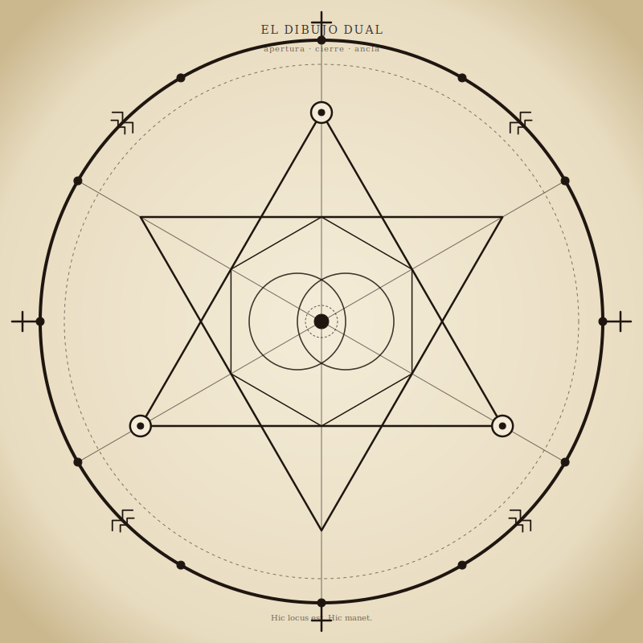
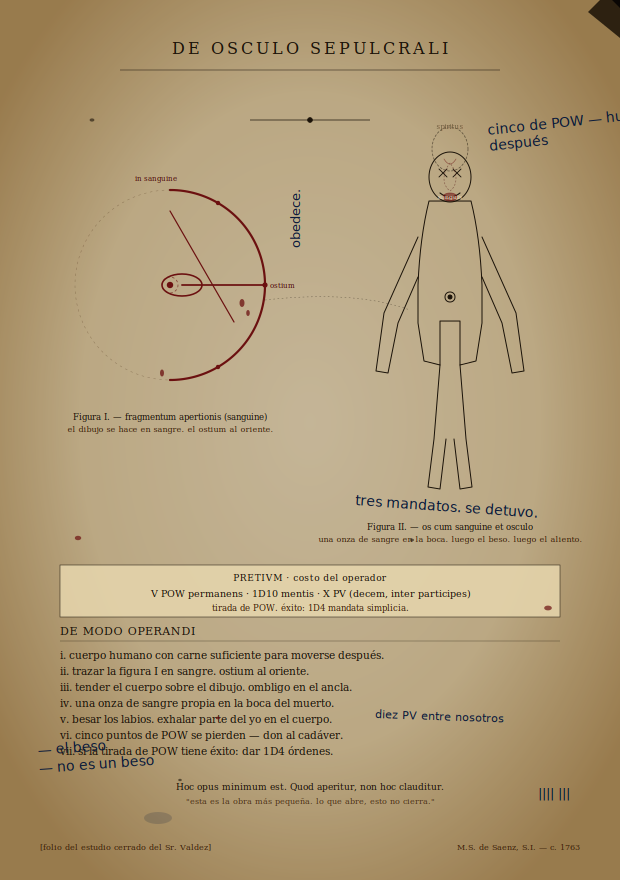
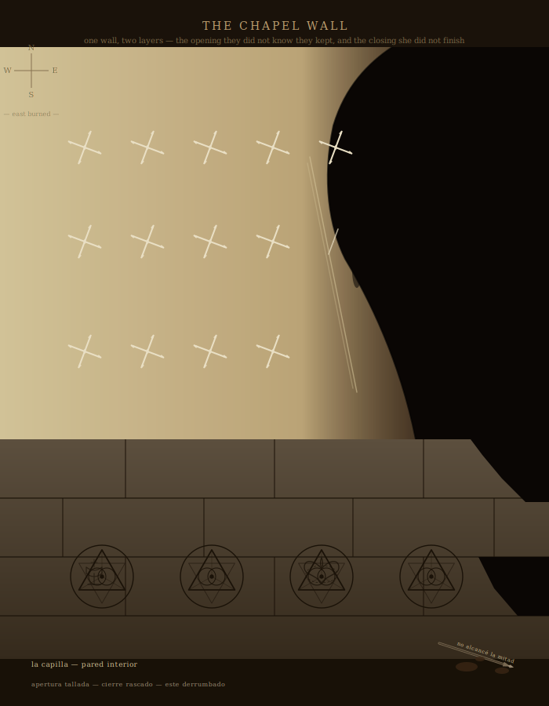
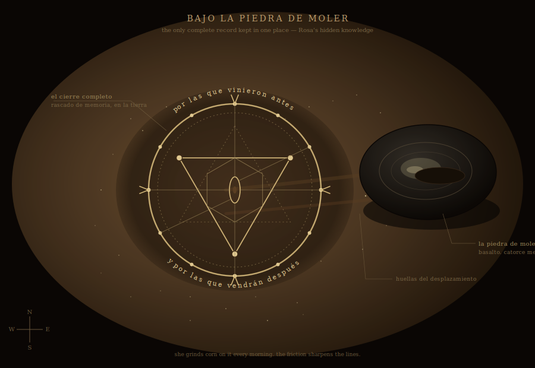
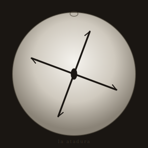

# THE GEOMETRY — One Shape, Many Hands

> *Reference doc for Arc 1. How the diagrams relate to each other and to what the players will see at the table.*

The campaign uses a lot of diagrams. They look different. They are the same diagram. This doc unifies them.

---

## The Principle

There is **one geometry**. It has two aspects, and both are present in every full rendering of it:

| Aspect | What it does | Visual signature |
| --- | --- | --- |
| **Opening** (*la apertura*) | Sustains a weakness in spatial geometry — a path. Things from elsewhere can come up it. | **Radiates outward**: triangle pointing **up**, vesica piscis at center oriented horizontally, six radial spokes from the anchor reaching past the outer ring. |
| **Closing** (*el cierre*) | Seals the path. Holds the geometry shut. | **Converges inward**: triangle pointing **down**, vesica narrow and vertical (a "shut door"), twelve stations on the outer ring with cardinal barbs, three solid pressure points. |

A *full* rendering of the geometry is **dual** — both aspects, together, on the same page or stone or floor. (See the carved Saens stone, below.) Most of what the players will see in Arc 1 is **partial** — one aspect alone, or one aspect rendered in a vocabulary the other tradition does not recognize. The whole point of Arc 1 is that the players slowly learn to read the partials as parts of one shape.

The reference rendering — the canonical version — is on the carved Saens stone in the Jesuit ruins (C5). The players will not see the whole stone in Arc 1. They will see fragments and reflections of it, in different hands, different materials, different scales.

> *On the table*: the dual diagram is the **GM's reference**. Use it to keep yourself oriented. Show it to the players only at C5. Until then, the geometry is a thing they assemble in their heads from fragments.

---

## The Reference Rendering — *El Dibujo Dual*

`assets/dual-diagram.svg`

This is what every fragment is a fragment **of**. Read it as two superimposed shapes:

- **Outer ring + twelve stations + cardinal crosses + Mapuche stepped patterns** — the *closing*. Twelve stations because the binding rests on twelve points; cardinal crosses are the colonial-Catholic vocabulary; the Mapuche patterns at the intercardinals are first-people memory of the same stations under another name.
- **Hexagram (two interlocking triangles), vesica piscis at center, six radial spokes, anchor** — the *opening*. The triangle pointing **up** is the opening proper; the triangle pointing **down** is the closing's keystone signature; together they form the doorway and its lock in one figure. The vesica is the door itself.
- **Three solid pressure points** at the upward triangle's vertices — what Marta will press in C5 to *open* the descent. On the closing aspect (Rosa's grinding stone) these same three points are **filled** to keep the door shut.

Padre Saens carved this stone alone, after the rest of the Jesuit mission was gone, in 1763. He laid himself on the geometry as the center and the binding consumed his body. **What he bought was time, not closure.** Every other binding the players will encounter in Arc 1 is downstream of his work — improvised, partial, folk, lay — keeping that partial seal alive after the lineage thinned out.

---

## Vocabulary Cheat Sheet

| Word | Meaning | Where it shows up |
| --- | --- | --- |
| *La apertura* | The opening aspect | Don Eusebio's pit, the cattle hides, Tomás's stone (obverse), the manuscript |
| *El cierre* | The closing aspect | The chapel foundations + Dolores's overlays, the creek bed, Rosa's grinding-stone floor, Tomás's stone (reverse), Rosa's silver ornament |
| *La atadura* | "The binding" — compact form of the closing, used as a token or amulet | Silver ornament, doorframes, wax seals, scratched on portable objects |
| *El ancla* | "The anchor" — the center of either aspect; where a body must lie | Padre Saens (1763), Nahuel (C3), Marta (C5), the carriage in BA (C12) |
| *La piedra* | "The stone" — Padre Saens's carved stone, the canonical record | Jesuit ruins, C5 |
| *El ostium* | Latin for "door" — the opening's eastern outlet | Don Eusebio's manuscript, marionette rite |

---

## The Opening Aspect — Don Eusebio's Hand

Don Eusebio found the manuscript three years ago. He performed a partial opening eight months ago and did not understand he was performing one. The opening aspect, in Arc 1, is **his vocabulary**: ink on parchment, cattle blood in earth, iron brand on hide. It looks Catholic and bookish, not folk. That's the disguise.

### The Pit

The pit at the south pasture is the geometry **drawn in cattle blood at field scale**. Outer ring is the placement of the carcasses; inner arcs are the blood splatter; the radial spokes are the directions La Luz Mala travels at moonrise. It has no SVG of its own — it is staged at the table from the players' descriptions and the GM's body-placement diagram. **It is the opening, at full scale, missing nothing**.

> *Use*: When players see the pit and the light, then later see the cow-hide fragment, they should recognize the blood-arc on the hide. The hide is *a piece* of the pit at portable scale.

### The Branded Hide

`assets/cow-hide-geometry.svg`

A patch of cowhide with the opening burned into it — *partially*. Don Eusebio distributes the geometry across his herd; no single hide carries the whole shape. **The southern arc is missing on this hide.** It was burned onto a different animal.

> *On the table*: place this when Don Eusebio produces the hide in C1. Players who notice the legitimate ranch brand (`EV - 1820`, upper-left) and the ritual brand (large, central, charred halo) at the same time are reading him correctly already.

### Tomás's Vizcachera Stone — The Obverse

`assets/tomas-stone.svg` *(obverse face — left half of the image)*

Tomás copied a fragment of the opening from what he saw on a branded hide, scratched into a flat river rock. He does not know what he copied. His copy is *jagged* — he is a man with calloused hands working from memory. **The obverse is the opening fragment.** The reverse is something else (see the closing section).

> *On the table*: Tomás may give this stone to a player he trusts in C1. The two faces side-by-side are the chapter's silent argument — *one stone, one hand, two opposed shapes* — and a player who turns it over and notices the difference is already half-way to the chapel revelation.

### The Marionette Rite — Eusebio's Locked-Study Page

`assets/marionette-rite.svg`

A page from the colonial Jesuit manuscript, with Eusebio's frantic marginalia in different ink. **It is a low-level derivative of the opening** — uses only the eastern fragment (one anchor, one spoke, one arc, the vesica tilted east) plus a body diagram of seven bind-points. Not a major working. A pet ritual.

What it does:

- Animates a fresh corpse (less than a day old) as a marionette of meat and pressure.
- The body **moves**; the body **does not obey**. *Non vivificat sed movet*. It walks where the operator stands; it does not answer. It does not see the operator. It sees something else through the operator.
- Lasts **until sunrise**, then collapses.
- Requires **a handful of soil from the open pit**.
- This is the same mechanism that powers the reanimated cattle at the end of C1 (those are not undead — they are carcasses operated by the entity's geometric field at field scale). The marionette rite does it at body scale, with one practitioner.

How players will encounter it:

1. Don Eusebio is gone east at the end of C1; the locked study is still locked, the key is gone.
2. Force the door (C1 endgame stretch goal, or revisit at C2/C5/C8): the desk is full of recopying drafts. The folio is the cleanest, most legible copy he made.
3. They can read it. They can perform it. **It is performable.** Cost is real (SAN, 1D6; 0/1 each subsequent use; geometric Mark advances one level on first performance).
4. Every time a player performs the marionette rite, El Patrón knows their hand a little better. By C12 he can recognize them at distance. **This is a power they should be afraid to use, not afraid to find.**

> *Note on the rite as plot device*: this is the **first piece of operable Mythos magic** the players have access to. It is intentionally low-level — it does not solve anything, it complicates everything. Don't push players toward it. Let them find it. Let them decide.

---

## The Closing Aspect — Four Hands

The closing was performed once in 1763 by Padre Saens, who died completing it. After him, the lineage of *Antu-Rayo* maintained it with regular counter-rites for nearly six decades. As that lineage thinned, the seal weakened on its own. **By the time the campaign opens, the closing is being held alive by four hands and one stone:**

1. **Padre Saens (1763)** — dead. His carved stone is the canonical record. *(See dual diagram, above.)*
2. **Dolores Quiroga (deceased, 14 months ago)** — three days of scratched counter-bindings on the chapel walls. Burned to death by villagers under the pattern's compulsion before she finished.
3. **Kuyen (active, C3)** — the creek-bed working, in folk geometry, contested by the Hound on the eastern arc.
4. **Rosa Quiroga (active, C2 and beyond)** — the complete binding scratched in the floor under her grinding stone, plus a daily silent prayer of six words.

These are different hands working in different vocabularies on the same shape. Each is partial. **Together they are what is keeping the entity at the edge.** Take any of them away and the binding fails.

### Dolores's Hand — The Chapel Walls

`assets/chapel-wall.svg`

A section of the burned chapel's interior wall. Two layers, one beneath the other, of the same geometry:

- **Lower band — foundation stones — CARVED OPENING.** Older than the chapel. The community built worship on top of it; you can see a sacred heart and a chalice incised over the carved geometry. *Cthulhu Mythos / Occult (Hard)*: this pattern predates the building. Probably colonial. Possibly older. It is what Padre Saens carved here — when he ran out of time and needed to mark the territory before he could close it. The chapel was built on top, and the parish, ignorant, integrated the geometry into devotional practice for two and a half centuries.
- **Upper band — plastered wall — SCRATCHED COUNTER.** Dolores's three-day work, scratched into soot-darkened plaster with a sharpened iron rail. Same shape as Rosa's silver ornament, repeated as a frieze. Hurried. Imperfect.
- **Eastern third — collapsed/burned.** Two villagers walked in with kerosene the night Dolores died. The roof came down. The walls held — *the carved stone is intact* — but the eastern plaster is gone, and Dolores's scratches stop short there. **She did not finish the eastern third.** The tool is in the rubble. On its flat side, scratched: *no alcancé la mitad* — "I didn't finish half."

> *On the table*: place this when investigators enter the chapel in C2. Tell them what they see ("a wall, the eastern half collapsed, two layers of marks"). Let them notice the layering. Let them ask. The two-layers-as-one-shape is the chapter's central revelation; it lands harder if they find it than if you tell them.

> *Why the carved opening was here at all*: Saens's binding, in 1763, **required the opening to be present** — you can't seal a door if there's no door to seal. He carved both. The community kept the opening alive devotionally for 250 years without knowing what they were tending. Dolores recognized the shape at the end and worked alone to overlay the closing. She got two-thirds of the way.

### Kuyen's Hand — The Creek Bed

`assets/tribal-binding.svg`

Kuyen and Nahuel's working, in **folk geometry**: ochre on tamped earth, four cardinal fires, animal-track sympathies (guanaco N, puma S, condor W, *erased* E), four Tehuelche spiral motifs at the diagonals, four Mapuche stepped zig-zags between rings. It is the closing aspect rendered in the visual vocabulary the entity does not yet recognize. *That is why Kuyen is using it.* The pattern recognizes the carved stone; it does not yet recognize the spiral.

#### How it works

- **The four cardinal fires** anchor the perimeter. Each fire is a station; together they correspond to the twelve stations of the closing's outer ring (compressed into four for field-scale folk practice).
- **The four animal-tracks** outside the outer ring carry sympathetic direction — guanaco for migration (north, the river), puma for territory (south, the country), condor for sky-passage (west, the cordillera), and (originally) **fox** for cunning (east, the coast). The fox track has been **erased** — the Hound has scuffed it out.
- **The Tehuelche spirals at the diagonals** carry the path the entity takes through angle-space. The closing reverses them. *(This is what the Hound wants undone. Hounds of Tindalos travel by angles; spirals are what their geometry cannot follow.)*
- **The Mapuche stepped zig-zags** in the cardinal quadrants are the first-people stations — the same shape as the stepped patterns at the intercardinals on the dual diagram, repurposed. The eastern quadrant's zig-zag is **incomplete**.
- **The center (the anchor)** is where Nahuel kneels. He is the body the closing rests on. *That is why he matters.* If Nahuel breaks, the binding has no center. A player hearing this should understand they cannot just let him die.

#### What is missing

The **eastern arc** is contested. Look at the SVG: the eastern arc is **thin, dashed, partially erased**; the eastern fire is **dimmer**; one of the eastern fire stones has been **displaced**; the eastern animal-track has been **wiped to a faint shadow**; the brushed-clear spot in the eastern quadrant is where the Hound has wiped ochre off the dirt. **This is where the Hound enters.**

> *On the table*: place this when investigators reach the creek bed in C3. Don't point at the eastern weakness. Let the players locate it themselves. **A Marked PC who later sees this side-by-side with the dual diagram (e.g., in C5) will see the relationship instantly.** Tonight, they should just *feel the eastern wrongness*.

#### What Kuyen needs to finish

Kuyen and Nahuel need 3 rounds of uninterrupted ritual to complete the closing. The investigators' job — if they understand what they are looking at — **is to keep them alive for 3 rounds.** Not to stop them. Not to "help" by joining in. To stand between Kuyen and the Hound for 180 seconds.

### Rosa's Hand — Beneath the Grinding Stone

`assets/rosa-grinding-stone.svg`

Rosa scratched the **complete binding** into the earthen floor of her house, beneath where her grinding stone rests. She lays the stone back over it daily. **Every time she grinds corn, the friction sharpens the lines.** This is the campaign's only complete record of the closing aspect kept in one fixed place that a player will see in Arc 1.

Around the rim, in tiny letters, her six-word prayer:

> *Por las que vinieron antes y por las que vendrán después.*
> "For those who came before, and for those who come after."

It is **silent**. Players will not hear it spoken. She has been saying it daily for fourteen months. **It is what is sustaining the partial binding in the chapel walls**, alongside Dolores's scratched symbols. Without Rosa, the chapel would have failed entirely a year ago.

> *On the table*: do **not** show this to players in C2. Rosa will not show it. Show it only if they earn her trust — typically only after they survive the chapel encounter and return to her, or in the C12 epilogue. *"Ahora ya saben en qué están metidos."* — *"Now you know what you're in the middle of."* If they have proved themselves, she draws the stone aside, lets them see, and resumes work.

> *What the players take away*: anyone with this image in hand has the complete closing. Kuyen does not have this. Dolores died trying to reconstruct this. **A player who memorizes this can carry it.** That matters in C7 and C12.

---

## The Compact Tokens — *La Atadura*

The closing aspect, miniaturized into a single repeating motif, is **the binding symbol**. Four lines meeting at angles, off-axis. Not quite a cross. It travels well. People scratch it on doorframes; silver-smiths cast it as ornaments; couriers stamp it on wax seals.

`assets/binding-symbol.svg`

This compact token is what carries the closing across the world when no one can carry the full diagram. **It is the closing's signature, distilled to four strokes.** The same shape appears:

- At Rosa's throat (silver, worn).
- Scratched on the inside of doorframes throughout San Ruiz (in pencil, charcoal, knife).
- On the **reverse** of Tomás's vizcachera stone — `assets/tomas-stone.svg`, right half of the image. Tomás copied it from a doorframe in San Ruiz years ago, from memory, *because looking at it gave him peace.* He does not know it is opposed to the obverse. **A Marked player returning to this stone after C3 will see the relationship the moment they look. One stone, one hand, two opposed shapes.**
- *Inside-out* on the wax seal of a folded parchment Mercedes hands the players in C11.
- On the eastern arch of the dual diagram (when fully drawn, the binding-symbol shape emerges as the negative space between the closing's pressure points and the central vesica).

> *On the table*: print the binding-symbol small. It is a **prop**. Use it when you want players to recognize a closing without saying the word "closing." A player who sees this on Rosa's throat, then on a doorframe, then on the reverse of Tomás's stone, then on a wax seal, has been **shown the same answer four times**. That is the campaign's pedagogy: never tell, repeat.

---

## What to Show, When

| Chapter | Beat | Put on the table |
| --- | --- | --- |
| C1 | Don Eusebio produces the hide | `cow-hide-geometry.svg` |
| C1 | Tomás slips the player his stone | `tomas-stone.svg` |
| C1 | Players force the locked study (if they do) | `marionette-rite.svg` |
| C2 | Players meet Rosa | `binding-symbol.svg` (on her throat) |
| C2 | Players enter the chapel | `chapel-wall.svg` |
| C2 | Rosa shows them what is under the grinding stone (if earned) | `rosa-grinding-stone.svg` |
| C3 | Players reach the creek bed | `tribal-binding.svg` |
| C5 | Players reach the carved Saens stone | `dual-diagram.svg` |

After C5 — once the dual diagram is on the table — leave it. The players should be able to compare any future fragment back to the dual diagram with their own eyes. Don't take the reference away.

---

## GM Notes

**Why so many partials.** Every faction in the campaign sees a piece of the geometry and not the whole. Don Eusebio sees the opening (and reads it as a recipe). The community of San Ruiz saw the opening and read it as a saint. Dolores saw both and tried to overwrite one with the other. Kuyen sees the closing and renders it in folk vocabulary. Rosa sees both and chooses to maintain. The players' arc is **assembling the whole shape from the fragments other people gave them.** That is the campaign's central pleasure. Do not collapse it by showing the whole geometry early.

**Geometry as through-line.** Every clue in Arc 1 points to patterns. Don't lecture. The moment a player says *"these are all the same shape"* — reward it. *That insight is the hook.* If by end of C2 a player has not yet said it aloud, by end of C3 they will.

**The Marked threshold.** The geometry recognizes consistency. A player who sees the same shape in five places **becomes able to feel the shape** when they encounter a sixth. That's mechanically the *Mark*. Marked PCs get 1/1D4 SAN penalty for the *first* dual recognition (C5); after that, the recognition becomes a tool — they can read the geometry on a stranger's face, on a town plan, on a carriage's path through Buenos Aires. By C12 the Marked PCs are the only people in the room who can see what is happening.

**One geometry. Many hands. One shape.** Hold this in your head as GM. The diagrams are not lore. **They are the same answer being given by every NPC who has ever tried to help.** The campaign is the players catching up.
