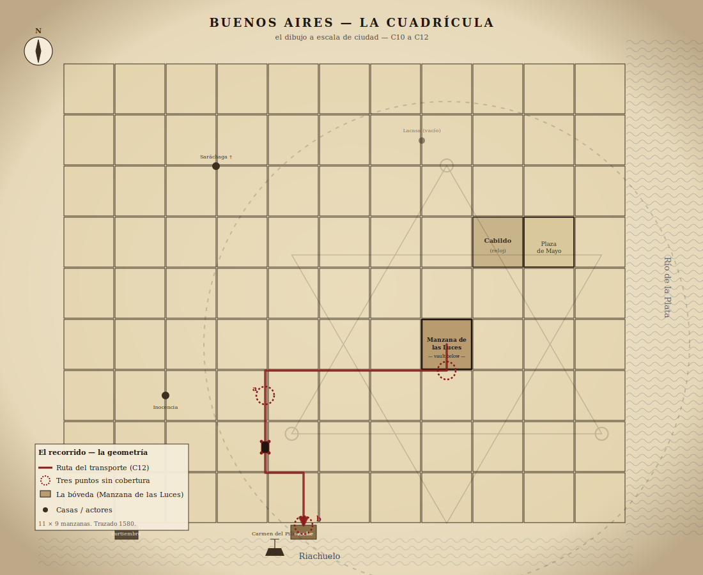

# CHAPTER 12 — EL LIBRO
### *The Book*

**Chapter Goal**: Run the transport, the heist, the reveal, and the final choice. End the campaign on a player decision with named cost — Hidden, Used, or Destroyed — and live with what remains.
**Emotional Arc**: Cold Resolve → The Long Hour → Choice → Aftermath
**Key Seed**: He told you the truth, mostly. The trap is not in what he said. The trap is in what he didn't say. The book moves; the geometry follows; the city becomes his diagram. The choice is whether you give him the diagram he needs.

---

## OPENING SITUATION

Midnight is in eighteen hours. The witness-stone in the bedroom is still hot. The players have a plan, allies, a knife, a folded parchment, and a pencil. The city is awake earlier than usual — by 5 AM the *aguatero* carts are out, the bakeries smell of *pan criollo* in production, and there is a small but distinct crowd around the Cabildo that is not normally there. Word has not gotten out. People feel it without language for it.

This chapter is structured in four acts, each roughly 90 minutes of real-table time:

- **Act 1 — The Transport** (early evening through midnight): the carriage rolls, the cordon walks, the first attack hits.
- **Act 2 — The Reveal** (midnight to 1 AM): the Cursed Gaucho's stand, the dockyards, El Patrón on stage, Mercedes' name spoken aloud.
- **Act 3 — The Choice** (1 AM to 2 AM): the three options, made concrete, with cost. The players decide.
- **Act 4 — Aftermath** (dawn and after): the survivors, the land, the final image.

Run them in order. Do not collapse them. Each act has a rhythm.

> **Visual handout for the GM and the table**: see `assets/city-grid.svg`. The eleven-by-nine block grid of 1580. The Manzana de las Luces (the vault), the Plaza de Mayo, the Cabildo, the Riachuelo, the dock, and the brig *Carmen del Pilar*. The transport route is highlighted; the three uncovered ambush corners are marked. The dual diagram is faintly overlaid on the grid, centered on the vault — print this for the players when the carriage starts moving. As the carriage moves and the cordon panels light, mark each completed leg of the route on the players' copy. They are *drawing the diagram*; let them see it being drawn.

---

# ACT 1 — THE TRANSPORT

## THE DAY BEFORE THE NIGHT

The chapter opens in the morning. Mercedes is at the meeting house. Galíndez is at the docks doing final arrangements. Albarrán is at San Ignacio holding a small mass for Saráchaga (it doubles as a quiet blessing of the carriage and Galíndez's men). Ana is writing the false intel for Quirce under Mercedes' supervision.

### What the Players Do With Their Day

Several useful things, depending on who is in the party:

1. **Walk the route**. The carriage path from the Manzana de las Luces to the Riachuelo dock is approximately 1.5 km, through eleven streets. Players walking it before nightfall identify obstacles, line of sight, where the cordon needs reinforcement. **Spot Hidden / Track / Stealth** rolls — successes lower difficulty for specific moments later.

2. **Visit Kuyen and Nahuel** at the tannery. The cordon ritual is being prepared. The leather panels — six of them, scaled-up versions of the Arc 1 binding — are being painted in red ochre and bone-black. Kuyen explains the timing: the cordon is *moving*, panels carried by walkers, drawn at sequential corners. She needs eight walkers minimum. Currently has four. Players can volunteer (good — they are Marked, the cordon is stronger), or recruit additional people (Inocencia knows two men who would do it for a debt; Galíndez can spare two of his less-armed soldiers).

3. **Speak with the Cursed Gaucho** privately. He will be terse and clear. He is going to be in the carriage with the chest. He knows he is bait. He has a *facón* (large knife) on his back, the *cuchillo de campo* on his belt, and an old flintlock pistol that he has not loaded yet because *"si lo cargo ahora me lo llevo a la cama y no quiero soñar con esto más de lo que ya."* — *"If I load it now I take it to bed with me and I don't want to dream about this more than I already do."* He will load it at dusk.

4. **Inspect the chest**. Mercedes will allow the players a final look at the chest in the vault (not opened) at 4 PM. She wants them to see it once more before it is moved. She places her hand on the iron, says nothing, removes her hand. The players can do the same. The chest is colder than the room. **SAN Check 0/1**.

5. **Recover or destroy Quirce's brass markers** (if the players caught them in earlier arcs and remembered them now): a **Hard Spot Hidden / Library Use** roll on the Manzana de las Luces' rector's office identifies surveying marks Quirce placed weeks ago. Pulling them now denies him a pre-recorded observation reference for whatever he is going to attempt tonight.

6. **Receive an unwanted visitor**: At 6 PM, a runner brings a sealed letter to Mercedes. It is from Quirce. He has been excluded from Keeper meetings since Arc 2. The letter is short.

> *"Mercedes — Esta noche estoy en la calle, no en la galera. No voy a interferir. Voy a observar. Si la geometría se cierra, voy a poder ofrecerle a la Red algo que no han podido medir desde 1610. Si no se cierra — voy a estar para ayudar. No te voy a perdonar lo de Ana, pero esta noche estamos del mismo lado. — A.Q."*
>
> *"Mercedes — Tonight I am in the street, not the carriage. I will not interfere. I will observe. If the geometry closes, I can offer the Network something they have not been able to measure since 1610. If it does not close — I will be there to help. I will not forgive you for Ana, but tonight we are on the same side. — A.Q."*

Mercedes hands the letter to the players. *"Léanlo. Decidan ustedes qué hacemos con él."* — *"Read it. You decide what we do with him."* Quirce as ally-of-convenience is now on the table. Players can include him, refuse him, or leave him to operate independently.

---

## DUSK — DEPARTURE

At 11:30 PM, the carriage leaves the Manzana de las Luces. The chest is inside. Galíndez rides ahead. Two of his men ride flank. Mercedes is in the carriage with the chest and the Cursed Gaucho. The remaining men walk in pairs — eight on foot, two ahead, two behind, two on each flank. The cordon walkers are already in position, fanned along the route at sequential corners, leather panels rolled and ready.

The players choose their positions:
- **In the carriage** with Mercedes and the chest (highest concentrated risk; closest to the truth).
- **Ahead with Galíndez** scouting (best for combat, first to engage).
- **In the cordon walk** with Kuyen / Nahuel / surviving Wrong Returned (best for catching geometric anomalies, supporting the binding).
- **In a free position**, mobile, responsive — the Marked have an advantage here since the city's geometry tells them where to go.

### Setting Description

> *Buenos Aires at midnight is not a city you have seen before. The streets are empty in a way that is unnatural — not because nobody is out, but because nobody is in the wrong place. The drunks are home. The dogs are silent. The night-watchmen are inside their booths and have not come out for an hour. The Cabildo's clock has not struck. By the *aljibes* — the public wells in the squares — the water is still. The river smells stronger tonight than it should from this far inland.*
>
> *The city is holding its breath.*
>
> *The carriage rolls. Iron-rimmed wheels on cobblestone, the only sound for two blocks at a time, then a small night bird, then the wheels again. Galíndez's horse breathes loud behind the soldiers. The cordon walkers, when you look back, are visible only as occasional dark figures stepping into a corner and then stepping out — the leather panels making a brief amber glow as Kuyen's chant activates them, then fading.*

**Mechanic — the Mark**: Every Marked player rolls 2d6 every two blocks. Snake eyes triggers a Hound aftershock — short, contained, *brief* (1d3 rounds, the geometry of the city limits its duration). This is a real threat tonight; the city is the most geometrically charged place the campaign has visited. Reroll if a player has the binding active in their hand (cordon walker) or is inside the carriage with Mercedes (proximity to the chest).

---

## THE THREE WEAK POINTS

### Weak Point 1 — University Exit

The first fifty meters from the Manzana de las Luces. Galíndez's worry: a sniper from a balcony, a trip-line at the corner, a rush from one of the side streets. **What actually happens**:

- A *vigilante urbano* walks out of an alley and asks Galíndez for papers. Galíndez has them. The man reads them slowly. Slowly. Slowly. **Spot Hidden / Psychology** roll: he is stalling. He is not a real *vigilante* tonight — he is a man wearing the armband and carrying the staff, but he is too clean and his accent is from the Banda Oriental.
- If the players catch this in time: Galíndez disarms him quickly and quietly. The carriage moves on. **The false intel Ana sent has worked**: El Patrón's first ambush was meant to occur here, but the timing was thrown off by ten minutes — long enough for Galíndez to clear the corner before the rest arrives.
- If they do not catch this: the man is a delaying agent. The ambush hits in three minutes — six men out of two side streets, knives and one pistol, attempting to swarm the carriage. Combat, 3 rounds, Galíndez and his men handle most of it, players who help reduce casualties. **One of Galíndez's men dies** if combat is engaged. Mark him by name — *Esteban*, the youngest of the soldiers. Galíndez kneels for one second beside the body, then stands and continues.

---

### Weak Point 2 — Belgrano and Defensa

The carriage has to slow to a walk to make the right turn. Galíndez has been most worried about this corner.

**What happens**:

- **The Cursed Gaucho stands up in the carriage**. He has been quiet for the entire trip. At the corner, he opens the door without warning and steps out — *while the carriage is moving*. He hits the cobblestone in stride. He walks ahead of the lead horse, knife in hand, and turns to face the corner before the corner appears.
- The cordon-walker at this corner is **Marta** (if alive) or **Héctor** (if Marta did not survive Arc 3). They are unrolling the leather panel at the corner in time. The amber glow lights the face of the Cursed Gaucho from below.
- Around the corner, walking unhurried in the middle of the street toward the carriage, is a man the players have seen before. **Don Eligio Dadálah — El Patrón**. He is alone. He is dressed simply. He smiles when he sees the Cursed Gaucho.
- He says, in a perfectly conversational tone: *"Llegaste primero. Bien. No quería hacer esto en el muelle."* — *"You got here first. Good. I didn't want to do this at the dock."*

### The Stand

**The Cursed Gaucho's fight with El Patrón is not a combat encounter** in the mechanical sense. It is a *scene*. Run it cinematically.

> *They meet in the middle of Calle Belgrano, ten meters from the corner where Marta's panel glows. The Cursed Gaucho's facón is in his right hand, the cuchillo de campo in his left. El Patrón is unarmed. He is also smiling. He says one more sentence to the Cursed Gaucho, in Mapundungun — the Mapuche language of the Cursed Gaucho's mother, who was killed in the awakening attempt in Arc 3.*
>
> *Whatever he says, the Cursed Gaucho's face does not change. He moves.*

Run the fight as a series of short freeze-frames. The Cursed Gaucho is a master of the *facón*, fighting on his own terms, with the city's geometry briefly bent in his favor by Marta's cordon panel and the players' presence.

**Outcomes (Keeper choice based on player support)**:

- **The Cursed Gaucho wounds El Patrón before he dies**. El Patrón staggers. He is bleeding from a cut on the jaw and a cut along the ribs. He is *bleeding*, which should not be possible if he is what they think he is. He smiles wider for it. The Cursed Gaucho is dying on the cobblestone. He has bought roughly seven minutes.

- **If the players agreed to the Cursed Gaucho's terms in Chapter 11**, this is also where he gets to land his last word. He says, looking up at the player who took his terms: *"No me lo lleves al barco. Lo dejo a vos."* — *"Don't take him to the ship. I leave him to you."* He hands them the *cuchillo de campo* — already in their possession, but the gesture matters.

- **If the players did not agree**: the Cursed Gaucho still fights, still wounds El Patrón, still dies. But the players never get the *cuchillo* with the same weight. The destroy-by-blade option in Act 3 is mechanically harder.

**SAN Check**: 1/1D6 — for the Cursed Gaucho's death, the casualness of El Patrón's smile, the smell of blood that is and is not blood.

---

### Weak Point 3 — The Riachuelo Dock Transfer

The carriage continues. Mercedes does not look at the body of the Cursed Gaucho as the carriage rolls past it. Galíndez does. He says nothing.

The dock is a hundred meters of wood on stone pilings, the brown Riachuelo lapping below. The brig *Carmen del Pilar* is anchored fifty meters out, lit by two stern lanterns. A launch waits at the dock, four oarsmen, Capitán Borghi himself at the tiller. Borghi is no fool — he saw the carriage stop down the street, saw a man die, and his hand has been on his pistol since.

**The chest is offloaded from the carriage**. Two of Galíndez's men carry it. Mercedes walks behind. The launch is twenty meters away.

**This is where El Patrón takes the book.**

He arrives at the dock at the same moment the chest does, walking unhurriedly down the street the carriage just left. He is bleeding and he is smiling. He is unarmed. He says — to the air, not to anyone in particular:

> *"Gracias por traérmelo. Es lo único que necesitaba — que se moviera. Tenía la llave hace cuarenta años. Lo que no tenía era el dibujo afuera. Ustedes me lo dibujaron esta noche, calle por calle."*
>
> *"Thank you for bringing it to me. It was the only thing I needed — that it move. I have had the key for forty years. What I did not have was the diagram on the outside. You drew it for me tonight, street by street."*

And then **the geometry activates**. Around the dock — the Riachuelo's bend, the rooflines of the *saladeros*, the angle of the brig's masts to the water, the position of every player — locks into a single shape the Marked players recognize. It is the diagram. At city scale. The carriage has been the moving point of the diagram all night, drawing the line from the Manzana de las Luces to the dock. *The transport itself was the act of completion.* He needed the book to traverse the city to fix the geometry around it.

**SAN Check**: 1/1D8 — for the realization that everything they did tonight, and most of what they did before tonight, was him moving them across his board.

### Observable consequences (D5) — the city *drawing itself*

Use these progressively as the carriage moves through the city. They are the chapter's silent argument that the players are participating in a ritual, not transporting cargo.

- **At each cordon panel activation**: A line of street-lamps along the carriage's path *flickers in sequence* — three blocks ahead of the carriage, then two, then one — like a reverse-procession of light arriving before the carriage does. Mercedes does not comment. Galíndez does. *"Las farolas. Está pasando."* — *"The lamps. It is happening."*
- **As the carriage crosses each named corner of the route**: Dogs in the surrounding houses *fall silent* simultaneously, then resume barking ten seconds later, then go silent again at the next corner. The dogs of Buenos Aires are reading the diagram.
- **At each ambush corner that the players failed to cover** (the three points highlighted on `assets/city-grid.svg`): The temperature drops perceptibly — three to five degrees, no wind. The breath of the horses fogs visibly for the first time. The breath of the *people* in the carriage fogs second.
- **At the Plaza de Mayo (if the route crosses it)**: The Cabildo clock, which has been correct all chapter, *begins to tick out of rhythm*. One tick is normal; the next is faster; the next is slower. By the time the carriage clears the plaza, the clock has ticked thirteen times in twelve seconds. It will not be observed by the unmarked PCs unless they are looking; the Marked PC hears it like a stutter.
- **At the dock, the moment the geometry locks**: Every gas-lamp in the city *dims* by about 30%, simultaneously, for one second, then returns. Witnesses in the days following will report a "wave of dark" that crossed the city at midnight. No newspaper will publish this. The official explanation will be a problem at the gasworks. There was no problem at the gasworks.

---

# ACT 2 — THE REVEAL

## THE DOCK GEOMETRY

The Marked players make a roll on the Mark — but it is *different*. The Mark does not threaten a Hound here. It threatens *clarity*. The Marked players see, all at once, what the geometry is doing.

> *The diagram has closed around you, but it is not a containment. It is a doorframe. The Necronomicón, sitting in its chest five meters from El Patrón, is the key. The door's other side opens onto the part of him that is not currently in this body — the rest of the avatar, the part that does not need to wear a face. If he gets the chest open inside this geometry, the geometry calls the rest of him through.*

This is the trap. Not stealing the book to use elsewhere. Stealing the book *here, on this dock, inside this diagram*.

### Galíndez

He has not understood any of the supernatural mechanics of the campaign. He understands one thing: a man is standing on his dock who should not be there, and his men have not yet shot him. He raises his pistol. The pistol is, mechanically, the answer to none of this. *El Patrón does not flinch.* He looks at Galíndez. He says one word: *"Quieto."* — *"Still."* Galíndez's hand shakes. He does not lower the pistol. He does not pull the trigger.

**SAN Check** for Galíndez: 1D6 — he is going to be no use for the rest of the night.

### Mercedes

She stands between the chest and El Patrón. She does not draw a weapon. She has none. She holds out her hand to the player carrying the folded parchment.

> *"Este es el momento que dije. Si vamos a destruir, ahora."* — *"This is the moment I said. If we are going to destroy, now."*

If the players have not yet decided, she gives them sixty seconds. She will not pressure further. She is shaking.

### El Patrón

He smiles, again, at Mercedes.

> *"Lo que copiaste hace cuarenta años fue lo que me dejó saber dónde estaba. Mi querida, todo lo de hoy es porque vos fuiste curiosa y pasaste mal una noche en la biblioteca. No te lo cuento para hacerte sentir mal. Te lo cuento porque es justo que ellos lo sepan también."*
>
> *"What you copied forty years ago is what let me know where it was. My dear, all of tonight is because you were curious and had a bad night in the library. I am not telling you this to make you feel bad. I am telling you because it is just that they know it too."*

Mercedes does not look at him. She looks at the folded parchment in the player's hand.

> *"Decidan."* — *"Decide."*

---

# ACT 3 — THE CHOICE

This is the campaign's final scene. The players have three options. Each has a concrete cost. Each defeats El Patrón in some way and fails in another. The decision must come from the *players*, not from any single PC. Take a vote at the table if necessary.

The three options can also be combined — see *Combinations* at the end.

---

## OPTION 1 — HIDDEN

> Re-bind the book in a new vault. Use the Keepers' tradition. Trust the city's grid. The book stays in Buenos Aires. The geometry survives. El Patrón is denied. He is *not* gone.

### How it works mechanically

- **Mercedes leads**. She gives the order to Galíndez's two surviving men carrying the chest: do not move toward the launch. Move *back* toward the carriage. The book never reaches the brig.
- **Albarrán arrives** — Mercedes had quietly arranged for him to be at the corner of Belgrano and Defensa during the transport, to consecrate the cordon panels as they were activated. He is now sprinting down the street toward the dock, fully out of breath, in his Franciscan habit. He carries an oil lamp and a Bible in one hand and a hammer in the other (for the new lock).
- **He stops at the edge of the dock and looks first at Mercedes, then at the player who walked the cloister with her the night before** *(if the cloister conversation happened — see C11)*. He knows what speaking the Latin means. He does not pretend otherwise. He says, quietly, in Spanish first:

> *"Dios me contestó dos veces. Anoche, junto al pozo, me contestó *muévanlo*. Esta noche, ahora, en este muelle, me contestó *aquí, hasta acá*. Las dos respuestas son la misma. La fórmula es lo que cuesta."* — *"God answered me twice. Last night, by the well, He answered *move it*. Tonight, now, on this dock, He answered *here, this far*. Both answers are the same. The formula is what it costs."*

- **He gives the players a beat to refuse.** If a player says *"don't,"* Albarrán meets their eyes. *"Si no lo digo yo, lo dice ella."* — *"If I don't say it, she does."* He looks at Mercedes. The player can still refuse — and Mercedes will speak the Latin in his place, and *she* will be the one who pays. **This is a real player choice, not an animation cue.** If the players take Mercedes' offer to bear it, Albarrán lives; Mercedes pays the full cost (death within twenty-four hours, in her chair at the Manzana de las Luces, looking at a window).

- **If the players let Albarrán speak**: He raises the hammer. He stops two meters from El Patrón. He looks at the dock — at the river, at the brig, at the body of the Cursed Gaucho if it is still there — and he says, first, in Spanish, the prayer he has been carrying since he was a boy in San Pedro province, the prayer his grandfather said over a drought-killed calf:

  > *"Por la tierra que fue buena, y por la tierra que se cansó. Que la tierra descanse, y que nosotros pasemos ligeros."*

  He looks at El Patrón. El Patrón understands what is coming. He smiles his polite smile. Albarrán then says one sentence — not in Spanish, in *Latin*, the binding form Saráchaga taught him in 1798: *"Hic locus est. Hic manet."* — *"Here is the place. Here it stays."*

  > **Atmospheric runner — the prayers (4)**: This is the campaign's third and final utterance of *Por la tierra que fue buena*. Tomás named it at the pit-rim in C1; Don Eusebio could not finish it in C8; Albarrán finishes it here. **Three speakers, two unfinished, one completed at the cost of a life.** A player who heard all three should be given a private moment with the GM after the chapter to acknowledge the recognition. The campaign was, in part, a story of who could finish that prayer.
- The geometry on the dock *resets*. The diagram does not close; it dissolves. El Patrón is no longer at the center of a door — he is just a man standing on a dock at midnight, bleeding from two cuts, alone except for the players.
- **The book returns to the vault**. With Albarrán's blessing and Mercedes' hand. A new lock is added (the old 1810 lock is removed, melted, the iron sold for scrap). The chest goes deeper — they dig the vault floor a meter further down, and the book sits beneath that. The witness-stone returns to *cool*.

### The Cost

- **Whoever spoke the Latin dies within twenty-four hours.** If Albarrán: he dies in his cell at San Ignacio, peacefully, looking at a candle. *"Dios me contestó. Era esto."* — *"God answered me. It was this."* If Mercedes: she dies in her chair at the Manzana de las Luces, in the rector's office, an open notebook in her lap. The last entry, in her hand: *"He estado esperando esto cuarenta años. Llegó tarde, pero llegó."* — *"I have been waiting forty years. It came late, but it came."*
- **Mercedes is permanently weakened.** She loses an eye over the next month — not violently, not painfully; the cornea clouds and goes white. Her sight in the other eye is fine. She continues as a Keeper. *"Esto era lo justo,"* she says. *"He estado evitándolo cuarenta años."* — *"This was just. I have been avoiding it for forty years."*
- **El Patrón is not destroyed.** He withdraws from the city in the days following. He goes north, to his Areco estancia, to his other names, to the hundred small places he is. He will be back. Not in the players' lifetimes — but. The campaign ends with him still in the world.
- **The Marks remain on the players, quiet.** The witness-stones across the city return to cool. The Cabildo clock strikes twelve again, on the hour, every hour.

### The Closing Image

> *The book goes back. The vault is sealed. Mercedes places her hand on the new chest-lock and closes her eye that is going to cloud over. Albarrán, smiling, walks back toward San Ignacio in the first grey of dawn. The Riachuelo, behind you, is empty. No man on the dock. No body in the street. The Cursed Gaucho's body is gone — taken by his own people. Buenos Aires wakes up and does not know.*

---

## OPTION 2 — USED

> Open the book on the dock. Bind El Patrón directly with what is in it. Pay the cost of what reading it does to whoever reads it.

> **Availability check (Keeper, before running this option)**: Use is available *only* if the Reader-path was earned across the campaign — see C5 (page-79 read aloud), C8 (Mercedes's *"Yo lo escuché en mi cabeza"* exchange), and C11 (Mercedes's offer in the cloister, *"Yo lo copié hace cuarenta años; vos podés"*). If any of those beats was missed and the Reader role was never identified, *Use is not on the table* — Mercedes will not propose it, the parchment's inner page is unreadable to anyone present, and the players choose between Hide and Destroyed only. **Do not retrofit Use at the dock.** The campaign intentionally lets one of its three endings close.

### How it works mechanically

#### Step 1 — The Reader names themselves

Use is available because *one specific PC* — the one who read Saens aloud, the one Mercedes recognized at the camp, the one Mercedes spoke to in the cloister — can read. **No other character can.** Mercedes will not read. Galíndez will not. Albarrán will not (and may already be sprinting toward the dock with a different answer; see Hide). Other PCs cannot — the words on the page do not stay still for them; they read as ink-on-paper-moving and the eye slides off.

The Reader-PC has to name themselves at the table. *"Yo leo."* — *"I read."* — out loud, to the table, in the moment El Patrón is bleeding on the dock. This is **the campaign's most one-sided player choice**: it cannot be made by group vote, by Mercedes asking, or by another PC volunteering. The Reader must propose themselves.

> **If the Reader-PC hesitates**: Mercedes will, after a fifteen-second silence the GM should let *be* fifteen seconds, say the only thing she will say to compel:
>
> > *"No te puedo pedir esto. Te puedo decir: si no lo hacés, mañana lo hago yo, mal, y no funciona, y todos pagamos. Eso no es un pedido. Es un hecho."* — *"I cannot ask this of you. I can tell you: if you do not, tomorrow I do it, badly, and it does not work, and we all pay. That is not a request. It is a fact."*
>
> Mercedes is being honest. She *cannot* read the inner page — the apprenticeship-cost of her copying it forty years ago made her a one-way receiver. If the Reader-PC refuses, **Mercedes attempts the read at dawn and fails**, the geometry holds for sixty seconds and then breaks, El Patrón escapes with the book, and the campaign ends in a Hidden-ending-but-worse outcome (the book is gone north, the Network is hunted, the Marked PCs all die within a year). This is a real consequence and the Keeper should be willing to run it.

#### Step 2 — The Reader unfolds the parchment

The parchment Mercedes gave the Reader-PC in the cloister (C11) has two pages. The outer page is the destroy-ritual everyone saw. The inner page is the binding section of the Necronomicón, hand-copied by Mercedes in 1781. The Reader-PC unfolds it the rest of the way at the dock. They see the geometry first — the same shape as the Saens stone, as the burial pit, as the floor of the vault, *written in ink as a sequence of words*. The geometry as language.

> **Player-facing moment**: Hand the Reader-PC's player a *physical piece of paper* with one Latin sentence on it. Suggested text: **"Hic vincio nomen tuum loco. Hic vincio locum nomini tuo. Verbum dico, et iam dictum est."** — *"Here I bind your name to the place. Here I bind the place to your name. I speak the word, and it is already spoken."* Tell the player: *"This is what your character reads. You read it aloud at the table. When you finish, El Patrón is bound."*
>
> **The player's choice**: read it, or don't. Players who read it land the binding. Players who hold the paper and look at El Patrón and put it down without reading it have *chosen Hide or Destroyed*. The act of reading aloud at the table is the act of binding in the fiction. **This is the only place in the campaign where a player's literal physical action — speaking words at the table — is the act their character is performing.**

#### Step 3 — The binding lands

When the Reader's last syllable lands, the geometry around the dock closes *on El Patrón specifically*. He is held in the diagram. The avatar of Nyarlathotep is cut from the body of Eligio Méndez and sealed into the geometry of this place — the dock, the brig's masts, the rooflines, the Marked players' positions. The body that was Don Eligio Dadálah falls, and what falls is just a man — exhausted, bewildered, dying from two knife wounds. He looks at Mercedes once. *"Cuarenta años. Bien hecho."* — *"Forty years. Well done."* He dies.

#### Step 4 — The book closes itself

The book on the Reader-PC's lap closes *on its own*. The page that bound El Patrón is now *used* — the ink has darkened to almost black, the diagram half-faded. The book is heavier. The Reader-PC notices their own hand has gone slightly cold. **They are not finished paying.**

### The Cost

- **The Reader does not come back the same.** SAN: *one full Sanity Track lost*. Permanent. Skill: gain Cthulhu Mythos to a base they did not have, in one round, by reading. *Their character is now fundamentally altered.*
- **The teacher / receiver inversion**: Mercedes, who copied the page in 1781, became unable to *read* it (one-way receiver: she can transmit, she cannot use). The Reader, who *read* the page, becomes unable to *transmit* it (one-way receiver in reverse: they understand, they cannot teach). The Reader-PC will, for the rest of their life, *know* the binding section verbatim and be incapable of writing it down. Quills break in their hand. Ink dries. Speaking the words aloud only ever works once, on the night they were aimed at El Patrón. They have a perfect memory of a perfect closing they cannot share.
- **Permanent passive effects** (run all of these in the epilogue, in any sequel campaign):
  - When they enter a room with precise right angles (a notary's office, a chapel, a barracks), they hear a low syllable repeating at the edges of the room. It does not interfere with hearing.
  - When they sleep, the geometry dreams. Not nightmares — just *geometry*, looping, slow, calm. They wake rested and slightly hollow.
  - They cannot carry a copy of any ritual text. Their saddlebag will lose any such book within a week. The book is not destroyed; it is *elsewhere*. They learn not to try.
  - When they are within twenty meters of an active opening or partial opening anywhere in the world, they feel the precise compass-direction of it as a warmth on the cheek. The Network will, in time, find this out. They will be approached.
- **The book stays.** It is not destroyed. The page that bound El Patrón is now *used*; the next Reader to use this book will have to read a different page. The Network will know within a month. Mercedes will tell them. The book is now a *spent* tool, not an unused one.
- **El Patrón's body is buried** — at the Recoleta, in an unmarked grave Galíndez personally arranges. The avatar is gone. The man who was the vehicle was, before the avatar took him, a cattle merchant from Salta who disappeared in 1798. He dies under his birth name: *Eligio Méndez*. His sister, alive in Salta, will be told.
- **The Marks on the other players** burn briefly hot when the binding lands, then go quiet. Permanently quiet. The Mark is gone for everyone except the Reader — who has *new* Marks now, of a different shape, that the campaign does not name.

### The Closing Image

> *The Reader is on the dock at dawn, the book closed on their lap, looking out at the Riachuelo. Mercedes is sitting beside them. Galíndez is standing watch. The Reader looks at the parchment in their other hand. The destroy-page is still there; the Necronomicón-page is now blank — the ink has migrated into them. They fold the parchment back along its old creases and hand it to Mercedes. Mercedes looks at the parchment. The destroy-page is still legible. She says, quietly: "Yo te enseñé esto y vos te lo llevaste. Está bien. Yo guardo lo que queda."*
>
> *— "I taught you this and you took it from me. It is alright. I keep what is left."*
>
> *The book goes back into the chest. The Reader carries the chest themselves. They are different. They are still the Reader. They are also, now, partly something else. As they walk away from the dock, the player at the table can hand the Latin sentence-card the GM gave them earlier back across the table — or keep it. **What the player does with the physical card is the campaign's last act.** Keep it: the Reader carries it forever. Hand it back: the Reader has set it down, but the words stay anyway.*

---

## OPTION 3 — DESTROYED

> Open Mercedes' folded parchment. Use the older binding, the Tehuelche-Tobá-Salamanca chain that the Keepers do *not* officially possess. Pay with the Marks. End the book and what it called.

> **Availability check (Keeper)**: Destroyed is *always* available. Mercedes carried this exact ritual on her body for forty years specifically so it would always be available. The only way Destroyed becomes unavailable is if the parchment is lost (tossed in the Riachuelo by a confused PC, burned earlier by mistake, taken by El Patrón at Weak Point 1 — all of which are recoverable; Mercedes can rewrite it in fifteen minutes from memory if she has paper and ink). **If a player is reaching for Destroyed, give it to them.** This is the campaign's safety-valve ending.

### How it works mechanically

#### Step 1 — The circle forms

The Marked PCs gather around the chest. Mercedes, the surviving Wrong Returned (Marta, Héctor), and any tribal allies who survived to C12 join them — the older-binding tradition supports this format. Each Marked PC takes a position at one of the eight cardinal-and-intercardinal points around the chest. Mercedes is at the parchment-position, just outside the circle.

#### Step 2 — The cost is named, before it is paid

This is the step that distinguishes Destroyed from Hide and Use. **Mercedes will not begin reading until the Marked PCs have decided, at the table, who pays what.** She says, quietly:

> *"Esto es distinto. No alcanza con que yo lea. La marca de cada uno de ustedes va a contribuir al cierre. Cuanto más uno carga, menos cargan los otros. No puedo decirles cómo distribuir el costo. Eso es de ustedes. Pero no puedo empezar hasta que sepan, entre ustedes, quién está dispuesto a cargar más y quién va a aceptar cargar menos. No es justo. Es un cierre. Decidan."*
>
> *"This is different. My reading is not enough. Each of your Marks will contribute to the closing. The more one carries, the less the others carry. I cannot tell you how to distribute the cost. That is yours. But I cannot begin until you know, among yourselves, who is willing to carry more and who will accept carrying less. It is not fair. It is a closing. Decide."*

**Run this as a real table conversation.** No Keeper override. The Marked players talk. They look at each other. Some volunteer to absorb. Some step back. Some are silent. The conversation should take a real five to ten minutes of table time. The Keeper does not facilitate beyond reminding the table that a) someone has to volunteer for the heaviest, b) the lightest cost is not zero, c) Mercedes is not impatient.

#### Step 3 — The cost-table

Distribute the following five cost-tiers among the Marked PCs at the table. Each PC takes exactly one tier. **The tiers are non-negotiable in their effects, but the assignment is the players' choice.**

| Tier | The PC who takes this tier... |
|---|---|
| **The Anchor** *(heaviest)* | Dies. Not violently — between one breath and the next, like Saráchaga did. Their body is unmarked. The Mark consumed them as the destroy-ritual's foundation. Exactly one PC takes this tier. |
| **The Pillar** *(heavy)* | Survives but loses a permanent point of POW and one sense — sight in one eye, hearing in one ear, the sense of touch in one hand. They pick which sense, at the table. They walk away with a visible mark. |
| **The Wall** *(medium)* | Survives. Loses 1D10 SAN that cannot be recovered. Gains a small, permanent geometric tic — counts the corners in every room they enter, traces the doorframe with two fingers when they cross a threshold, hums the Salamanca rhythm when nervous. They will have this for the rest of their life. |
| **The Witness** *(light)* | Survives. Mark goes quiet, *almost* gone. They will, for one year, dream the closing once a week. After the year, the dreams stop and the Mark is genuinely gone. |
| **The Bystander** *(minimum)* | Survives. Mark goes quiet immediately. They feel a single warm pulse on their chest as the book burns, and then nothing. They will, for the rest of their life, *occasionally* remember the rhythm of the night without distress. |

If there are fewer than five Marked PCs, the lighter tiers are dropped from the bottom — five Marked PCs use all five tiers, four use Anchor/Pillar/Wall/Witness, three use Anchor/Pillar/Wall, two use Anchor/Pillar (heavy table — give the players a beat to absorb that), one Marked PC uses **only Anchor** (one PC paying the full cost; this is the campaign's most expensive single moment and should be honored).

If there are *more* than five Marked PCs (rare but possible if PCs swapped Marks at C7's entity-contact moment), add a sixth tier called **The Edge** at the bottom: survives, no permanent effect, the Mark is gone before the closing finishes. The Edge is for PCs whose involvement was peripheral.

> **Keeper note (Destroyed cost-table)**: A table that argues over the tiers and ultimately distributes them is doing the campaign's emotional work. A table that resolves it in thirty seconds — one obvious volunteer for Anchor, the rest sort themselves — is also doing the campaign's emotional work, in a different register. Both are correct. Do not push toward either.

#### Step 4 — The reading and the burning

Once the tiers are assigned, **Mercedes opens the parchment and reads from the destroy-page**. She reads in the older Tehuelche-Tobá-Salamanca chain — a sequence Kuyen recognizes, if she is alive and present, and joins on the third line. The Cursed Gaucho's *cuchillo de campo* (the knife he used on El Patrón's body in Act 1) is laid across the closed chest. The cuts he took were the *first stroke* of this destroy-ritual; he didn't know that, but the older tradition allows the destroying tool to be primed in advance with willing bloodshed. The knife is on the chest. The chest is in the circle. Mercedes finishes reading.

> **If the Cursed Gaucho's *cuchillo* is unavailable** (he died too early to wound El Patrón, the players never met him, his body and knife were taken before the dock): a substitute is needed. The substitute is **the blade of any Marked PC who is willing to draw their own blood at the chest**. The PC who does this *takes one tier higher* than they otherwise would have — Witness becomes Wall, Wall becomes Pillar, etc. The blood substitutes for the Cursed Gaucho's accumulated work.

#### Step 5 — The book burns

The book burns. Not by fire — by withdrawal. The pages collapse inward. The ink leaves the paper as smoke that rises and disperses upward through the dawn light. The leather of the cover chars and falls in. *The chest, the iron, and the locks remain.* Inside the chest is now a fine grey ash. The book, as an object, no longer exists.

El Patrón fades at the same moment the book does. He does not collapse. He becomes — visibly, slowly, over thirty seconds — *less*. The body that was Eligio Méndez collapses at the end, restored to its 1798 weight, age, and dignity. The avatar leaves the world entirely. He is *gone* — not banished, not bound, *gone*. The Network will not find him because he no longer exists to be found.

### The Cost

The cost-table tiers (Step 3) are the primary mechanical cost. In addition:

- **The Anchor's body** is taken to San Ignacio by Albarrán, who stops at the dock on his way back from his own rounds. He does not interfere with the destroy-ritual; he watches, prays once, and waits for the body. He buries the Anchor in the Franciscan cloister with a Latin prayer the rest of the table will not hear. The Anchor's name goes into the Keepers' archive — the *real* archive, the one beneath the Manzana de las Luces, in Mercedes's hand. It is the only way Mercedes ever uses that ledger again.
- **Surviving Wrong Returned** (Marta, Héctor) experience a final, accelerated version of the burning-off described in C9. They survive but spend a week unable to speak. After that week, they are *fully* the people they were before they walked into the field at night. They will live ordinary lives. Marta goes back to her village. Héctor stays at the estancia. Neither will dream of geometry again.
- **Surviving tribal allies** pay a different cost: their tradition has lost a knowledge it has held for centuries. Kuyen's people will, in the coming generations, no longer be able to perform the older closing ritual. They have spent their inheritance to end the worst use of it. **Kuyen's last line of dialogue, if she lives**:

  > *"Lo dejamos. Lo van a recordar mal, dentro de cien años. Pero ya no hay libro que cerrar."* — *"We let it go. They will misremember it, in a hundred years. But there is no book left to close."*

  If Kuyen did *not* survive to C12, this line is delivered instead by the senior surviving Tehuelche or Mapuche elder present, in their own language, with Mercedes translating. The line is the campaign's longest-rooted thread; it must be spoken at the table.
- **Mercedes survives.** The destroy-ritual was hers; she carried it forty years; she lives. She loses her hair in the night — it goes white and falls out by morning. It grows back over a year. She continues as a Keeper *of no book*. She is, finally, free of the thing she copied. **She will outlive everyone at this table.** The campaign's last image of her, decades later, is one of the surviving PCs visiting her in her old age and finding her tending the fig tree at the Jesuit ruins; the fig tree, also, is still there.

### The Closing Image

> *The chest is a black square on the dock. Inside it, a layer of grey ash. Mercedes is on her knees. The surviving players are standing or kneeling around the chest. The Marked who paid the worst cost are at the center. The dawn light comes from the east. The Riachuelo is the color of the ash for one minute, then the color of muddy water again. There is no body where El Patrón stood. The Cursed Gaucho's body is gone. The brig *Carmen del Pilar* sails at first light without its cargo, paid in full. Capitán Borghi never tells anyone.*
>
> *Buenos Aires wakes up. The Cabildo clock strikes seven, on the hour, exactly seven times.*

---

## COMBINATIONS — IF THE PLAYERS DO MORE THAN ONE

The three options can interact. A few combinations and their costs:

- **Used + Hidden**: The Reader binds El Patrón with the book, then the Keepers re-vault the book without destroying it. *Cost*: Reader pays Use cost, Albarrán pays Hide cost. Both. The book is held but used; future scholars will be able to tell.
- **Used + Destroyed**: The Reader binds El Patrón, then Mercedes destroys the book over the bound diagram. *Cost*: Reader pays Use cost, all Marked pay Destroy cost. The double cost may break the table; only do this if the players insist.
- **Hidden + Destroyed**: Mercedes destroys the book, but Albarrán's binding has already fired to keep the geometry from completing. *Cost*: Albarrán dies, Mercedes survives, all Marked pay Destroy cost. El Patrón is destroyed and the geometry is reset; this is the *cleanest* combination and the most expensive.

---

# ACT 4 — AFTERMATH

## The dust lifts

> **The campaign-spanning dust runner resolves here, at the moment of the binding** (any of the three endings). For ten months the players have carried a fine pale grit on cuffs, seams, hatbands, and saddle-leather — the dust from the pit. Rosa noticed it on them in C2. Kuyen in C3. Silvio in C4. Tomás and the ranch hands at La Esperanza in C6. Mercedes at the camp in C7 and on her cuff in C10. Inocencia, who saved a tin of it without knowing why, in C11.
>
> *In the second after the binding lands — Albarrán's Latin, the Reader's last syllable, or Mercedes's "queda hecho" — the dust **lifts**.* It does not fall to the ground. It rises in a single coherent layer, two centimetres above every surface that holds it, hangs there for a heartbeat, and then is *gone* — not blown, not dispersed, *gone*, as if the geometry it was attached to has finally let go of it.
>
> The Marked PCs feel this in their cuffs first, then their hatbands, then the small pouches at their belts. A Marked PC who looks down at their own jacket in the second after the binding sees the dust rise, hold, and disappear. *"Se fue."* — *"It's gone."*
>
> Inocencia's tin, in her kitchen across the city, is empty in the morning. She does not remember keeping a tin. Rosa's chapel, two hundred kilometres south, is dust-free for the first time in seventy years. The goat in the San Ruiz well, depending on the ending, is gone or merely ordinary. The campaign's longest-running motif resolves in a single silent image. **Show it to the Marked PCs and let them name what they see.**

---

## The Survivors

Each surviving named NPC gets one line of epilogue. Each surviving PC gets one line, in their own voice. Run this around the table, slowly, around dawn light on the dock or back at Inocencia's parlor.

**Standard epilogues** (adjust per outcome):

- **Mercedes**: *"Esta es la última vez que les pido algo. Vayan a casa. Si vuelven, vienen como amigos, no como Custodios."* — *"This is the last thing I ask of you. Go home. If you come back, you come as friends, not as Keepers."*
- **Galíndez**: *"Pasé treinta años pensando que sabía cómo se libraba una guerra. Hoy aprendí que no se. Ustedes saben."* — *"I spent thirty years thinking I knew how a war was fought. Today I learned I don't. You do."*
- **Padre Albarrán** (if he survived — i.e., not the Hide ending): *"Voy a confesarme cuando llegue a San Ignacio, y voy a confesar nada, porque no hay palabras para esto. Dios va a entender."* — *"I will confess at San Ignacio, and I will confess nothing, because there are no words for this. God will understand."*
- **Ana Bermúdez**: *"Voy a Coimbra. Quirce me ofreció una carta. La acepté. No me malinterpreten — no voy a la Red. Voy a estudiar lejos. Voy a aprender qué hice."* — *"I am going to Coimbra. Quirce offered me a letter. I accepted. Don't misunderstand me — I am not going to the Network. I am going to study, far away. I am going to learn what I did."*
- **Quirce** (if encountered tonight): *"Observé. No participé. Saráchaga estaba equivocado y tenía razón al mismo tiempo. Mi Red va a saber lo que pasó esta noche; lo que hagan con eso es de ellos. Yo me quedo con Ana."* — *"I observed. I did not participate. Saráchaga was wrong and right at once. My Network will know what happened tonight; what they do with it is theirs. I stay with Ana."*
- **Kuyen** (if alive): *"Volvemos al sur. Hay un enterrar que hacer en la cordillera. La piedra de allá es la que necesita saber que esto terminó."* — *"We go south. There is a burial to do in the cordillera. The stone there needs to know this is over."*
- **Héctor / Marta** (the Wrong Returned, if alive): see Arc 3's C9 epilogues; they continue to fade out of geometric alignment over the months.
- **Inocencia Vallejos**: she keeps her boarding house. She does not remember El Patrón visiting. She remembers the players fondly. She remembers, oddly clearly, *the bread on the table* the night before. She tells her grandchildren about it for the rest of her life.

---

## The Land

Cut briefly back to the locations the campaign passed through. One sentence each, told as the players ride away from Buenos Aires (or, in Hide ending, watch the city from a horizon).

> *Estancia La Esperanza — La Despedida, in another telling — is quiet. The cattle in the south pasture are dying again, but normally. The grass rings have faded.*
>
> *San Ruiz is being slowly resettled. The chapel has been re-roofed with new tin. Rosa Quiroga is a widow in her own house and grows corn in what was the burial pit. The goat is still in the well. The new families know about her and leave her there.*
>
> *The Jesuit ruins are ruined, still. The fig tree, inexplicably, has fruit this year for the first time. Two boys from a *paraje* nearby pick it.*
>
> *The cordillera is silent. The Zonda came late this year and was unremarkable. The locusts did not return.*
>
> *Buenos Aires woke up on the morning after and did not know. The University opened its doors at eight. Students argued about Latin grammar.*

---

## The Final Image

> *La Luz Mala flickers, once, at the edge of frame — over the burial pit at La Esperanza, or over the Jesuit ruins, or over the dock at the Riachuelo, depending on the ending. It hangs there for two seconds. Then —*
>
> ***[Hidden]:** it descends into the earth without disturbing the soil.*
> ***[Used]:** it goes out, and a new light, of a different color, opens in its place — small, elsewhere, far away. The Reader will see this in dreams, for years.*
> ***[Destroyed]:** it does not descend or relocate. It simply ends. The space where it was holds for a heartbeat and then is just air.*

---

## Between-chapter hook (5d) — The annual dream

Run this beat **once a year of in-fiction time**, as long as the campaign's epilogue is still being kept alive at the table. (Use it for sequel hooks, character-development scenes between campaigns, or as a closing flourish if the table wants a single one-year-later check-in.)

> *On the calendar night of the closing — the same night, every year — **one of the surviving investigators dreams of the pit**. Only the pit. Not La Salamanca, not Buenos Aires, not the dock. The original burial pit at Estancia La Esperanza, in the South Plains, on the night the closing happened. The investigator is standing at its rim. The bowl is full of grass — short, green, ordinary grass. Concepción is at the centre, fourteen years old now, then fifteen, then sixteen. She is humming a different tune every year. **She does not look up.** The investigator wakes calmly. They will not remember the dream by the afternoon. But they will write the date in their journal, every year, without remembering why.*

> **Which investigator dreams**: Rotate through the surviving PCs by year. Year one, the PC who had the most direct contact with Concepción at the pit in C1. Year two, the PC who stood in the outer ring at C8. Year three, the PC who took the heaviest tier in the Destroyed ending or the Reader role in Use, if applicable. The pattern is *the geometry remembers each of them*; **none of them dream it twice in the same year**.
>
> **Long-form variant**: if the table wants the dream to *develop*, run it as a recurring scene each year for ten years. Year one, the bowl is grass. Year three, the grass has wildflowers. Year five, two children are playing in the bowl (Concepción's, if she lived; village children, if she did not). Year seven, the bowl has a small chapel — built by Rosa's nephews in honor of Dolores. Year ten, the bowl is just *land* — no longer geometric, no longer remembering itself. The dream stops after year ten. **The campaign is finally, fully, over.**
>
> **In a Use ending**, the Reader-PC dreams the pit *and* something else — small, elsewhere, far away — every year for the rest of their life. They are not surprised. They write the dates down. They will go, eventually, to one of those small elsewhere places.

---

## GM NOTES

**This chapter is structured to be the longest of the campaign**: four acts. Plan accordingly. If your table is short on time, the Aftermath act can be folded into a "month later" scene the following chapter, but the Choice cannot be cut — it is the campaign.

**Run the Cursed Gaucho's stand cinematically, not mechanically**: he is a master, El Patrón is unkillable in conventional terms, and the scene is about the gesture. Combat math will only blur it. Describe the strokes, the cuts, the smile, the falling.

**El Patrón's reasonableness is the point**: he should be *easy to listen to* throughout. He is courteous in the parlor (C11), courteous on Calle Belgrano, courteous on the dock. The horror is that *you almost agree with him*. Do not make him hiss or threaten. He is the most polite person the players have ever met, and he wants, gently, the worst thing in the world.

**The Choice belongs to the players**: do not steer. Have all three options on a sheet of paper if necessary. Read them aloud. Let the players argue. If they take twenty minutes of real time to decide, that is correct. The campaign has been asking this question for twelve chapters.

**The Marks pay or cost**: in Hidden, they go quiet. In Used, they transfer. In Destroyed, they consume themselves. Each ending is different by what it does to the Marks the players have been carrying. Make the players *feel* the Mark's role at the end. It has been with them since Chapter 3.

**Don't forget the pencil**: At some point in the long night, El Patrón looks at the player who has been carrying the pencil from Chapter 11 and *winks*. That is its only effect. It exists to remind the players that the most powerful thing at the table tonight has been doing this for fun.

---

## CAMPAIGN CLOSE — WHAT THE PLAYERS SHOULD FEEL

- **Grief** for the people who didn't make it: the four tribe members from Chapter 3, Dolores Quiroga, the lost ones from San Ruiz, Saráchaga, Esteban (if he died at Weak Point 1), the Cursed Gaucho, possibly Albarrán, possibly a Reader-PC, possibly a Marked-PC.
- **Complicated relief** — the campaign is over, and the cost was real, and the choice was theirs.
- **Respect** for Mercedes, who carried her sin for forty years and laid it on the table; for Kuyen, who paid in inheritance; for Albarrán, who answered his prayer late and well.
- **Complicated feelings about El Patrón** — he was the most polite person they have ever met, and the worst person they have ever met, and those are the same person.
- **The weight of the Marks** — gone, transferred, or sleeping. Either way, the players will dream of geometry for years.
- **A quiet pride** — they held the city, they paid what was asked, they saw it through. They were not always right. They were, in the end, present.
- **The land is just land again** (in Hidden and Destroyed) or **the land has a new light somewhere far away** (in Used).

---

## CAMPAIGN SEEDS (For Future Play)

| Seed | Details |
|---|---|
| The Network | Quirce, Ana, the European correspondents. They observed Buenos Aires tonight. They will write papers. They will study the readings. They will look for the next opening. |
| The Reader (Used) | Now a person of value to multiple traditions. They can read what others cannot. The next campaign may begin with their voice. |
| The Tehuelche-Tobá-Salamanca chain (Destroyed) | The older binding tradition has lost a major piece of itself. The next opening, somewhere else, will find them less able to respond. This is a hook for a future game where the players are themselves looking for the lost knowledge. |
| Lacasa in Areco | Still alive, hiding. He will surface in a future campaign as a tertiary villain — broken, useful, dangerous. |
| The 1610 binding of the city | The eleven-by-nine grid is still in place. Buenos Aires will continue to be a containment site. The grid was *designed* by someone in 1580. Who, and what they were containing, is a campaign in itself. |
| El Patrón (if Hidden) | Withdrew, not destroyed. Will be back in 1840s. By then, the Argentine Confederation. Rosas. The grid will be tested again. |
| Mercedes | The last surviving senior Keeper after C12 in any ending. She will train the next generation. She will not write down what happened tonight. The next campaign that needs her finds an old woman with one eye and no hair (Destroyed), or one eye (Hidden), or a steady hand (Used). She is a recurring NPC for the next three decades. |
| The fig tree at the Jesuit ruins | Still impossibly there, still bearing fruit. Permanent. A waypoint for any future story that touches this region. |
