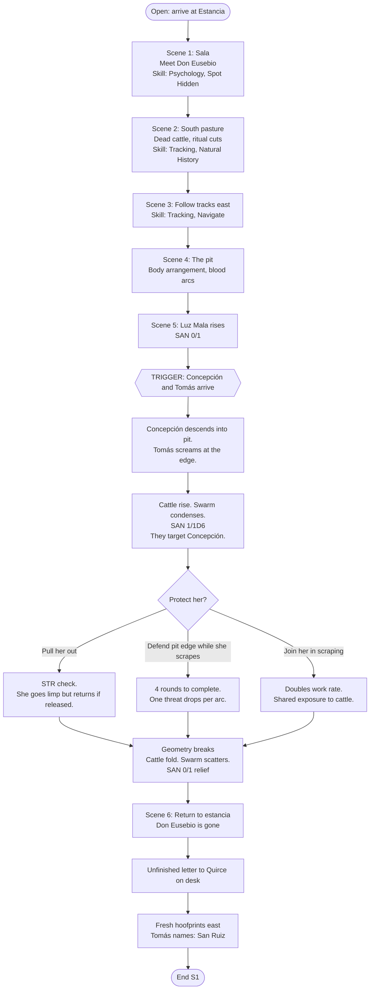
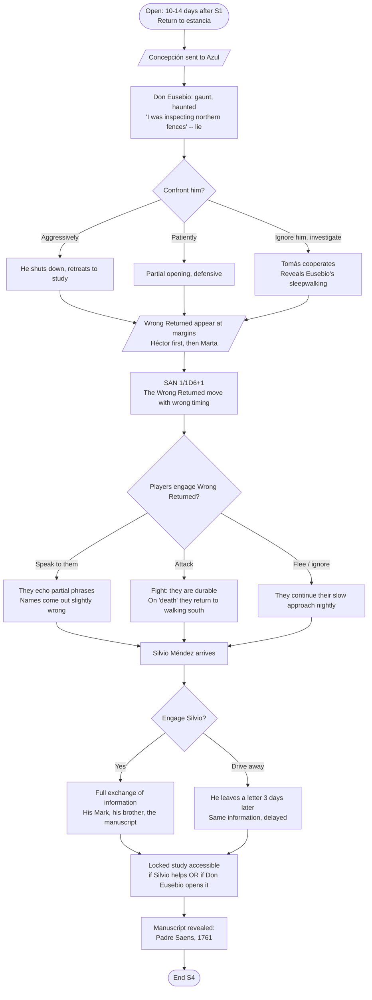
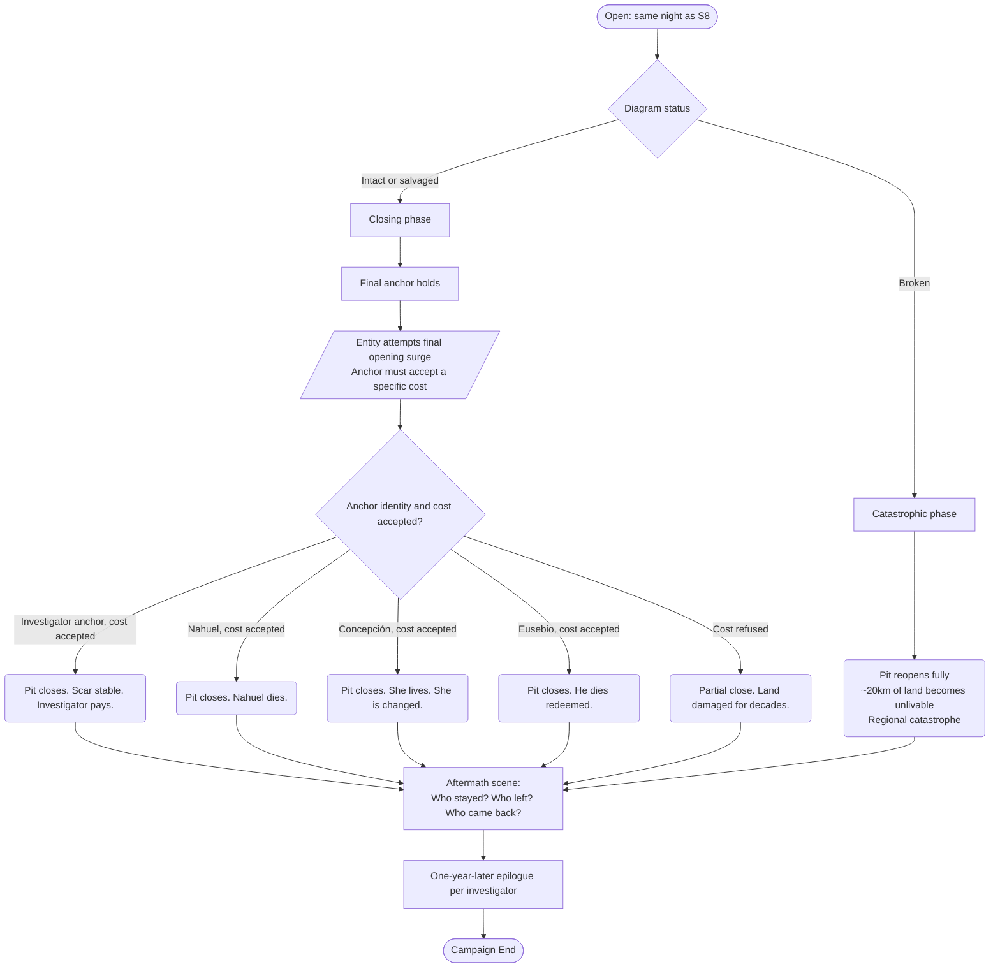

# CAMPAIGN FLOW MAP — *La Tierra Mala*
### Scene flow, decision points, branches, and ending states

This document visualizes the campaign structure. It is the Keeper's navigation tool — when players do something unexpected, consult the flow map to find which branch they are on, what recovery paths exist, and what consequences propagate.

Diagrams use Mermaid syntax (renders in GitHub, Obsidian, VSCode, and most modern markdown viewers). Tables summarize what the diagrams cannot.

---

## 0. HOW TO READ THIS DOCUMENT

**Node types in flowcharts**:
- **Rectangle** `[Scene Name]` — a scene or location the investigators pass through
- **Rounded** `(Outcome)` — a state change or new fact established
- **Diamond** `{Decision?}` — a player choice that branches the flow
- **Parallelogram** `[/NPC Action/]` — something an NPC does regardless of players
- **Hexagon** `{{Trigger}}` — mechanical event (roll, check, reveal) that gates the flow

**Arrow labels**:
- A plain arrow means the default path
- `|label|` on an arrow indicates what player action or roll result leads down that branch
- Dashed arrows `-.->` indicate information flow, not movement

---

## 1. CAMPAIGN AT A GLANCE


**Arc themes**:
| Arc | Theme | Emotional trajectory |
|---|---|---|
| 1 | Players act on bad information and learn the cost | Certainty → Doubt → Grief |
| 2 | Knowledge about the ritual turns against those who possess it | Understanding → Dread → Helplessness |
| 3 | Closing the wound requires paying a price that cannot be calculated in advance | Resolve → Sacrifice → Consequence |

---

## 2. MASTER FLOWCHART — MAJOR BRANCHES

This is the campaign's backbone. Every table will pass through these nodes in some form.

```mermaid
flowchart TD
    Start([Session 1 Opens:<br/>Investigators arrive at Estancia La Esperanza]) --> S1A[Meet Don Eusebio, Tomás, Concepción]
    S1A --> S1B[Cattle field and the pit]
    S1B --> S1C{{Concepción walks into the pit<br/>and starts breaking geometry}}
    S1C --> S1D[Awakening: cattle rise, swarm condenses,<br/>targeting Concepción]
    S1D --> S1E{Players save Concepción?}
    S1E -->|Yes, protected and rescued| S1F1(Concepción survives intact.<br/>Eusebio's S7 confession lands harder)
    S1E -->|Injured but alive| S1F2(Concepción survives wounded.<br/>Eusebio's S7 confession shifts)
    S1E -->|Dies| S1F3(Concepción dies.<br/>Eusebio's S9 role becomes grimmer)
    S1F1 & S1F2 & S1F3 --> S1G[/Don Eusebio has fled east/]
    S1G --> S1H[Letter to Quirce found on desk]
    S1H --> S2Decide{Where to next?}

    S2Decide -->|Follow Don Eusebio's trail| S2A1[Glimpse him at the ridge<br/>spying on tribal camp<br/>-- he slips them --]
    S2Decide -->|Follow old geometry trail east| S2A2[Arrive at San Ruiz directly]
    S2Decide -->|Stay at estancia| S2A3[Police runner arrives next morning:<br/>lights over San Ruiz bell tower]

    S2A1 & S2A3 --> S2A2
    S2A2 --> S2B[Rosa: the last witness]
    S2B --> S2C[The chapel and La Llorona]
    S2C --> S2D(Counter-symbols understood.<br/>False premise broken: not raids, ritual)
    S2D --> S3A[Track the tribal camp]

    S3A --> S3B[Kuyen and Nahuel]
    S3B --> S3C{Players' posture toward counter-ritual?}
    S3C -->|Observe, do not interfere| S3D1(Ritual partially succeeds.<br/>Crisis reduced but not resolved)
    S3C -->|Interfere actively| S3D2(Ritual collapses.<br/>El Sabueso manifests)
    S3C -->|Assist properly --<br/>Mythos/Occult check| S3D3(Ritual holds better.<br/>Nahuel survives intact<br/>if successful)

    S3D1 & S3D2 & S3D3 --> S3E{Anyone struck by the Hound?}
    S3E -->|Yes, survived| S3F1(Investigator(s) Marked)
    S3E -->|No| S3F2(No investigator Marked.<br/>Silvio's Mark becomes only example)

    S3F1 & S3F2 --> S4A[Return to estancia]
    S4A --> S4B[Don Eusebio: deteriorated, defensive]
    S4B --> S4C[Silvio Méndez arrives]
    S4C --> S4D{Engage Silvio?}
    S4D -->|Yes| S4E[Silvio reveals manuscript exists]
    S4D -->|Drive him away| S4F[Silvio leaves letter later]
    S4E & S4F --> S4G[/Wrong Returned appear at margins/]
    S4G --> S5A[Manuscript translated]

    S5A --> S5B[Padre Saens's regret.<br/>The cost of the opening]
    S5B --> S5C[Jesuit ruins OR Wrong Returned at estancia]
    S5C --> S5D(The eight anchors.<br/>The names of the four directions.<br/>The warning: entity wants ritual to fail at peak)
    S5D --> S6A[Aldao Quirce arrives with 3 men]
    S6A --> S6B[/Quirce coerces Don Eusebio via manuscript phrase/]
    S6B --> S6C{Players' response to Quirce?}
    S6C -->|Cooperate / negotiate| S6D1(Quirce's agenda hidden until S8)
    S6C -->|Attempt to kill Quirce| S6D2(Fight: if Quirce dies,<br/>S8 betrayal shifts to Don Eusebio)
    S6C -->|Take Don Eusebio away| S6D3(Eusebio sleepwalks to pit within 12h.<br/>Ritual location unchanged)

    S6D1 & S6D2 & S6D3 --> S7A[The Víspera:<br/>night before the ritual]
    S7A --> S7B[Don Eusebio's confession about Concepción]
    S7B --> S7C[Nahuel's revelation:<br/>entity wants closing to fail at peak pressure]
    S7C --> S7D[Silvio's insight:<br/>Quirce's diagram contains an error]
    S7D --> S7E{Who anchors the focus?}
    S7E -->|Nahuel --<br/>default| S7F1(Nahuel will likely die)
    S7E -->|Marked investigator| S7F2(Investigator faces structured<br/>CON/POW/SAN sequence in S9)
    S7E -->|Concepción<br/>if she returned| S7F3(She anchors successfully.<br/>Unique survival odds)
    S7E -->|Don Eusebio| S7F4(He dies, redeemed)

    S7F1 & S7F2 & S7F3 & S7F4 --> S8A[Ritual begins]
    S8A --> S8B{Quirce alive?}
    S8B -->|Yes| S8C1[/Quirce reveals true goal:<br/>bind entity to himself/]
    S8B -->|No| S8C2[/Entity tempts Don Eusebio<br/>to reopen outer ring/]

    S8C1 & S8C2 --> S8D{Players prevent the betrayal?}
    S8D -->|Yes| S8E(Diagram holds.<br/>Ritual continues to closing phase)
    S8D -->|No| S8F(Outer ring broken.<br/>Entity surges toward full opening)

    S8E --> S9A[Final closing phase]
    S8F --> S9B[Catastrophic failure phase]

    S9A --> S9C{Cost paid correctly?}
    S9C -->|Anchor holds, price accepted| S9D(Pit closes.<br/>Scar remains but is stable)
    S9C -->|Anchor fails, price refused| S9E(Partial close.<br/>Land damaged for decades)

    S9B --> S9F(Pit reopens at full width.<br/>Region unlivable ~20km.<br/>Regional catastrophe)

    S9D & S9E & S9F --> End([Aftermath & Epilogue])

    classDef fix fill:#2a3b2a,stroke:#4a8b4a,color:#c4f4c4
    classDef fail fill:#3b1a1a,stroke:#8b1414,color:#f4c4c4
    classDef neutral fill:#2a2a3b,stroke:#4a4a8b,color:#c4c4f4
    class S1F1,S3D3,S3F1,S7F3,S9D fix
    class S1F3,S3D2,S9F fail
    class S1F2,S3D1,S3F2,S9E neutral
```

---

## 3. PER-SESSION FLOW — SCENE LEVEL

### 3.1 Session 1 — El Contrato



**Key rolls in S1**:

| Check | When | Reward |
|---|---|---|
| Psychology on Don Eusebio | Scene 1 | He is afraid of something specific |
| Spot Hidden on Concepción | Scene 1 | Her feet are dusty and scratched |
| Natural History on cattle | Scene 2 | The cuts are geometric, not predatory |
| Tracking east of pit | Scene 3 | Tracks loop, stop, restart — not raiders |
| Cthulhu Mythos / Occult | Scene 4 | The arcs are a diagram |
| INT Hard | Scene 5 | The whole pasture is one diagram |
| Spot Hidden on rolltop desk | Scene 6 | The Quirce letter |

### 3.2 Session 2 — Las Señales


### 3.3 Session 3 — El Ritual Roto


### 3.4 Session 4 — El Patrón



### 3.5 Session 5 — El Manuscrito


### 3.6 Session 6 — El Visitante


### 3.7 Session 7 — La Víspera


### 3.8 Session 8 — La Traición

```mermaid
flowchart TD
    O8([Open: dawn at the pit]) --> A[Panels laid, anchors placed<br/>Eusebio in outer ring]
    A --> B[Kuyen opens the chant<br/>Nahuel OR investigator takes the focus]
    B --> C[Round 1-2: pressure builds]
    C --> D[Round 3: entity responds]
    D --> E{Quirce status}
    E -->|Alive| F1[/Quirce reveals true goal:<br/>bind entity to himself/<br/>Attempts to break the outer ring deliberately]
    E -->|Dead| F2[/Entity tempts Eusebio:<br/>reopen, return to prosperity/<br/>He wavers]
    F1 & F2 --> G{Prevent the betrayal?}
    G -->|Yes, via Psychology, combat, or restraint| H1(Diagram holds<br/>Ritual advances to closing phase)
    G -->|Partial, with cost| H2(Diagram damaged but salvageable<br/>Ritual much harder)
    G -->|No| H3(Outer ring breaks<br/>Entity surges toward full opening)
    H1 & H2 & H3 --> End8([End S8 → straight into S9])
```

### 3.9 Session 9 — El Cierre



---

## 4. NPC PRESENCE TIMELINE

Tracks when each NPC appears, their state, and the key interaction available that session.

| NPC | S1 | S2 | S3 | S4 | S5 | S6 | S7 | S8 | S9 |
|---|---|---|---|---|---|---|---|---|---|
| **Don Eusebio** | Host, lies, flees east | Absent | Glimpsed at ridge | Returned, deteriorated | Withdrawn to study | Coerced by Quirce | Confesses | Wavers or holds | Anchor or witness |
| **Tomás** | Foreman, fails at pit | Provides horses | — | Diminished, loyal | Reveals San Ruiz family tie | Will fight if loved | Available for S8 | Fourth combatant | Mourns or survives |
| **Concepción** | Saves everyone | Silent at estancia | Asleep | Sent to Azul | Absent | Absent | Returns unexpectedly | Present, humming | Anchors or witnesses |
| **Rosa** | — | Full scene | Referenced | Can be visited | Silver ornament may be used | — | May send message | — | Likely dying |
| **Kuyen** | — | Referenced | Central scene | Can be sought out | Translates Mapudungun | Arrives at pit | Leads preparations | Leads chant | Closes the ritual |
| **Nahuel** | — | — | Anchor of counter-ritual | — | Consulted | Arrives at pit | Reveals entity's plan | Default anchor | Likely dies |
| **Silvio Méndez** | — | — | — | Arrives | Translates Latin | Present | Warns about Quirce | Supports | Lives or sacrifices |
| **Aldao Quirce** | Named in letter | — | — | — | Letter arrives | Arrives w/ 3 men | Assembles panels | BETRAYAL | Dies or flees |
| **La Llorona / Elena** | — | Chapel scene | — | — | Journal referenced | — | — | — | — |
| **El Sabueso** | — | — | 3-round manifestation | — | — | — | — | — | — |
| **Wrong Returned** | — | — | — | At margins | Estancia or ruins | — | — | — | Resolved by ritual |
| **Padre Saens** (dream) | — | — | — | — | Possible vision | — | — | — | — |
| **Dionisia** (cook) | Background | Sister info | — | Background | — | — | — | Hides in kitchen | Alive |

---

## 5. CLUE AND ITEM PROPAGATION

Tracks how key evidence and objects flow through the campaign. An item listed in "Origin" is introduced there; "Used In" shows when it matters later.

| Item / Clue | Origin | Used In | Purpose |
|---|---|---|---|
| **Branded hide fragment** | S1 pasture | S2 (matches chapel marks), S5 (matches manuscript diagrams) | Proves unified geometry |
| **Tomás's stone** | S1 (optional gift) | S5 | Second fragment of ritual diagram |
| **Blood arcs in the pit** | S1 (partially scraped by Concepción) | S4 (re-drawn by Eusebio), S8 (final ritual) | The working surface |
| **Unfinished Quirce letter** | S1 (on desk) | S6 (Quirce's arrival explained) | Seeds the visitor |
| **Silver four-line ornament** | S2 (Rosa wears it) | S2 (may give to investigator), S3 (wards vs Hound) | Minor protective charm |
| **Elena's journal** | S2 (chapel) | S5 (cross-refs Saens dates) | Local timeline anchor |
| **Counter-symbols on doorframes** | S2 (San Ruiz) | S3 (same as ritual), S5 (match manuscript) | Proves counter-ritual lineage |
| **The Mark** | S3 (Hound strike) | S4 (partial gifts), S5 (easier manuscript reading), S7-9 (anchor eligibility) | Major mechanical thread |
| **Saens's manuscript** | S4 (locked study) | S5 (translation), S7 (diagram reference), S8 (ritual procedure) | The core object of Arc 2 |
| **Padre Saens's regret** | S5 (dream or reading) | S7 (informs Eusebio's confession), S9 (thematic close) | Emotional frame |
| **Quirce's diagram error** | S6-7 (Spot Hidden) | S8 (must be fixed before closing) | Key puzzle |
| **Aldao Quirce's true papers** | S6 (if killed) OR S8 (after betrayal) | S9 | Reveals his agenda |
| **Concepción's humming rhythm** | S1 (Keeper seeds it) | S2, S7, S9 | She is aligned — payoff in S7 |
| **The goat in the well** | S2 | Referenced in epilogue | Unexplained survivor; atmosphere |
| **Eusebio's rolltop desk letters** | S1 (or later) | S6 | Corroborates Quirce connection |
| **Dust from the pit** | S1 onward | Sensed by Rosa, Kuyen, Silvio | Running motif — the ritual follows them |

---

## 6. CRITICAL DECISION POINTS AND THEIR CONSEQUENCES

A decision-point summary the Keeper can reference mid-session when players do something that diverges from the primary flow.

### 6.1 Session 1

| Player Action | Consequence |
|---|---|
| Protect and save Concepción | She survives intact; S7 confession lands maximally; she may return to anchor in S7-9 |
| Save Concepción but she is wounded | S7 confession adjusts; she is present in S9 but cannot anchor |
| Concepción dies | Eusebio has nothing left to lose; his S9 role becomes self-sacrifice |
| Players recognize and break geometry before Concepción arrives | She arrives mid-work, joins them; work completes faster; she is not put at risk |
| Kill Tomás accidentally | S4-9 loses a potential ally; Eusebio becomes significantly more hostile |
| Burn the estancia or take aggressive action against Eusebio | S4 opens at a different location; Silvio finds them via inquiry; manuscript must be extracted from ruins |

### 6.2 Session 2

| Player Action | Consequence |
|---|---|
| Trust Rosa and listen | Full information delivered; she gives silver ornament |
| Accuse or threaten Rosa | She answers calmly; information still delivered but tighter; no ornament |
| Refuse to enter chapel | Rosa shows them Elena's journal instead; same outcome, lower SAN cost |
| Attack La Llorona | She harms one investigator; Rosa may intervene |
| Find the child's drawing in NE house | Spot Hidden reveals a circle with a stick figure standing outside — reinforces "geometry contains" theme |

### 6.3 Session 3

| Player Action | Consequence |
|---|---|
| Passive observation | Partial success; crisis reduced; no Marks received |
| Active interference | Ritual collapses; Hound manifests; likely Marks |
| Occult/Mythos assistance to outer ring | Full success; Nahuel may survive intact |
| Kidnap Nahuel | Catastrophe; camp dies; investigators carry that forward |
| Shoot Kuyen | Ritual fails; investigators become active antagonists to Kuyen's surviving people (who will not forgive them in S7-9) |
| All flee before Hound | No Marks; Silvio's Mark is the only living example in Arc 2 |

### 6.4 Session 4

| Player Action | Consequence |
|---|---|
| Kill Don Eusebio | Manuscript still accessible via study break-in; Silvio must carry more of the informational load; S7 confession lost; S8 anchor ritual harder |
| Drive Silvio away | He leaves a letter; information delayed but delivered |
| Welcome Silvio | Full alliance; translation easier; he is a dependable ally in S8 |
| Ignore Wrong Returned entirely | They continue appearing; visibility increases until they enter the estancia in S5 |
| Capture and interrogate a Wrong Returned | SAN 1/1D6 for what they say; yields partial names of entity, reveals alignment is irreversible |

### 6.5 Session 5

| Player Action | Consequence |
|---|---|
| Complete translation | Best-case entry into S6 |
| Partial translation | S6-9 rolls slightly harder; some checks become Hard |
| Burn manuscript | Closing becomes improvisation; worst-case success is "survived, land damaged" |
| Solo night read | Dream sequence; extra insight; 1/1D10 SAN |
| Take manuscript to ruins | Wrong Returned ambush; atmospheric but same info |

### 6.6 Session 6

| Player Action | Consequence |
|---|---|
| Cooperate with Quirce | Default path; betrayal occurs in S8 |
| Kill Quirce in S6 | Betrayal vector shifts to Eusebio; Quirce's papers yield early agenda reveal |
| Take Eusebio away from the pit | He sleepwalks back within 12h; same outcome, delayed |
| Refuse to proceed to pit at all | Entity pulls Eusebio anyway; investigators may arrive late to find ritual underway without them |

### 6.7 Session 7

| Player Action | Consequence |
|---|---|
| Catch Quirce's diagram error | S8 begins clean; betrayal is non-diagram; ritual can close |
| Miss it; Silvio's safety-net check | Can still be caught at start of S8 |
| Miss both | S8 begins with corrupted diagram; ritual will fail unless detected mid-sequence |
| Nahuel anchors (default) | He dies in S9 |
| Investigator anchors | Structured sequence in S9; survival possible, scarring permanent |
| Concepción anchors | Best survival odds for her; worst consequence if it fails (she is young, an anchor failure on her is lethal and changes her irreversibly) |
| Eusebio anchors | He dies; it is his arc's end |

### 6.8 Session 8

| Player Action | Consequence |
|---|---|
| Prevent betrayal cleanly | Path to S9 intact |
| Prevent with injury | Diagram damaged; S9 harder but closing possible |
| Fail to prevent | Outer ring breaks; S9 is catastrophic phase |
| Kill Eusebio mid-ritual | If he was anchor: immediate collapse; if he was only in outer ring: tolerable loss |
| Kill Quirce mid-ritual | If after betrayal attempt: neutral; if before: his men respond violently |

### 6.9 Session 9

| Player Action | Consequence |
|---|---|
| Anchor accepts specific cost | Full close |
| Anchor refuses cost | Partial close; land damaged |
| Anchor dies mid-acceptance | Partial close; cost not fully paid but entity receded |
| All investigators flee | Catastrophic failure; region lost |

---

## 7. ENDING STATE MATRIX

The campaign has no single ending. These are the reachable end-states, ordered by "completeness of closing." A given table's ending is a combination of: *pit closed or not*, *who survived*, *what was paid*.

### 7.1 Pit closure tier

| Tier | Result | Path |
|---|---|---|
| **A. Full close** | Pit sealed; scar stable; region recoverable in 10–20 years | Diagram intact in S8; anchor holds in S9; cost accepted |
| **B. Partial close** | Pit contained but leaking; 5-10km of surrounding land unfarmable for decades | Diagram damaged but salvaged; anchor holds with loss; cost partial |
| **C. Held but not closed** | Pit paused; will reopen in 5-15 years barring return expedition | Ritual aborted mid-sequence; investigators escaped |
| **D. Catastrophic failure** | Pit fully open; ~20km unlivable; regional depopulation | Diagram broken in S8; no recovery |

### 7.2 Who survives

For each significant NPC, survival depends on combined actions across the campaign. This is not fully deterministic — the Keeper has latitude — but these are the default outcomes by tier:

| NPC | Default outcome at A | at B | at C | at D |
|---|---|---|---|---|
| Don Eusebio | Dies redeemed (anchor) OR survives diminished | Dies | Survives but broken | Dies |
| Tomás | Survives | Survives wounded | Survives | Dies or flees |
| Concepción | Survives, changed | Survives, changed | Survives, restored over time | Dies or is taken |
| Nahuel | Dies (default anchor) or survives if investigators anchored | Dies | Survives but damaged | Dies |
| Kuyen | Survives | Survives, mourning | Survives, furious | Dies with the ritual |
| Silvio | Survives | Survives | Survives | Dies |
| Rosa | Dies of old age within the year | Dies within the year | Dies within the year | Dies during catastrophe |
| Quirce | Dies or flees | Dies | Escapes | Escapes, becomes future antagonist |

### 7.3 Cost paid (thematic closure)

Every full-tier closing demands a specific, named cost. Pre-identify one per investigator before Session 9. Suggestions:

| Investigator concept | Possible costs |
|---|---|
| A family person | A specific family member's name can no longer be spoken aloud without a Luck check |
| A scholar | A specific field of knowledge is now permanently inaccessible; trying to recall it causes 1D3 SAN |
| A combatant | A specific limb never recovers full sensation; minor Combat penalty forever |
| A religious investigator | Faith is lost or transformed; prayers have weight they did not before, in a way that is not comforting |
| An outsider / newcomer | Cannot return to their city of origin; doors that were open to them now close |

Every Marked investigator ends the campaign with a permanent sensory alteration: angles look slightly wrong; certain geometries cause mild nausea.

---

## 8. FAILURE STATE RECOVERY — WHEN THINGS GO WRONG MID-CAMPAIGN

Some tables will break the flow in ways the primary branches cannot easily accommodate. Use these recovery paths:

### 8.1 Investigators refuse to engage the pit entirely

**Symptom**: After S1 or S2, the group decides the situation is someone else's problem and attempts to leave the region.

**Recovery**: One of them starts walking south at night (the Mark of geography, not the Hound's mark — the land claims them now that they have stood on its wound). They must return to close it or the alignment deepens. A sympathetic NPC — Rosa if still alive, Silvio otherwise — can articulate this. If the players still refuse, the campaign ends early with Tier D.

### 8.2 TPK mid-campaign

**Symptom**: All investigators die before S9.

**Recovery**: Option A — Kuyen and her surviving people attempt the closing alone; narrate as an epilogue with Tier C outcome. Option B — a new investigator group is introduced at the start of the next session (the Buenos Aires authorities sent a second party after the first did not report back); they inherit S4+ clues from the dead group's belongings.

### 8.3 Key NPC dies too early

**Symptom**: Don Eusebio, Silvio, or Nahuel dies before their intended session.

**Recovery matrix**:
- **Eusebio dies pre-S7**: Concepción can carry the opening's memory (she has been Mark-adjacent to it); her S7 scene becomes a rewritten confession-in-her-own-words
- **Silvio dies pre-S7**: Kuyen can identify Quirce's diagram error; Spot Hidden on any investigator using Cthulhu Mythos can catch it
- **Nahuel dies pre-S7**: Kuyen volunteers as anchor herself; she is older and less aligned, so the ritual is riskier but viable

### 8.4 Campaign running too long

**Symptom**: After the sixth table session, the group is only finishing S4 or S5.

**Recovery**: Merge S5 and S6. The manuscript reading happens in the same session as Quirce's arrival; Quirce's men interrupt the translation mid-scene. This compresses Arc 2 into two sessions and preserves Arc 3's pacing.

### 8.5 Campaign running too short

**Symptom**: The group is burning through material and wants more. After S3, they are ready for Arc 2.

**Recovery**: Insert an interstitial session ("S3.5 — La Vuelta") set during the journey back to the estancia. Wrong Returned encounters in the dark. A failed rural police outpost. A second survivor of the tribal ritual who joins them. Gives the Keeper room to deepen characters without stretching the main plot.

---

## 9. FILE MAP

How the flow map relates to other reference documents:

- **REF-CampaignReview.md** — narrative review, plot-hole fixes, alternate paths in prose
- **REF-NPCs.md** — full NPC dossiers (voices, motivations, key lines)
- **REF-FlowMap.md** — THIS FILE — structural flow and decision tree
- **Session-01-ElContrato.md** through **Session-09-ElCierre.md** — per-session keeper notes

Consult the flow map for *structure*. Consult the review for *why*. Consult the NPC reference for *how to play them*. Consult the session notes for *what to say*.

---

*End of Flow Map.*
