# CAMPAIGN FLOW MAP — *La Tierra Mala*
### Scene flow, decision points, branches, and ending states

This document visualizes the campaign structure. It is the Keeper's navigation tool — when players do something unexpected, consult the flow map to find which branch they are on, what recovery paths exist, and what consequences propagate.

Diagrams use Mermaid syntax (renders in GitHub, Obsidian, VSCode, and most modern markdown viewers). Tables summarize what the diagrams cannot.

---

## 0. HOW TO READ THIS DOCUMENT

**Node types in flowcharts**:
- **Rectangle** `[Scene Name]` — a scene or location the investigators pass through
- **Rounded** `(Outcome)` — a state change or new fact established
- **Diamond** `{Decision?}` — a player choice that branches the flow
- **Parallelogram** `[/NPC Action/]` — something an NPC does regardless of players
- **Hexagon** `{{Trigger}}` — mechanical event (roll, check, reveal) that gates the flow

**Arrow labels**:
- A plain arrow means the default path
- `|label|` on an arrow indicates what player action or roll result leads down that branch
- Dashed arrows `-.->` indicate information flow, not movement

---

## 1. CAMPAIGN AT A GLANCE

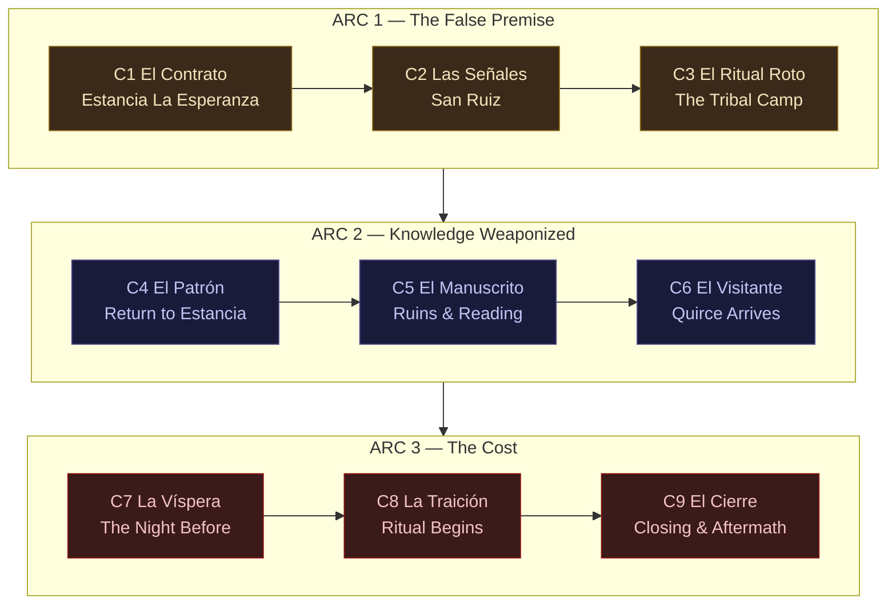

**Arc themes**:
| Arc | Theme | Emotional trajectory |
|---|---|---|
| 1 | Players act on bad information and learn the cost | Certainty → Doubt → Grief |
| 2 | Knowledge about the ritual turns against those who possess it | Understanding → Dread → Helplessness |
| 3 | Closing the wound requires paying a price that cannot be calculated in advance | Resolve → Sacrifice → Consequence |

---

## 2. MASTER FLOWCHART — MAJOR BRANCHES

This is the campaign's backbone. Every table will pass through these nodes in some form.

```mermaid
flowchart TD
    Start([Chapter 1 Opens:<br/>Investigators arrive at Estancia La Esperanza]) --> S1A[Meet Don Eusebio, Tomás, Concepción]
    S1A --> S1B[Cattle field and the pit]
    S1B --> S1C{{Concepción walks into the pit<br/>and starts breaking geometry}}
    S1C --> S1D[Awakening: cattle rise, swarm condenses,<br/>targeting Concepción]
    S1D --> S1E{Players save Concepción?}
    S1E -->|Yes, protected and rescued| S1F1(Concepción survives intact.<br/>Eusebio's C7 confession lands harder)
    S1E -->|Injured but alive| S1F2(Concepción survives wounded.<br/>Eusebio's C7 confession shifts)
    S1E -->|Dies| S1F3(Concepción dies.<br/>Eusebio's C9 role becomes grimmer)
    S1F1 & S1F2 & S1F3 --> S1G[/Don Eusebio has fled east/]
    S1G --> S1H[Letter to Quirce found on desk]
    S1H --> S2Decide{Where to next?}

    S2Decide -->|Follow Don Eusebio's trail| S2A1[Glimpse him at the ridge<br/>spying on tribal camp<br/>-- he slips them --]
    S2Decide -->|Follow old geometry trail east| S2A2[Arrive at San Ruiz directly]
    S2Decide -->|Stay at estancia| S2A3[Police runner arrives next morning:<br/>lights over San Ruiz bell tower]

    S2A1 & S2A3 --> S2A2
    S2A2 --> S2B[Rosa: the last witness]
    S2B --> S2C[The chapel and La Llorona]
    S2C --> S2D(Counter-symbols understood.<br/>False premise broken: not raids, ritual)
    S2D --> S3A[Track the tribal camp]

    S3A --> S3B[Kuyen and Nahuel]
    S3B --> S3C{Players' posture toward counter-ritual?}
    S3C -->|Observe, do not interfere| S3D1(Ritual partially succeeds.<br/>Crisis reduced but not resolved)
    S3C -->|Interfere actively| S3D2(Ritual collapses.<br/>El Sabueso manifests)
    S3C -->|Assist properly --<br/>Mythos/Occult check| S3D3(Ritual holds better.<br/>Nahuel survives intact<br/>if successful)

    S3D1 & S3D2 & S3D3 --> S3E{Anyone struck by the Hound?}
    S3E -->|Yes, survived| S3F1(Investigator(s) Marked)
    S3E -->|No| S3F2(No investigator Marked.<br/>Silvio's Mark becomes only example)

    S3F1 & S3F2 --> S4A[Return to estancia]
    S4A --> S4B[Don Eusebio: deteriorated, defensive]
    S4B --> S4C[Silvio Méndez arrives]
    S4C --> S4D{Engage Silvio?}
    S4D -->|Yes| S4E[Silvio reveals manuscript exists]
    S4D -->|Drive him away| S4F[Silvio leaves letter later]
    S4E & S4F --> S4G[/Wrong Returned appear at margins/]
    S4G --> S5A[Manuscript translated]

    S5A --> S5B[Padre Saens's regret.<br/>The cost of the opening]
    S5B --> S5C[Jesuit ruins OR Wrong Returned at estancia]
    S5C --> S5D(The eight anchors.<br/>The names of the four directions.<br/>The warning: entity wants ritual to fail at peak)
    S5D --> S6A[Aldao Quirce arrives with 3 men]
    S6A --> S6B[/Quirce coerces Don Eusebio via manuscript phrase/]
    S6B --> S6C{Players' response to Quirce?}
    S6C -->|Cooperate / negotiate| S6D1(Quirce's agenda hidden until C8)
    S6C -->|Attempt to kill Quirce| S6D2(Fight: if Quirce dies,<br/>C8 betrayal shifts to Don Eusebio)
    S6C -->|Take Don Eusebio away| S6D3(Eusebio sleepwalks to pit within 12h.<br/>Ritual location unchanged)

    S6D1 & S6D2 & S6D3 --> S7A[The Víspera:<br/>night before the ritual]
    S7A --> S7B[Don Eusebio's confession about Concepción]
    S7B --> S7C[Nahuel's revelation:<br/>entity wants closing to fail at peak pressure]
    S7C --> S7D[Silvio's insight:<br/>Quirce's diagram contains an error]
    S7D --> S7E{Who anchors the focus?}
    S7E -->|Nahuel --<br/>default| S7F1(Nahuel will likely die)
    S7E -->|Marked investigator| S7F2(Investigator faces structured<br/>CON/POW/SAN sequence in C9)
    S7E -->|Concepción<br/>if she returned| S7F3(She anchors successfully.<br/>Unique survival odds)
    S7E -->|Don Eusebio| S7F4(He dies, redeemed)

    S7F1 & S7F2 & S7F3 & S7F4 --> S8A[Ritual begins]
    S8A --> S8B{Quirce alive?}
    S8B -->|Yes| S8C1[/Quirce reveals true goal:<br/>bind entity to himself/]
    S8B -->|No| S8C2[/Entity tempts Don Eusebio<br/>to reopen outer ring/]

    S8C1 & S8C2 --> S8D{Players prevent the betrayal?}
    S8D -->|Yes| S8E(Diagram holds.<br/>Ritual continues to closing phase)
    S8D -->|No| S8F(Outer ring broken.<br/>Entity surges toward full opening)

    S8E --> S9A[Final closing phase]
    S8F --> S9B[Catastrophic failure phase]

    S9A --> S9C{Cost paid correctly?}
    S9C -->|Anchor holds, price accepted| S9D(Pit closes.<br/>Scar remains but is stable)
    S9C -->|Anchor fails, price refused| S9E(Partial close.<br/>Land damaged for decades)

    S9B --> S9F(Pit reopens at full width.<br/>Region unlivable ~20km.<br/>Regional catastrophe)

    S9D & S9E & S9F --> End([Aftermath & Epilogue])

    classDef fix fill:#2a3b2a,stroke:#4a8b4a,color:#c4f4c4
    classDef fail fill:#3b1a1a,stroke:#8b1414,color:#f4c4c4
    classDef neutral fill:#2a2a3b,stroke:#4a4a8b,color:#c4c4f4
    class S1F1,S3D3,S3F1,S7F3,S9D fix
    class S1F3,S3D2,S9F fail
    class S1F2,S3D1,S3F2,S9E neutral
```

---

## 3. PER-CHAPTER FLOW — SCENE LEVEL

### 3.1 Chapter 1 — El Contrato


**Key rolls in C1**:

| Check | When | Reward |
|---|---|---|
| Psychology on Don Eusebio | Scene 1 | He is afraid of something specific |
| Spot Hidden on Concepción | Scene 1 | Her feet are dusty and scratched |
| Natural History on cattle | Scene 2 | The cuts are geometric, not predatory |
| Tracking east of pit | Scene 3 | Tracks loop, stop, restart — not raiders |
| Cthulhu Mythos / Occult | Scene 4 | The arcs are a diagram |
| INT Hard | Scene 5 | The whole pasture is one diagram |
| Spot Hidden on rolltop desk | Scene 6 | The Quirce letter |

### 3.2 Chapter 2 — Las Señales

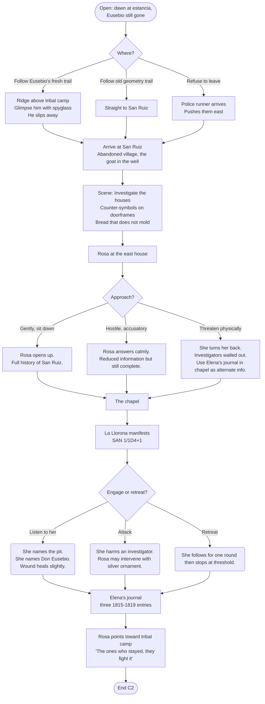

### 3.3 Chapter 3 — El Ritual Roto

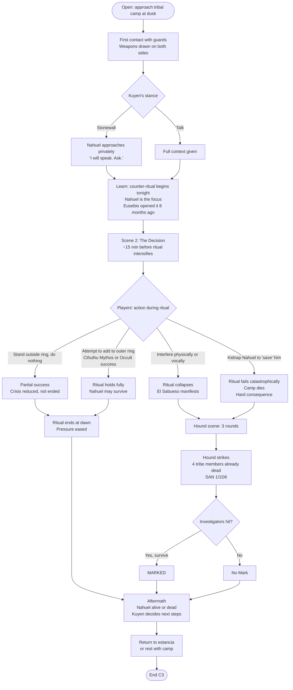

### 3.4 Chapter 4 — El Patrón

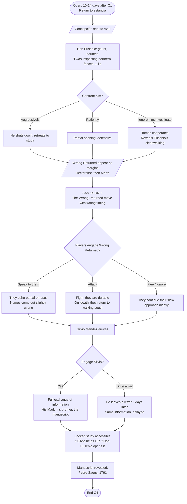

### 3.5 Chapter 5 — El Manuscrito

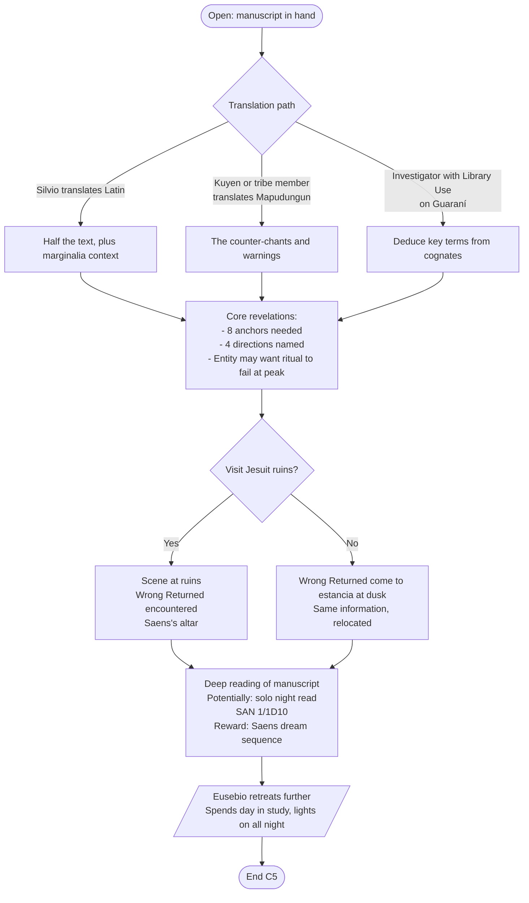

### 3.6 Chapter 6 — El Visitante

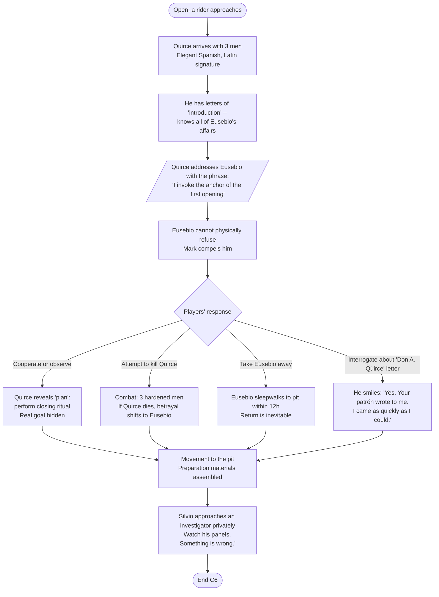

### 3.7 Chapter 7 — La Víspera

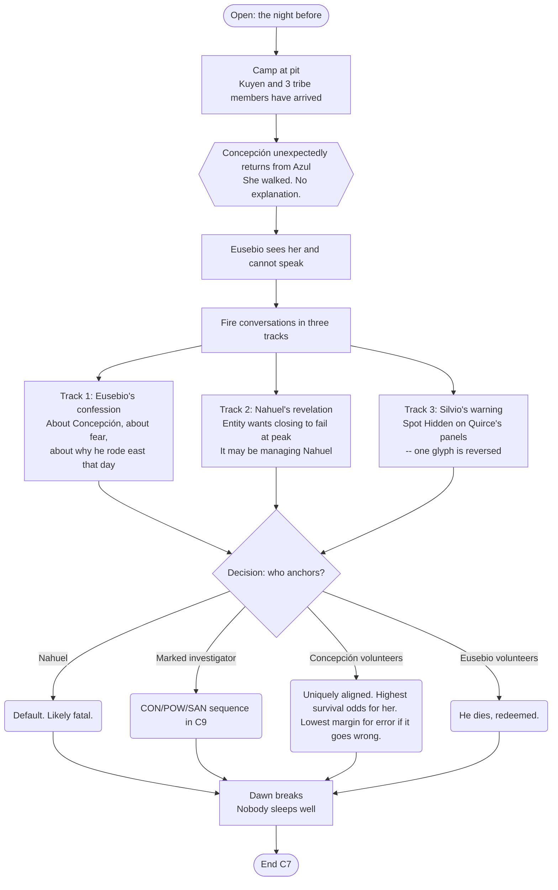

### 3.8 Chapter 8 — La Traición

```mermaid
flowchart TD
    O8([Open: dawn at the pit]) --> A[Panels laid, anchors placed<br/>Eusebio in outer ring]
    A --> B[Kuyen opens the chant<br/>Nahuel OR investigator takes the focus]
    B --> C[Round 1-2: pressure builds]
    C --> D[Round 3: entity responds]
    D --> E{Quirce status}
    E -->|Alive| F1[/Quirce reveals true goal:<br/>bind entity to himself/<br/>Attempts to break the outer ring deliberately]
    E -->|Dead| F2[/Entity tempts Eusebio:<br/>reopen, return to prosperity/<br/>He wavers]
    F1 & F2 --> G{Prevent the betrayal?}
    G -->|Yes, via Psychology, combat, or restraint| H1(Diagram holds<br/>Ritual advances to closing phase)
    G -->|Partial, with cost| H2(Diagram damaged but salvageable<br/>Ritual much harder)
    G -->|No| H3(Outer ring breaks<br/>Entity surges toward full opening)
    H1 & H2 & H3 --> End8([End C8 → straight into C9])
```

### 3.9 Chapter 9 — El Cierre

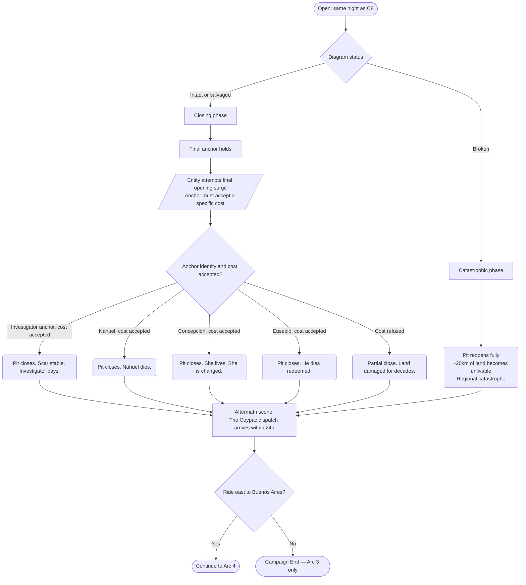

### 3.10 Chapter 10 — La Llegada

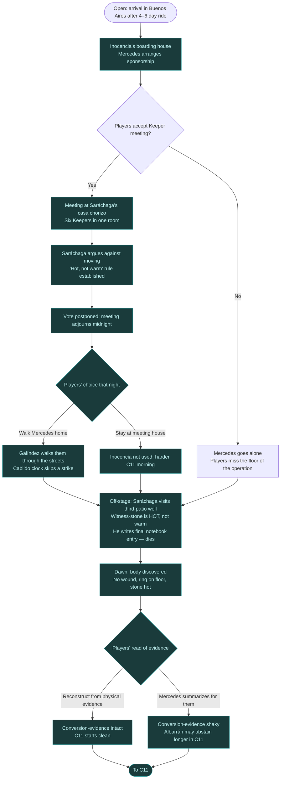

### 3.11 Chapter 11 — La Decisión

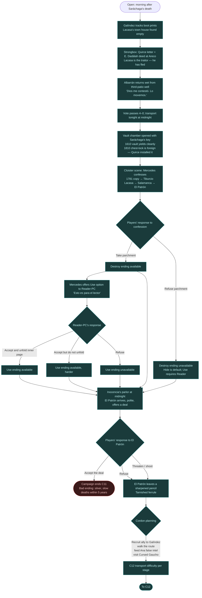

### 3.12 Chapter 12 — El Libro

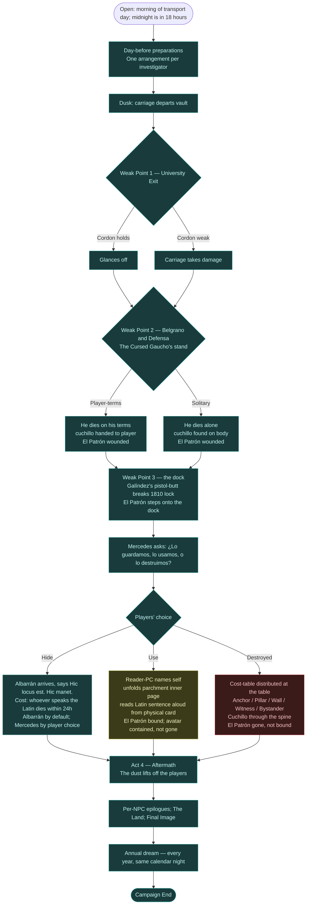

---

## 4. NPC PRESENCE TIMELINE

Tracks when each NPC appears, their state, and the key interaction available that chapter.

### 4.1 Arc 1–3 NPCs (C1–C9; carry-over to C10–C12 noted)

| NPC | C1 | C2 | C3 | C4 | C5 | C6 | C7 | C8 | C9 | C10–C12 |
|---|---|---|---|---|---|---|---|---|---|---|
| **Don Eusebio** | Host, lies, flees east | Absent | Glimpsed at ridge | Returned, deteriorated | Withdrawn to study | Coerced by Quirce | Confesses | Wavers or holds | Anchor or witness | Optional Buenos Aires anchor (Hide) |
| **Tomás** | Foreman, fails at pit | Provides horses | — | Diminished, loyal | Reveals San Ruiz family tie | Will fight if loved | Available for C8 | Fourth combatant | Mourns or survives | Stays at La Esperanza; holds the home |
| **Concepción** | Saves everyone | Silent at estancia | Asleep | Sent to Azul | Absent | Absent | Returns unexpectedly | Present, humming | Anchors or witnesses | Stays at La Esperanza; epilogue per ending |
| **Rosa** | — | Full scene | Referenced | Can be visited | Silver ornament may be used | — | May send message | — | Likely dying | If alive: returns ornament to Mercedes |
| **Kuyen** | — | Referenced | Central scene | Can be sought out | Translates Mapudungun | Arrives at pit | Leads preparations | Leads chant | Closes the ritual | If alive: rides east; architect of the city cordon |
| **Nahuel** | — | — | Anchor of counter-ritual | — | Consulted | Arrives at pit | Reveals entity's plan | Default anchor | Likely dies | If alive: rides east as co-anchor |
| **Silvio Méndez** | — | — | — | Arrives | Translates Latin | Present | Warns about Quirce | Supports | Lives or sacrifices | If alive: stays at La Esperanza; mentioned in letters |
| **Aldao Quirce** | Named in letter | — | — | — | Letter arrives | Arrives w/ 3 men | Assembles panels | BETRAYAL | Dies or flees | If alive: off-stage; turns Ana via correspondence; one C11 letter |
| **La Llorona / Elena** | — | Chapel scene | — | — | Journal referenced | — | — | — | — | — |
| **El Sabueso** | — | — | 3-round manifestation | — | — | — | — | — | — | — |
| **Wrong Returned (Héctor & Marta)** | — | — | — | At margins | Estancia or ruins | Outer ring | At camp | Anchor outer ring | Resolved by ritual | If alive: travel with party; possible final-binding anchors |
| **Padre Saens** (dream) | — | — | — | — | Possible vision | — | — | — | — | — |
| **Dionisia** (cook) | Background | Sister info | — | Background | — | — | — | Hides in kitchen | Alive | Stays at the estancia |

### 4.2 Arc 4 NPCs (C10–C12; introductions earlier where applicable)

| NPC | C1–C3 | C4 | C5 | C6 | C7 | C8 | C9 | C10 | C11 | C12 |
|---|---|---|---|---|---|---|---|---|---|---|
| **Doña Mercedes Solís** | — | Letter | Reply (confirms Necronomicón) | Second letter (names vault) | Arrives in person; embraces Kuyen | Names book + city at phase break | Carries Coypac dispatch east | Sponsors players; brings them to meeting | Confesses 1781 copy; gives parchment | At dock; calls choice; pays cost per ending |
| **Don Eladio Saráchaga** | — | — | — | — | — | — | Named in runner letter | Hosts meeting; argues against; dies at well | Posthumous: notebook converts Keepers | Posthumous: his Latin form spoken by Albarrán |
| **Padre Ramón Albarrán** | — | — | — | — | — | — | — | At meeting; prays; abstains | Returns wet from well: *"Lo movemos."*; cordon plan | At Belgrano/Defensa; sprints to dock (Hide); says *Hic manet* |
| **Captain Juan Pablo Galíndez** | — | — | — | — | — | — | — | At meeting; argues operational floor; walks players home | Tracks Lacasa boots; coordinates heist | Drives/escorts; breaks 1810 lock; buries El Patrón |
| **Ana Bermúdez** | — | — | — | — | — | — | — | Meeting secretary; translates shorthand | Confronted; confesses; may feed Quirce false intel | At cordon if trusted; under guard if not |
| **Inocencia Vallejos** | — | — | — | — | — | — | — | Houses players; asks no questions | Sleeps through El Patrón's parlor visit | Holds the boarding house; bread on the table |
| **Capitán Ettore Borghi** | — | — | — | — | — | — | — | — | Recruited; brig anchored | At dock with four oarsmen; sails at dawn |
| **Don Bartolomé Lacasa** | — | — | — | — | — | — | — | The empty chair at meeting | Town house empty; spurred boots; fled to Areco | Off-stage; sequel hook |
| **The Cursed Gaucho** | — | — | — | — | Arrives uninvited at camp | Outer ring; breaks formation | Rides west to hunt 12 priests | At Riachuelo tannery | Asks for terms; *cuchillo* as collateral | Stand on Belgrano; wounds El Patrón; dies |
| **Saúl Carrasco** | — | — | — | — | Sent west by Mercedes | Possible Coypac intel | Returns with hand-copy + alignment | Possible deathbed line at Inocencia's | — | — |
| **El Patrón / Don Eligio Dadálah** | *Hand* | *Hand* (manuscript placement) | — | *Voice through Quirce* (named) | *Named by Cursed Gaucho* | Briefly visible at western edge | — | Carriage at Florida and San Martín; window flickers | In Inocencia's parlor at midnight; the deal | Full presence at dock; ended (Use/Destroyed) or withdrawn (Hide) |

---

## 5. CLUE AND ITEM PROPAGATION

Tracks how key evidence and objects flow through the campaign. An item listed in "Origin" is introduced there; "Used In" shows when it matters later.

| Item / Clue | Origin | Used In | Purpose |
|---|---|---|---|
| **Branded hide fragment** | C1 pasture | C2 (matches chapel marks), C5 (matches manuscript diagrams) | Proves unified geometry |
| **Tomás's stone** | C1 (optional gift) | C5 | Second fragment of ritual diagram |
| **Blood arcs in the pit** | C1 (partially scraped by Concepción) | C4 (re-drawn by Eusebio), C8 (final ritual) | The working surface |
| **Unfinished Quirce letter** | C1 (on desk) | C6 (Quirce's arrival explained) | Seeds the visitor |
| **Silver four-line ornament** | C2 (Rosa wears it) | C2 (may give to investigator), C3 (wards vs Hound) | Minor protective charm |
| **Elena's journal** | C2 (chapel) | C5 (cross-refs Saens dates) | Local timeline anchor |
| **Counter-symbols on doorframes** | C2 (San Ruiz) | C3 (same as ritual), C5 (match manuscript) | Proves counter-ritual lineage |
| **The Mark** | C3 (Hound strike) | C4 (partial gifts), C5 (easier manuscript reading), C7-9 (anchor eligibility) | Major mechanical thread |
| **Saens's manuscript** | C4 (locked study) | C5 (translation), C7 (diagram reference), C8 (ritual procedure) | The core object of Arc 2 |
| **Padre Saens's regret** | C5 (dream or reading) | C7 (informs Eusebio's confession), C9 (thematic close) | Emotional frame |
| **Quirce's diagram error** | C6-7 (Spot Hidden) | C8 (must be fixed before closing) | Key puzzle |
| **Aldao Quirce's true papers** | C6 (if killed) OR C8 (after betrayal) | C9 | Reveals his agenda |
| **Concepción's humming rhythm** | C1 (Keeper seeds it) | C2, C7, C9 | She is aligned — payoff in C7 |
| **The goat in the well** | C2 | C8 (still there), C9 (six pupils — Marked PC sight), C12 epilogue (per ending) | Atmospheric runner; campaign-spanning witness |
| **Eusebio's rolltop desk letters** | C1 (or later) | C6 | Corroborates Quirce connection |
| **Dust from the pit** | C1 onward | C2 (Rosa), C3 (Kuyen), C4 (Silvio + ranch hands), C7 (Mercedes), C10 (Inocencia's tin), C11 (Mercedes archives a paper), **C12 (lifts off)** | Running motif — the ritual follows them, then releases |
| **The low vibration** | C1 onward | C2 (chapel), C3 (creek bed), C4–C6 (study), C7–C8 (peak at C8), **C9 (silent for first time)**, C10–C11 (faint return; teeth in vault), **C12 (resolves per ending)** | The entity's baseline; awareness is protective |

### 5.1 Arc 4 specific items and clues

| Item / Clue | Origin | Used In | Purpose |
|---|---|---|---|
| **Coypac dispatch + hand-copied alignment** | C9 (Saúl arrives within 24h of closing) | C10 (justifies the ride east) | Bridges Arc 3 → Arc 4; names Manzana de las Luces |
| **Saráchaga's iron Keeper-ring** | C10 evening (on his finger) | C10 dawn (on the floor where he tore it off) | Evidence that the contact at the well burned him |
| **Saráchaga's witness-stone** | C10 (third-patio well) | C10 dawn (still hot to the touch) | Proves the *"hot, not warm"* threshold; converts the Keepers |
| **Saráchaga's shorthand notebook** | C10 evening | C10 dawn (Ana translates final entry) | Final entry: *"Caliente, no tibia. Mercedes tenía razón. Movámoslo."* — single-source vote-flip |
| **Lacasa's spurred boot prints** | C10 dawn (third patio) | C11 morning (back door of his town house) | Lacasa as delivery vehicle |
| **Quirce's letter to Lacasa** | C11 (in Lacasa's strongbox) | C11 (confirms turn), C12 (sequel hook) | Confirms Quirce–Lacasa–El Patrón chain |
| **The *E. Dadálah* deed at Areco** | C11 (in Lacasa's strongbox) | C11 (proof) | Proves Lacasa was paid in property |
| **Mercedes's folded parchment** | C11 cloister (Mercedes hands it to the Reader-PC) | C12 (Destroy ending uses outer page; Use ending unfolds inner page) | The campaign's most consequential physical handout |
| **The Latin sentence card** *(GM physical handout)* | C12 dock (Reader-PC reads aloud) | C12 only | The single line: *"Hic vincio nomen tuum loco. Hic vincio locum nomini tuo. Verbum dico, et iam dictum est."* — the binding act |
| **The 1610 vault key** | C10 (on Saráchaga's belt) | C11 (opens the vault chamber cleanly) | The *Jesuit* lock — yields to its owner |
| **The 1810 chest-lock** | C11 (revealed when chamber opens) | C12 (Galíndez's pistol-butt breaks it at the dock) | The *Quirce* lock — installed to fool the Keepers; foreign work |
| **The Cursed Gaucho's *cuchillo de campo*** | C11 (handed to a player as collateral) | C12 (the only blade that can wound El Patrón) | Three-generation knife; Destroy ending's killing blade |
| **Mercedes's substitute *facón*** | C12 (only if *cuchillo* is unavailable) | C12 (Destroy ending) | Keeper-blade consecrated by Saráchaga's predecessor in 1796; one-time use |
| **El Patrón's sharpened pencil** | C11 (left on a chair at Inocencia's) | Atmospheric only | Tarnished brass ferrule; the *tarnished copper* runner's clearest beat |
| **Albarrán's oil lamp + Bible + hammer** | C12 (he sprints to the dock with all three) | C12 Hide ending only | The Catholic surface of the new vault binding |
| **Tiburcio Lacasa's notebook fragments** *(off-stage)* | Pre-campaign (1812 inheritance) | C11 (Mercedes names the chain) | Explanatory: how Mercedes's 1781 copy reached the cult |
| **Inocencia's tin of dust** | C11 morning (kitchen doorstep) | C12 morning (empty in the morning) | Quiet payoff for the dust runner; Inocencia does not understand it |
| **Rosa's silver four-line ornament** | C2 (Rosa gives it) | C3 (vs Hound), C9 (returned to Mercedes per ending) | The folk-art counter-binding; campaign-spanning charm |

---

## 6. CRITICAL DECISION POINTS AND THEIR CONSEQUENCES

A decision-point summary the Keeper can reference mid-chapter when players do something that diverges from the primary flow.

### 6.1 Chapter 1

| Player Action | Consequence |
|---|---|
| Protect and save Concepción | She survives intact; C7 confession lands maximally; she may return to anchor in C7-9 |
| Save Concepción but she is wounded | C7 confession adjusts; she is present in C9 but cannot anchor |
| Concepción dies | Eusebio has nothing left to lose; his C9 role becomes self-sacrifice |
| Players recognize and break geometry before Concepción arrives | She arrives mid-work, joins them; work completes faster; she is not put at risk |
| Kill Tomás accidentally | C4-9 loses a potential ally; Eusebio becomes significantly more hostile |
| Burn the estancia or take aggressive action against Eusebio | C4 opens at a different location; Silvio finds them via inquiry; manuscript must be extracted from ruins |

### 6.2 Chapter 2

| Player Action | Consequence |
|---|---|
| Trust Rosa and listen | Full information delivered; she gives silver ornament |
| Accuse or threaten Rosa | She answers calmly; information still delivered but tighter; no ornament |
| Refuse to enter chapel | Rosa shows them Elena's journal instead; same outcome, lower SAN cost |
| Attack La Llorona | She harms one investigator; Rosa may intervene |
| Find the child's drawing in NE house | Spot Hidden reveals a circle with a stick figure standing outside — reinforces "geometry contains" theme |

### 6.3 Chapter 3

| Player Action | Consequence |
|---|---|
| Passive observation | Partial success; crisis reduced; no Marks received |
| Active interference | Ritual collapses; Hound manifests; likely Marks |
| Occult/Mythos assistance to outer ring | Full success; Nahuel may survive intact |
| Kidnap Nahuel | Catastrophe; camp dies; investigators carry that forward |
| Shoot Kuyen | Ritual fails; investigators become active antagonists to Kuyen's surviving people (who will not forgive them in C7-9) |
| All flee before Hound | No Marks; Silvio's Mark is the only living example in Arc 2 |

### 6.4 Chapter 4

| Player Action | Consequence |
|---|---|
| Kill Don Eusebio | Manuscript still accessible via study break-in; Silvio must carry more of the informational load; C7 confession lost; C8 anchor ritual harder |
| Drive Silvio away | He leaves a letter; information delayed but delivered |
| Welcome Silvio | Full alliance; translation easier; he is a dependable ally in C8 |
| Ignore Wrong Returned entirely | They continue appearing; visibility increases until they enter the estancia in C5 |
| Capture and interrogate a Wrong Returned | SAN 1/1D6 for what they say; yields partial names of entity, reveals alignment is irreversible |

### 6.5 Chapter 5

| Player Action | Consequence |
|---|---|
| Complete translation | Best-case entry into C6 |
| Partial translation | C6-9 rolls slightly harder; some checks become Hard |
| Burn manuscript | Closing becomes improvisation; worst-case success is "survived, land damaged" |
| Solo night read | Dream sequence; extra insight; 1/1D10 SAN |
| Take manuscript to ruins | Wrong Returned ambush; atmospheric but same info |

### 6.6 Chapter 6

| Player Action | Consequence |
|---|---|
| Cooperate with Quirce | Default path; betrayal occurs in C8 |
| Kill Quirce in C6 | Betrayal vector shifts to Eusebio; Quirce's papers yield early agenda reveal |
| Take Eusebio away from the pit | He sleepwalks back within 12h; same outcome, delayed |
| Refuse to proceed to pit at all | Entity pulls Eusebio anyway; investigators may arrive late to find ritual underway without them |

### 6.7 Chapter 7

| Player Action | Consequence |
|---|---|
| Catch Quirce's diagram error | C8 begins clean; betrayal is non-diagram; ritual can close |
| Miss it; Silvio's safety-net check | Can still be caught at start of C8 |
| Miss both | C8 begins with corrupted diagram; ritual will fail unless detected mid-sequence |
| Nahuel anchors (default) | He dies in C9 |
| Investigator anchors | Structured sequence in C9; survival possible, scarring permanent |
| Concepción anchors | Best survival odds for her; worst consequence if it fails (she is young, an anchor failure on her is lethal and changes her irreversibly) |
| Eusebio anchors | He dies; it is his arc's end |

### 6.8 Chapter 8

| Player Action | Consequence |
|---|---|
| Prevent betrayal cleanly | Path to C9 intact |
| Prevent with injury | Diagram damaged; C9 harder but closing possible |
| Fail to prevent | Outer ring breaks; C9 is catastrophic phase |
| Kill Eusebio mid-ritual | If he was anchor: immediate collapse; if he was only in outer ring: tolerable loss |
| Kill Quirce mid-ritual | If after betrayal attempt: neutral; if before: his men respond violently |

### 6.9 Chapter 9

| Player Action | Consequence |
|---|---|
| Anchor accepts specific cost | Full close |
| Anchor refuses cost | Partial close; land damaged |
| Anchor dies mid-acceptance | Partial close; cost not fully paid but entity receded |
| All investigators flee | Catastrophic failure; region lost |
| Ride east with the Coypac dispatch | Arc 4 begins |
| Refuse to ride east | Campaign ends after Arc 3; epilogue plays as written |

### 6.10 Chapter 10

| Player Action | Consequence |
|---|---|
| Accept the Keeper meeting | Full information delivered; six new NPCs introduced; Saráchaga's *"hot, not warm"* rule established |
| Refuse the Keeper meeting | Mercedes goes alone; Saráchaga still dies; players arrive into a colder, frightened room in C11 |
| Walk Mercedes home through the streets | Galíndez treats them as colleagues; Cabildo skip noted; trust earned for C11 |
| Stay at the meeting house overnight | Inocencia's safe-house unused; harder C11 morning |
| Press for the vault chamber | Mercedes physically intervenes; trust damaged; C11 cloister scene tighter |
| Try to follow Saráchaga at midnight | He insists on going alone; if forced, he dies with the player present (the player witnesses the *"caliente"* note being written; C10 dawn discovery becomes a single live scene) |
| Reconstruct the death from physical evidence | Conversion-evidence is *players' own work*; C11 vote is unanimous |
| Accept Mercedes's summary | Conversion-evidence is hearsay; Albarrán may abstain longer in C11 |

### 6.11 Chapter 11

| Player Action | Consequence |
|---|---|
| Accept Mercedes's parchment | Destroy ending available in C12 |
| Refuse Mercedes's parchment | Destroy ending unavailable; only Hide and Use remain |
| Reader-PC unfolds inner page in C11 | Use ending available; binding takes 1d3 SAN |
| Reader-PC accepts but does not unfold | Use ending available, harder; binding takes 1d6 SAN |
| Reader-PC refuses the role | Use ending unavailable |
| Accept El Patrón's deal at Inocencia's | Campaign ends C11 — bad ending; players walk away with silver and die quietly within five years |
| Refuse El Patrón's deal | Campaign continues to C12 |
| Threaten / shoot El Patrón | He smiles, bows, walks out; bullets pass through; SAN loss for the shooter |
| Recruit additional men for Galíndez | C12 transport difficulty drops one tier |
| Walk the cordon route in advance | C12 ambush points where Marked PCs were present resolve cleanly |
| Feed Ana false intel (well-designed) | C12 first ambush hits the wrong location |
| Feed Ana false intel (sloppy) | El Patrón sees through it; first ambush hits *harder* |
| Visit the Cursed Gaucho at the tannery | His C12 stand is on his terms; *cuchillo* handed cleanly |
| Skip the Cursed Gaucho | His C12 death is solitary; *cuchillo* found on his body |
| Investigate Lacasa's town house | Strongbox yields Quirce letter + *E. Dadálah* deed; players know the chain |
| Skip Lacasa's house | Players still get to C12, but without the *named* traitor; emotional weight diminished |

### 6.12 Chapter 12

| Player Action | Consequence |
|---|---|
| **Choose Hide** | Albarrán speaks the Latin formula; whoever speaks it dies within 24 hours (Albarrán by default; Mercedes by player request only); twenty years of peace; book sailed north on *Carmen del Pilar* |
| **Choose Use** | Reader-PC reads the Latin sentence aloud at the table; full SAN track lost; gain Cthulhu Mythos in one round; permanent passive effects; book stays, *spent* |
| **Choose Destroyed** | Players distribute Anchor / Pillar / Wall / Witness / Bystander tiers among themselves; the Anchor dies; book burns; El Patrón is *gone*, not bound |
| Reader-PC refuses to read in C12 | Mercedes attempts at dawn and fails; book gone north; Marked PCs dead within a year (Hidden-but-worse) |
| *cuchillo* lost or never gained | Mercedes substitutes her *facón* (Destroy ending; Marked PC who draws their own blood takes one tier higher) |
| Combine Hide + Destroy | Possible; book burns at the dock, then the new chest is sealed and shipped (decoy ash); doubles the cost |
| Combine Use + Destroy | Reader binds first, then book burns; possible only if the Reader is also willing to take a Destroy tier |
| Try to keep the book personally | Mercedes refuses; Galíndez points his pistol; this is not on the table |
| All investigators flee the dock | El Patrón takes the book; the Network and the Marked PCs all die within a year; *worst ending of the campaign* |
| Spare Mercedes from any cost-sharing | Someone else takes the Anchor tier (player choice); Mercedes lives |
| Assign Mercedes the Anchor (player choice) | Mercedes dies between one breath and the next, like Saráchaga did; her last words go to the Reader-PC if there is one |

---

## 7. ENDING STATE MATRIX

The campaign has *two* layered endings: an **Arc 3 pit-closure tier** (how cleanly the local pit was closed, set in C8–C9) and an **Arc 4 final ending** (Hide / Use / Destroyed at the dock in C12, plus a fourth fail-state). A given table's true ending is the *combination* of the two, plus survivors, plus cost paid.

### 7.1 Arc 3 pit-closure tier (set in C8–C9)

| Tier | Result | Path |
|---|---|---|
| **A. Full close** | Pit sealed; scar stable; region recoverable in 10–20 years | Diagram intact in C8; anchor holds in C9; cost accepted |
| **B. Partial close** | Pit contained but leaking; 5-10km of surrounding land unfarmable for decades | Diagram damaged but salvaged; anchor holds with loss; cost partial |
| **C. Held but not closed** | Pit paused; will reopen in 5-15 years barring return expedition | Ritual aborted mid-sequence; investigators escaped |
| **D. Catastrophic failure** | Pit fully open; ~20km unlivable; regional depopulation | Diagram broken in C8; no recovery; *Arc 4 still happens, as a desperate rear-guard* |

### 7.2 Arc 4 final ending (set at the dock in C12)

| Ending | Result | Path | Cost |
|---|---|---|---|
| **Hide** | Book sealed in a new chest; sailed north on *Carmen del Pilar*; twenty years of peace; the Network knows | Albarrán arrives at the dock; speaks *"Hic locus est. Hic manet."* | Whoever speaks the Latin dies within 24 hours. Default: Albarrán. By player request only: Mercedes |
| **Use** | Reader-PC binds El Patrón's avatar back into Eligio Méndez's body; the body collapses; the avatar is *contained, not gone*; the book is *spent* | Reader-path foreshadowed across C5 / C8 / C11; Reader names self, unfolds inner page, reads Latin sentence aloud from physical card | Reader: full Sanity Track loss; permanent passive effects; one-way receiver in reverse (knows the binding section; cannot transmit it). Other Marks go quiet permanently |
| **Destroyed** | Book burns by withdrawal; ink rises as smoke; El Patrón fades over thirty seconds; **avatar is gone, not bound** | Cost-table distributed at the table among Marked PCs; *cuchillo* (or substitute *facón*) through the chest; Mercedes reads the Tehuelche-Tobá-Salamanca chain | Five-tier cost: Anchor (dies) / Pillar (POW + 1 sense) / Wall (1d10 SAN + tic) / Witness (one year of dreams) / Bystander (one warm pulse, then nothing) |
| **Bad ending — accept the deal** | Book stays in the vault; players walk away with silver | Players accept El Patrón's deal at Inocencia's parlor (C11) | Players die quietly within five years of natural-seeming causes; campaign ends C11 |
| **Bad ending — refuse the choice** | El Patrón takes the book; Network and Marked PCs hunted to extinction | Reader-PC refuses to read in C12 *and* parchment is lost (or all PCs flee the dock) | Marked PCs dead within a year; Buenos Aires Keepers dispersed; *worst ending of the campaign* |

### 7.3 Who survives — by combined Arc 3 tier × Arc 4 ending

For each significant NPC, survival depends on combined actions. This is *not* fully deterministic — the Keeper has latitude — but these are the default outcomes:

| NPC | Hide | Use | Destroyed | Bad ending |
|---|---|---|---|---|
| Don Eusebio | If alive after C9 and brought east: optional Hide-anchor (dies); else stays at La Esperanza | Stays at La Esperanza | Stays at La Esperanza | Dies in his sleep within months |
| Tomás | Stays at La Esperanza, holds the home | Same | Same | Survives but the estancia withers |
| Concepción | Hums occasionally; lives | **Stops humming forever; ordinary** | Sleeps three days, wakes asking for water; lives | Walks south one night and is not found |
| Kuyen (if alive) | Returns south; Mapuche tradition intact | Returns south; tradition intact | Pays inheritance: tradition loses the older binding for centuries; her line speaks the campaign's longest-rooted thread | Dies with her people in retaliatory violence |
| Nahuel (if alive) | Returns south with Kuyen | Returns south | Returns south, marked again | Dies |
| Mercedes | Survives; clouded eye over the next month | Survives; *will outlive everyone at the table*; loses an eye | Survives unless players assign her the Anchor tier; loses her hair (regrows in a year) | Survives, briefly; hunted within months |
| Albarrán | **Dies within 24 hours** at San Ignacio (default) | Lives; confesses nothing | Lives; takes the Anchor's body for burial | Lives; flees to a Toba mission, dies of fever |
| Galíndez | Lives; buries the new chest's lock-plate | Lives; buries Eligio Méndez's body at Recoleta | Lives; stands aside; his last line is the *thirty years* line | Dies fighting at the dock |
| Ana Bermúdez | Goes to Coimbra | Goes to Coimbra | Goes to Coimbra | Vanishes |
| Inocencia | Lives; never remembers El Patrón; the bread on the table | Same | Same | Lives; the Network burns her boarding house |
| Saráchaga | Dead since C10 | Same | Same | Same |
| Lacasa | At Areco, sequel hook | Same | Same | Same — but *promoted* by the Network |
| Borghi | Sails at first light; never tells anyone | Same (no cargo) | Same (no cargo) | Sails before the dock fight; survives |
| Rosa | Dies of old age within the year | Same | Same; chapel dust-free | Dies during the catastrophe |
| Quirce | Off-stage; leaves with Ana | Same | Same | Inherits the Network |
| Cursed Gaucho | Dead either way; on his terms (player-terms) or solitary | Same | Same | Same |
| El Patrón | **Withdraws.** Returns in ~20 years | **Bound back into the avatar's body.** Body dies; avatar contained, not gone | ***Gone.* Not banished, not bound, gone.** | Wins. Walks away with the book |

### 7.4 Cost paid (thematic closure)

Every Arc 3 full-tier closing demands a specific, named cost. Pre-identify one per investigator before Chapter 9. Suggestions:

| Investigator concept | Possible costs |
|---|---|
| A family person | A specific family member's name can no longer be spoken aloud without a Luck check |
| A scholar | A specific field of knowledge is now permanently inaccessible; trying to recall it causes 1D3 SAN |
| A combatant | A specific limb never recovers full sensation; minor Combat penalty forever |
| A religious investigator | Faith is lost or transformed; prayers have weight they did not before, in a way that is not comforting |
| An outsider / newcomer | Cannot return to their city of origin; doors that were open to them now close |

Every Marked investigator ends the campaign with a permanent sensory alteration: angles look slightly wrong; certain geometries cause mild nausea.

### 7.5 Arc 4 cost summary by ending

| Ending | Reader-PC | Cost-pool PCs | Mercedes | Albarrán | Marks status |
|---|---|---|---|---|---|
| Hide | No special cost | No special cost | Burned hands | **Dies within 24h** (default) | Marks remain; vibration drops to baseline |
| Use | Full SAN track + Mythos + permanent passives | Marks go quiet permanently | Loses an eye over a month | Lives | Reader has new (unnamed) Marks; others' Marks gone |
| Destroyed | One tier from the cost-table (Reader can choose Bystander) | All Marked PCs take a tier | Hair white and falls (regrows over a year); lives unless player-assigned Anchor | Lives; takes Anchor's body | Marks gone for everyone |

---

## 8. FAILURE STATE RECOVERY — WHEN THINGS GO WRONG MID-CAMPAIGN

Some tables will break the flow in ways the primary branches cannot easily accommodate. Use these recovery paths:

### 8.1 Investigators refuse to engage the pit entirely

**Symptom**: After C1 or C2, the group decides the situation is someone else's problem and attempts to leave the region.

**Recovery**: One of them starts walking south at night (the Mark of geography, not the Hound's mark — the land claims them now that they have stood on its wound). They must return to close it or the alignment deepens. A sympathetic NPC — Rosa if still alive, Silvio otherwise — can articulate this. If the players still refuse, the campaign ends early with Tier D.

### 8.2 TPK mid-campaign

**Symptom**: All investigators die before C9.

**Recovery**: Option A — Kuyen and her surviving people attempt the closing alone; narrate as an epilogue with Tier C outcome. Option B — a new investigator group is introduced at the start of the next chapter (the Buenos Aires authorities sent a second party after the first did not report back); they inherit C4+ clues from the dead group's belongings.

### 8.3 Key NPC dies too early

**Symptom**: Don Eusebio, Silvio, or Nahuel dies before their intended chapter.

**Recovery matrix**:
- **Eusebio dies pre-C7**: Concepción can carry the opening's memory (she has been Mark-adjacent to it); her C7 scene becomes a rewritten confession-in-her-own-words
- **Silvio dies pre-C7**: Kuyen can identify Quirce's diagram error; Spot Hidden on any investigator using Cthulhu Mythos can catch it
- **Nahuel dies pre-C7**: Kuyen volunteers as anchor herself; she is older and less aligned, so the ritual is riskier but viable

### 8.4 Campaign running too long

**Symptom**: After the sixth table chapter, the group is only finishing C4 or C5.

**Recovery**: Merge C5 and C6. The manuscript reading happens in the same chapter as Quirce's arrival; Quirce's men interrupt the translation mid-scene. This compresses Arc 2 into two chapters and preserves Arc 3's pacing.

### 8.5 Campaign running too short

**Symptom**: The group is burning through material and wants more. After C3, they are ready for Arc 2.

**Recovery**: Insert an interstitial chapter ("C3.5 — La Vuelta") set during the journey back to the estancia. Wrong Returned encounters in the dark. A failed rural police outpost. A second survivor of the tribal ritual who joins them. Gives the Keeper room to deepen characters without stretching the main plot.

### 8.6 Reader-PC dies before C12

**Symptom**: The PC who read Saens aloud in C5 (and was foreshadowed across C8 and C11) dies before reaching the dock.

**Recovery**: Mercedes hands the parchment to the most likely-to-read surviving PC (highest Latin / occult / scholarship). The Use ending is *harder* — 1d6 SAN instead of 1d3, and a CON roll the original Reader did not need to make. If no surviving PC has the requisite skills, **Use is unavailable** and players choose between Hide and Destroyed. Do not retrofit an unrelated PC into the Reader role; the foreshadowing has to have happened.

### 8.7 Mercedes's parchment lost or destroyed

**Symptom**: The folded parchment is tossed in the Riachuelo by a confused player, burned by mistake, or taken by El Patrón at Weak Point 1.

**Recovery**: Mercedes can rewrite both pages from memory in fifteen minutes if she has paper and ink — she has carried this exact ritual on her body for forty years. Buy the table the fifteen minutes with one of the cordon NPCs (Albarrán prays, Galíndez clears the room, Inocencia holds the door). The destroy-page rewrites cleanly. The use-page, if she rewrites it, is *less* potent (Use ending takes 2d6 SAN instead of 1d3). **If El Patrón took the parchment**, recover it at Weak Point 2 from the Cursed Gaucho's body — he wrenched it from the carriage when he wounded El Patrón. Do this without comment if the players miss the implication.

### 8.8 Mercedes dies before C12

**Symptom**: The Keepers' moral and intellectual center dies — by El Patrón's hand at Inocencia's parlor (if players threaten him recklessly), in an ambush at Weak Point 1, or by Keeper decision (rare).

**Recovery**: This is the campaign's hardest mid-Arc-4 break and should be avoided if possible. If it happens:

- The parchment passes to the Reader-PC (if foreshadowed) or to Albarrán (default). Albarrán cannot read the inner page — he is not the Reader — but he can read the outer page. Destroy ending remains available with him as the parchment-holder.
- The cloister confession is replaced by Mercedes's *handwritten letter*, found in her dress pocket, summarizing the same chain (1781 → Tiburcio → Salamanca). Hand it to a player; let them read it aloud at the table. The information lands; the emotional weight does not, and the campaign acknowledges that.
- C12's *"Lo guardamos, lo usamos, o lo destruimos?"* is asked by Albarrán in his Spanish, more uncertainly. The choice still stands. Galíndez breaks the tie if needed.
- Mercedes's epilogue dialogue is reassigned to her letter.

### 8.9 Albarrán dies before C12 (Hide-ending availability)

**Symptom**: Albarrán is killed by El Patrón's network during Arc 4 (rare; he is a tertiary target). Without him, the Hide ending's Latin formula has no speaker.

**Recovery**: Mercedes knows the formula — Saráchaga taught her in 1796 alongside her own apprenticeship. She can speak it. The cost remains: whoever speaks it dies within 24 hours. *If Mercedes speaks the formula in Hide, Mercedes dies* — she goes home, sits in her chair at the rector's office, opens a notebook, writes one line, and dies. The campaign loses its moral center *and* its Reader-mentor. This is the hardest version of Hide and should not be played without the table understanding the cost.

### 8.10 Cursed Gaucho dies before C12

**Symptom**: The Cursed Gaucho dies before reaching Weak Point 2 (e.g., the players ambush him at the tannery, El Patrón's network reaches him first, he overcommits in C8 and is killed).

**Recovery**: His *cuchillo de campo* is recoverable from his body — bring it back to the meeting house and Galíndez recognizes its weight. The Destroy ending still works mechanically. The narrative weight diminishes (no last stand, no *"Lo dejo a vos."* line). Wound El Patrón at Weak Point 2 with another blade if Destroy is the chosen path; the Marked PC who draws their own blood substitutes (see C12 §3 substitute rule). El Patrón is harder to wound here — Weak Point 2 takes one extra round, and one of the Marked PCs takes a half-tier higher cost in C12.

### 8.11 Players cannot agree on the C12 choice

**Symptom**: At the dock, the table fragments. Two players want Hide, two want Destroy, the Reader-PC will not commit.

**Recovery**: This is *the campaign's intended ambiguity* and should not be resolved by the Keeper. Mercedes gives the players sixty seconds (real time at the table). If no agreement emerges, the *default is Hide* — the Latin formula speaks itself in Albarrán's mouth, the carriage moves on, the brig sails. This is *the table's failure to decide*, narrated as a character moment: Mercedes's hand on the chest, Albarrán's prayer, the players watching it happen without choosing. Do not punish the indecision with a worse outcome — narrate it as the most institutional ending. The annual dream still comes. The brig still sails north.

---

## 9. FILE MAP

How the flow map relates to other reference documents:

### Reference documents

- **`overview.md`** — high-level campaign description; the entry point for new Keepers
- **`flowmap.md`** — campaign cheatsheet (lowercase): condensed at-a-table reference, NPC arc tables, atmospheric runners, named prayers, decision points
- **`REF-CampaignReview.md`** — narrative review, plot-hole fixes, alternate paths, open questions for the Keeper to decide before running
- **`REF-NPCs.md`** — full NPC dossiers (voices, motivations, key lines, tells, arc bullet lists)
- **`REF-FlowMap.md`** — THIS FILE — structural flow and decision tree

### Per-chapter keeper notes

**Arc 1 — La Tierra Mala**
- `01-la-tierra-mala/README.md`
- `01-la-tierra-mala/chapter-01-el-contrato.md`
- `01-la-tierra-mala/chapter-02-las-senales.md`
- `01-la-tierra-mala/chapter-03-el-ritual-roto.md`
- `01-la-tierra-mala/cheatsheet.md` — ultra-condensed at-the-table reference (3 chapters, 1 page each)

**Arc 2 — La Salamanca**
- `02-la-salamanca/README.md`
- `02-la-salamanca/chapter-04-el-patron.md`
- `02-la-salamanca/chapter-05-el-manuscrito.md`
- `02-la-salamanca/chapter-06-el-visitante.md`
- `02-la-salamanca/cheatsheet.md` — ultra-condensed at-the-table reference (3 chapters, 1 page each)

**Arc 3 — The Great Sleeper**
- `03-the-great-sleeper/README.md`
- `03-the-great-sleeper/chapter-07-la-vispera.md`
- `03-the-great-sleeper/chapter-08-la-traicion.md`
- `03-the-great-sleeper/chapter-09-el-cierre.md`
- `03-the-great-sleeper/cheatsheet.md` — ultra-condensed at-the-table reference (3 chapters, 1 page each)

**Arc 4 — Buenos Aires & The Heist**
- `04-buenos-aires-and-the-heist/README.md`
- `04-buenos-aires-and-the-heist/chapter-10-la-llegada.md`
- `04-buenos-aires-and-the-heist/chapter-11-la-decision.md`
- `04-buenos-aires-and-the-heist/chapter-12-el-libro.md`
- `04-buenos-aires-and-the-heist/cheatsheet.md` — ultra-condensed at-the-table reference (3 chapters; C12 runs 1–2 pages)

### Visual handouts and GM trigger sheets (`assets/`)

- `assets/dual-diagram.svg` — the campaign's central geometry: outer binding ring, inner opening/closing arcs, twelve stations, three pressure points, central anchor. Show in C2, C5, C8, C11.
- `assets/binding-symbol.svg` — Rosa's silver four-line ornament; Mercedes's wax seal in C11.
- `assets/city-grid.svg` — Buenos Aires as containment: 11×9 grid, landmarks, transport route, three ambush points, faint dual-diagram overlay. Show in C12 as the carriage moves.
- `assets/tomas-stone.svg` — Tomás's *vizcachera* stone: opening fragment (obverse) and counter-binding (reverse). Show in C1.
- `assets/cow-hide-geometry.svg` — burned hide fragment with missing southern arc, contrasted with a legitimate ranch brand. Show in C1.
- `assets/tribal-binding.svg` — Kuyen's tribal binding ritual: ochre on tamped earth, cardinal fires, animal-track sympathies, Tehuelche spiral motifs, eastern gap. Show in C3.
- `assets/geometric-perception-cues.md` — GM trigger sheet for the Mark = perception rule: per-chapter tables of private perception, observable consequences, "look hard" risks, Mark limits, and the trigger-raising curve.

### How to use this map

Consult **`overview.md`** for *what the campaign is*. Consult the **flow map** (this file) for *structure and contingencies*. Consult **`REF-CampaignReview.md`** for *why we made the calls we made*. Consult **`REF-NPCs.md`** for *how to play each character*. Consult the **chapter notes** for *what to say at the table*. Consult the **per-arc `cheatsheet.md`** files for *the ultra-condensed at-the-table sheet you keep next to the dice*. Consult **`flowmap.md`** for *what to remember when you're running it*. Consult the **`assets/`** folder for *what the players see*.

The four per-arc cheatsheets are deliberately *ultra*-condensed (one page per chapter; the Arc 4 closing chapter is one to two pages). They are designed to be printed and held while running. They do not replace the chapter files; they replace the *fumbling for the chapter file mid-scene*.

---

*End of Flow Map.*
