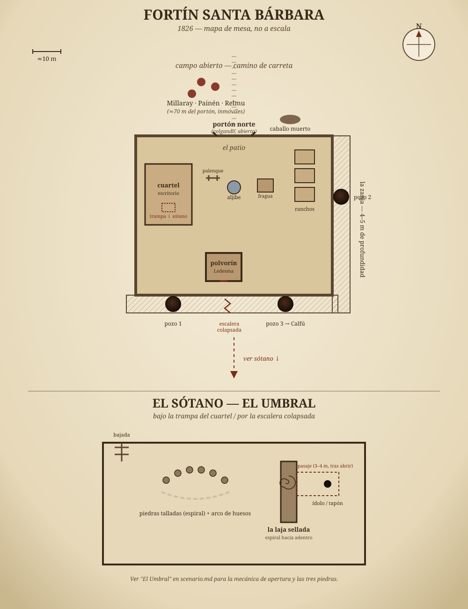

# LO QUE SE AGARRA DEL SUBTERRÁNEO
*One-shot — Call of Cthulhu 7e, modo Pulp · Pampa argentina, 1826 · 3 horas · 3 investigadores (gauchos)*

*Same-world, light tie-in to La Tierra Mala: same pampa, same 1820s register and voseo (see `assets/spanish-style-guide.md`), no direct plot connection. Nothing here needs the campaign to make sense, and nothing here should contradict it.*

---

## CÓMO USAR ESTE DOCUMENTO

- **Read-aloud** blocks are in Spanish, blockquoted, period-register (rural gaucho voseo — see the style guide). Read them straight off the page.
- **Keeper notes** are in English, plain text, under each block.
- **Pulp mode, house rules for tonight**:
  - **HP ×2** on all three investigator sheets, for this session only.
  - Play it like a serial matinee, not a slow burn: investigators get hurt, not maimed; the monster is a physical, chaseable threat, not an inevitability. Let them do the stupid heroic thing and have it *work*, sometimes.
  - Bennies: each investigator may, once per scene, auto-succeed a failed roll by narrating how — "the strap catches on the fence post," "I planted the facón in the ground stepping off the horse, it's right there." Keeper's call on whether the fictional justification is good enough; if it is, let it ride.
- **Duration math** (see the [Runsheet](#runsheet--3-horas) at the end): Apertura ~20 min · Fuerte + pistas ~70 min · Tercera emergencia + rescate ~40 min · Cierre ~30 min. Pace hard — this doc is written to be cut, not padded.

---

## LA VERDAD DEL KEEPER

*(Not for players. Read this once before the table opens; you won't need to re-check it during play.)*

Two days ago, the small garrison at **Fortín Santa Bárbara** finished blasting a stretch of defensive ditch (*zanja*) across the open ground a short distance south of the fort — the same kind of straight frontier line dug during the desert campaigns (think the Zanja de Alsina), not a moat around the fort itself. It's a border cut into the land, running for leagues in both directions; the fort sits just behind it, its back to the settled country, facing the line. **Capitán Olegario Fresco** ordered the charges laid deeper than the engineer's plan called for, over the objections of a Ranquel trading party who had warned the fort, weeks earlier, never to break ground east of the old stone cairns. He didn't ask why. He had heard "supersticiones" and he had a ditch to finish before the rains.

The charges broke through into a much older network of tunnels — not natural, not recent, worn smooth in places by something that has been moving through them for longer than any living memory, Ranquel or Spanish. What lives down there is not evil and does not hate anyone. It digs, it grabs, it drags what it grabs down to feed something below that has been fed this way for centuries. It has no name anyone at this table needs. Call it what the fort's survivor calls it: **lo de abajo** — "the thing below."

Since the breach: at least four soldiers dragged under and gone. The captain himself, three nights ago, went out at dusk to inspect the ditch alone and did not come back. The garrison scattered — some fled toward the nearest town, most are simply unaccounted for. **One soldier remains, barricaded in the fort's stone magazine: Cabo Wenceslao Ledesma.**

**Tonight is the third dusk since the breach.** In Ranquel memory this matters: ground broken open over "tierra que no se cava" stays open-and-worsening until it's closed again — more tunnels, more holes, wider each night. Nobody alive still knows a ritual fix for that; Millaray doesn't claim one. What she knows is practical: the longer it's left, the more there is to close. Wait past tonight and there won't be three *pozos* anymore — there'll be more, and whatever's making them will be harder to corner. This isn't a hard game-mechanical deadline so much as a **narrative pressure valve**: use it to justify escalation (see [Reloj de Temblores](#el-reloj-de-temblores)) and to make collapsing the tunnels tonight feel urgent rather than something that can wait.

An hour before the investigators arrive, four Ranquel traders — regulars at the fort, here on the usual seasonal trade run — were approaching along the cart road when gunfire broke out (Ledesma, alone, firing at something in the dark). In the panic, the ground opened under **Calfú**, the youngest of the four, and something pulled him under. The other three — **Millaray** (his mother), **Painén** (his cousin), and **Relmu** (family friend, walking point when it happened) — bolted for the open ground between the fort's wall and the ditch and have been frozen there since, too far from the fort to trust it, too close to the holes to run.

**Calfú is not dead.** *Lo de abajo* does not kill what it grabs immediately — it drags, it holds, it feeds something else eventually, but "eventually" for this creature is measured in many hours, not minutes. A rescue is possible within the session if the investigators commit to it. This is your pulp hook: give them a ticking, rescuable stake, not just a monster to survive.

---

## FORTÍN SANTA BÁRBARA — EL LUGAR

A small stockaded outpost, maybe forty years old, garrison of a dozen men on a good month. Adobe construction throughout, but only two buildings were built with a proper poured lime-and-rubble floor: **the cuartel and the polvorín.** Those floors are solid enough that *lo de abajo* cannot come up through them — **they're the only safe ground in the whole fort.** Everything else is bare earth: the patio, the yard between the wall and the ditch, the ditch itself, the cart road. The stockade wall stops a malón. It was never built to stop anything that comes from below, and the ground inside it is no different from the ground outside it.

**Play this straight when it matters**: an investigator who assumes "we made it through the gate" means safety is wrong, and should find that out the hard way once, ideally not fatally. The patio is exactly as vulnerable as the open field — it's just further from the known blast holes, which buys time, not immunity.

> *Lo ven antes de llegar: el portón sur abierto de par en par, colgando de un solo gozne. Más allá, silencio — no el silencio de un lugar dormido, el otro. El que queda después de un grito. Hay un caballo muerto cerca de la zanja, hinchado ya, con las patas apuntando al cielo en un ángulo que no es el de un animal que se cayó. Es el ángulo de un animal al que algo tiró.*

**Layout** (sketch it on a napkin at the table — it doesn't need to be prettier than that):

- **El portón sur** — the gate, hanging open, facing the frontier line. Cart road approaches from the south, crossing the zanja on a causeway before reaching it.
- **El patio** — open ground inside the walls: a well, a hitching rail, a smithy with a cold forge, three or four soldiers' huts (*ranchos*) around the perimeter, all empty, doors open or broken. **Bare earth — not safe ground**, despite being inside the walls.
- **El polvorín** — the stone powder magazine, small, thick-walled, the only building with its door barred *from the inside*. **Cabo Ledesma is in here. Safe ground (poured floor).**
- **El galpón principal / cuartel** — the main barracks building, where the captain's desk and the garrison's paperwork are. Ransacked-looking, but by panic, not by anything with hands. **Safe ground (poured floor).**
- **La zanja** — a straight defensive ditch cut across the open ground a short stretch south of the fort, four to five meters deep, part of a frontier line that runs for leagues in both directions — **not a moat around the fort**, just the nearest stretch of it. The fort sits with its back to the settled country, facing the line. The cart road crosses it on a narrow causeway. Blasted open in three places along its length; each blast site is now a ragged hole descending past the ditch floor into old tunnel, not fresh dirt.
- **El campo abierto entre la zanja y el monte** — open pampa south of the ditch, where Millaray, Painén, and Relmu are frozen in place, roughly seventy meters from the gate, on the far side of the crossing from the fort.

**Al entrar al patio** (read once, whenever they first pass the gate):

> *Adentro, todo quedó a mitad de algo. Una herradura en el yunque, ya fría. Baldes junto al pozo, uno volcado. El palenque donde atan los caballos está cortado, no desatado — alguien no tuvo tiempo de aflojar el nudo y usó el cuchillo. Las puertas de los ranchos, abiertas. Ninguna, cerrada.*

**El cuartel** (read once, when they go looking for the captain's desk):

> *El escritorio del capitán está como lo dejó: la pluma seca sobre un papel a medio escribir, la silla tirada para atrás, no para adelante — se paró rápido, no se cayó.*

The logbook itself isn't here — Ledesma took it with him into the polvorín the first night (see Clue 2, below). The desk is just atmosphere: proof he left in a hurry, not a source in itself.

---

## APERTURA — ACCIÓN INMEDIATA

*Do not open with a briefing. Open mid-motion. The players should be making a decision inside the first two minutes.*

> *Vienen con la tropilla cargada — cueros, sal, lo que sea que los trajo al fortín esta tarde — cuando el primer tiro rompe el silencio del campo. No es un tiro solo: son varios, apurados, el ruido de alguien que dispara sin apuntar bien. Después, un grito. Después, nada.*
>
> *Adelante, donde el camino se abre al fortín, ven tres figuras paradas a mitad de camino entre la zanja y el monte — inmóviles, como animales que se saben mirados por algo que todavía no decide. Una de ellas, una mujer mayor, tiene los brazos extendidos hacia un punto en el pasto que ustedes no pueden ver bien desde acá. No está gritando. Está más allá de gritar.*
>
> *El portón del fuerte, más allá de ellos, cuelga abierto. Y en el pasto, entre la gente parada y el fuerte, la tierra tiene agujeros que no estaban en ningún mapa.*

**Keeper**: stop reading here. Ask what they do. Whatever it is — ride for the traders, ride for the gate, dismount and approach on foot, fire a warning shot — it's action, not a discussion. If nobody moves in a beat, Painén breaks and shouts toward them in accented Spanish: **"¡Ayuda! ¡Se lo llevó, se lo llevó abajo!"** — that's your nudge.

Three rough branches from here, corresponding to the original design's "starting options" — don't force one, let the table's choice determine which scene runs first:

- **They go to the traders first** → run [Los Tres Mercaderes](#los-tres-mercaderes) immediately, in the open field, with the tension of standing on bad ground. First Reloj de Temblores tick happens here if they linger.
- **They go to the fort first** → run the fort's exterior beats (dead horse, open gate) then let the traders shout after them, pulling them back, or let them find Ledesma first and come back for the traders once armed/informed.
- **They fixate on escape routes / fall back** → perfectly fine. Let them scout, realize the holes are between them and the road out the way they came, and that the traders won't run without them. This naturally routes back into rescue.

All three roads reach the same place inside twenty minutes: **traders + fort, both need the investigators, nobody is going anywhere until this is dealt with.**

---

## LOS TRES MERCADERES

*Ranquel, regular trading partners of the fort for years — this isn't their first visit. They know the road, they know some of the soldiers by name, and that's exactly why what's happening feels so wrong to them: it's happening on ground they've walked a hundred times.*

### MILLARAY — *la madre*
Fifties, weathered, steady hands that are not steady right now. Decades of trade runs have given her working Spanish — not fluent, not fancy, but enough to say what needs saying. She code-switches to Ranquel under stress or for anything that matters emotionally, per the campaign's indigenous-register convention (§5 of the style guide — clean syntax, sparing pampa lexicon, land-metaphors).

**She is the investigators' primary source for the Lore clue and the emotional spine of the scene.** She will not leave without Calfú. She will, however, direct — she's spent thirty years managing a trade caravan through country that wants to kill you, and command is not new to her.

**Key Hook**: treat her as the most competent adult in the room, not a victim to be managed. She answers direct, respectful questions plainly and pushes back on anyone wasting time.

| STR | CON | SIZ | DEX | INT | POW | EDU | APP | HP | DB | Build | Move |
|---|---|---|---|---|---|---|---|---|---|---|---|
| 40 | 55 | 55 | 50 | 70 | 75 | 60 | 50 | 11 | +0 | 0 | 7 |

**Skills**: Persuade 60%, Fast Talk 50%, Bargain 70%, Natural World 70%, Track 55%, Ride 65%, Listen 60%, Spot Hidden 55%, Language (Ranquel) 90%, Language (Spanish) 55%

**Weapons**: plain trade knife 35% (1D4+2) — carried for work, not combat. She does not fight; if physically threatened she puts herself between the danger and whichever of the other two traders is closest.

**Voice sample:**
> *"Treinta años cruzando este campo y nunca les tuve miedo a los soldados. Les tengo miedo esta noche. Eso solo debería decirles algo."*
>
> *(Her full account of the land itself — the* pewma mapu *warning — is under [Diálogos](#millaray) below; this is just how she sounds meeting you.)*

### PAINÉN — *el sobrino*
Early twenties, Calfú's cousin, closer to a brother. Understands more Spanish than he speaks fluently — enough for trade, not enough for a crisis. Under stress he reverts to Ranquel in short bursts and needs either Millaray or a successful **Persuade or Psychology (Regular)** to get steady enough to switch back. He is not a coward — he's the one who tried to grab Calfú's arm and has rope burn on his palm to show for it — but he is currently useless for anything requiring calm.

**Use him for physical urgency, not exposition.** He'll grab an investigator's sleeve and point. He'll try to run at a hole barehanded if nobody stops him. He is the party's clock made flesh.

**Key Hook**: give him a job, never an order. He'll take almost any task that feels useful; flat refusals just make him wait for an opening to act alone.

| STR | CON | SIZ | DEX | INT | POW | EDU | APP | HP | DB | Build | Move |
|---|---|---|---|---|---|---|---|---|---|---|---|
| 55 | 60 | 55 | 65 | 50 | 45 | 30 | 55 | 12 | +0 | 0 | 9 |

**Skills**: Ride 60%, Track 45%, Natural World 50%, Fighting (Brawl) 40%, Spot Hidden 45%

**Weapons**: none drawn by default — unarmed 40% (1D3). Once steadied and given a task, he'll pick up whatever's handed to him competently enough (treat any simple weapon at his Brawl skill, untrained).

### RELMU — *el que caminaba adelante*
Forties, quiet by nature even on a good day, currently nonverbal. He was walking point, three steps ahead of Calfú, when the ground opened — close enough to see exactly what took him and not one step closer to having been able to stop it. He hasn't spoken since.

**He is not catatonic-useless — he's shock-mute**, and he communicates by drawing in the dirt with a stick, by miming, by pointing. This is deliberate: it's a visual, wordless clue delivery that plays well at the table and doesn't gate on a language roll.

**Key Hook**: never make a player roll to interpret him — his gestures are always clear once made. The only uncertainty is whether an investigator earns one.

| STR | CON | SIZ | DEX | INT | POW | EDU | APP | HP | DB | Build | Move |
|---|---|---|---|---|---|---|---|---|---|---|---|
| 60 | 65 | 60 | 55 | 60 | 60 | 35 | 45 | 13 | +0 | 0 | 8 |

**Skills**: Track 70%, Natural World 65%, Stealth 60%, Spot Hidden 65%, Fighting (Knife) 45% *(baseline — currently non-functional; see below)*

**Weapons**: a short work knife, sheathed, untouched all session. He will not fight tonight regardless of provocation — the shock has him, not cowardice.

- **Approach him gently (Psychology, Regular) or give him time and a task** (something to hold, something to do with his hands — very period-appropriate: offer him mate to prepare, a rein to hold) → he draws in the dirt: a body, low to the ground, **four arms and two legs** — taps the ground four times for the arms, twice for the legs, then drags his finger through the dirt in a fast, low line to show *how it moves*. This is the players' first real look at what they're dealing with, delivered without a word.
- **Push him (Intimidate, or just talking over him) →** he flinches, goes further inward, draws nothing. He isn't being difficult. He's gone somewhere else for a minute. Let a failed approach cost time, not information denied forever — he can be tried again later once the immediate area feels safer (e.g., inside the fort walls).

---

## COMUNICACIÓN — CÓMO FUNCIONA

No language skill should hard-gate this scene — nobody at a CoC table should sit out the emotional center of the opening because their sheet doesn't have Language (Ranquel/Mapudungun). Instead:

| Who | Default | To get more |
|---|---|---|
| **Millaray** | Speaks plainly, in Spanish, about anything factual or tactical. Will answer direct questions. | For the deeper Lore clue (the *pewma mapu* history, the three-dusk logic, what the old cairns mean) — no roll needed if asked with respect; **Hard Persuade or a Fast Talk misstep** costs her trust and she clams up, giving only what's needed to get Calfú back. |
| **Painén** | Understood in bursts, urgent and physical, not informative. | **Persuade or Psychology (Regular)** to calm him enough that he translates or steadies — after that he's a second, less careful source for anything Millaray already knows. |
| **Relmu** | Silent. Communicates only by drawing/miming. | **Psychology (Regular)** or simply giving him space and a task. Delivers the visual clue (creature shape, count) above. A PC who *sits down at his level, at his pace* — no roll, just good roleplay — gets it faster than one who interrogates him. |

**If a PC actually has Language (Ranquel) or similar** — great, let it matter: they get everything above without needing rolls, and Relmu will talk *around* his silence more, gesturing while speaking fragments, because he's being met halfway.

**On the "if a trader is grabbed / hurt, this ends badly" stake**: keep this real, but don't let it hard-stop the table. If a trader goes down before the investigators have learned the Lore clue from them, that knowledge doesn't vanish — it becomes recoverable later, harder, through the [mojones (Clue 3)](#las-cuatro-pistas) along the ditch (the carved stones corroborate what Millaray would have said), or simply lost, pushing the table toward a grimmer ending. Treat it as a consequence that reshapes the last act, not a curtain.

---

## DIÁLOGOS — LOS TRES MERCADERES

*Topic-keyed, for quick lookup mid-scene. Ask-and-answer, not a script — players will come at these out of order and that's fine.*

### MILLARAY

**Si le preguntan qué pasó:**
> *"Veníamos como siempre, con los cueros y la sal, hablando de nada. Sonaron los tiros y el mundo se abrió bajo los pies de mi hijo. No cayó — se lo llevaron. Vi el brazo, vi cómo lo agarró, vi cómo tiró. No fue la tierra que se hunde. Fue una mano."*

**Si preguntan quiénes son / por qué le creen a los soldados:**
> *"No le creo a los soldados. Le vendo a los soldados, que no es lo mismo. Venimos acá desde antes de que naciera Painén, cambiando cuero por herramienta, sal por lo que haga falta. El capitán era necio pero pagaba. Eso se acabó, me parece."*

**Si preguntan por el fuerte / la zanja:**
> *"Les dijimos que no cavaran para el este de las piedras. Un hombre de acá, hace dos lunas, se los dijo con estas manos, dibujando en la tierra. El capitán se rió. Ahora no se ríe nadie."*

**Si preguntan por Calfú (urgencia):**
> *"Mi hijo tiene veinte años y un genio corto y una mano rota de tanto pegarle a esa cosa cuando lo agarró. Está vivo. Lo sé como sé que hay sol arriba de las nubes aunque no lo vea. Si van a hablar, hablen caminando."*
>
> **GM**: this is her pushing the table toward action if the scene stalls. Use it as your own pacing lever, not just hers.

**Si preguntan por la tierra / *pewma mapu* (Pista de saber local — ver más abajo):**
> *"No es la primera vez que rompen la tierra acá y algo contesta. Mi abuela me lo dijo, se lo dijeron a ella. Hay tierra que no se cava — pewma mapu, la tierra que sueña — y esta es de esa. Esta noche es la tercera desde que abrieron el pozo. Después de esta noche, no sé qué queda por cerrar."*

**Si preguntan qué significan las piedras / los mojones (conecta con Pista 3):**
> *"Piedras chicas, en fila, espiral para adentro — ¿las vieron? Están puestas así en todos los campos que hay que dejar quietos. No las pusimos nosotros. Estaban ya cuando llegaron los primeros de mi gente que se acuerdan. Alguien las puso para que nadie se olvidara."*
>
> **GM**: if they haven't found the mojones yet (Clue 3, along the ditch line), this is a breadcrumb pointing them there. If they've already found them, this confirms/corroborates without repeating information — she recognizes the *pattern*, not the specific stones.

**Si preguntan cómo se cierra esto:**
> *"No hay ceremonia que lo cierre — eso es cuento para consolarse. Lo que se abrió, se tapa: con pólvora si hace falta, para que se caiga solo, y después con tierra, con piedra, con lo que haya, rápido, antes de que se haga más ancho cada noche. Eso sí lo sé. Lo demás son ganas de que sea más fácil de lo que es."*
>
> *— "There's no ceremony that closes it — that's a story people tell themselves for comfort. What's opened gets covered: with powder if it takes powder, to make it fall in on itself, and then with earth, with stone, with whatever's at hand, fast, before it gets wider every night. That much I know. The rest is just wanting it to be easier than it is."*
>
> **GM**: this is the whole point of cutting the basement/ritual thread — even the table's best source for old knowledge tells them, in-fiction, that the answer is physical, not mystical. Collapse it, bury it, don't wait. See [El Desenlace](#el-desenlace).

**Si la presionan mal (Hard Persuade fallido / Fast Talk):**
She doesn't get angry. She gets quiet and practical — the trust cost is real but it isn't melodrama.
> *"Ustedes preguntan mucho para gente que todavía no movió un dedo por mi hijo. Cuando esté a salvo, hablamos todo lo que quieran."*
>
> **GM**: she doesn't withhold out of spite — she's triaging. This is recoverable at any point by *doing* something toward the rescue, no re-roll needed.

**Si rescatan a Calfú:**
> *(No dice nada al principio. Lo agarra de la cara con las dos manos, le mira los ojos, y recién ahí llora — una vez, seco, y se termina. Después, a ustedes:)* *"Le debo. Se los digo una vez y no lo repito: le debo."*

**Si Calfú se pierde:**
She doesn't collapse. She goes still, the way people who've buried people before go still.
> *"Entonces cerramos por él. Que no le pase esto a otra madre en este camino."*
>
> **GM**: grief redirected into finishing the job — she becomes the table's clearest voice for collapsing the tunnels if this happens. Don't play her as broken; play her as focused.

---

### PAINÉN

Painén doesn't hold up under a topic table the way Millaray does — he's not a source, he's a pressure gauge. Use these as beats, not answers to questions.

- **On first contact** (already in the Apertura): *"¡Ayuda! ¡Se lo llevó, se lo llevó abajo!"*
- **If calmed (Persuade/Psychology, Regular) and asked what he saw:**
  > *"Yo lo tenía. Lo tenía de la mano y no alcanzó. Se me resbaló como... como si la mano de él no quisiera quedarse conmigo. Eso no es normal, ¿no? Que la propia mano no quiera."*
  >
  > **GM**: he's not describing physics, he's describing trauma — don't let a player "correct" him with mechanics. Let it sit strange.
- **If the party organizes to go after Calfú**: he tries to come. He has no weapon and no plan, just guilt. Let a player talk him into a useful, safer job instead (holding horses, watching Millaray and Relmu, running for the pedrero) rather than flatly forbidding him — he'll take a job over an order every time.
- **If a Cría surfaces near the group**: he panics again, first-time-fresh, regardless of how many times it's happened before. This is realistic, not a design flaw — let it cost a round of chaos each time and don't let the table optimize it away.
- **If Calfú is rescued**: he's the one who actually breaks down, not Millaray — relief hitting harder than the fear did. Lets the scene have levity if the table wants it: he'll hug an investigator he barely spoke to.
- **If Calfú is lost**: he goes silent the way Relmu is silent, at least for the rest of the session. A second, quieter casualty of the same shape as the first.

---

### RELMU

No spoken dialogue. Everything is drawn, mimed, or pointed at. Use this as a **key**, not a script — let players ask "what's he doing" and answer with the gesture, not a translation.

| Gesture | Meaning | When it lands |
|---|---|---|
| Draws a body, four arms, two legs, low fast line through the dirt | What took Calfú — the creature's shape and gait | First successful approach (Psychology Regular, or patient roleplay) |
| Points east, toward the second/third blast holes, taps the ground twice | That's the direction it went | If asked "which way," after the first drawing |
| Holds up a hand, palm out, then presses it flat and still against his own chest | *Stay still. Don't move. That's what saves you.* | If he watches an investigator freeze successfully near a Cría — he'll mime this afterward, teaching by example |
| Mimes striking downward with a torch or brand, then shakes his head; mimes a keg, a spark, an explosion with his hands, then nods hard | *Fire doesn't work. The powder does.* | If shown or asked about the Arsenal |
| Turns away, curls slightly inward, stops responding | He's gone somewhere else. Not now. | Any attempt that's too forceful, too fast, or happens somewhere that doesn't feel safe (outside the walls) |

**Breaking his silence** — a one-time beat, not a mechanic, use it when it's earned: if Calfú is rescued *and* an investigator has treated Relmu with real patience over the session (Keeper's call — no roll), he speaks once, quietly, to whichever investigator sat with him first:

> *"Yo caminaba adelante para que a él no le pasara nada. Así es como se hace. El que camina adelante es el que mira primero."*
>
> That's the whole line. He doesn't say anything else for the rest of the session, and he doesn't need to.

---

## LAS CUATRO PISTAS

*Found in plain sight, per the brief — nothing here should require a roll below Regular difficulty to notice once a PC is looking in the right place. The rolls below are for depth/detail, not gatekeeping.*

### 1 — Pista física (Track / Climb / Spot Hidden) — el sistema de túneles
**Where**: any of the three blast holes in the zanja, or the horse carcass.

A PC willing to get close and look finds the general wrongness of the walls automatically. Actually climbing down partway (rope, a second PC bracing) to look closer — very pulp-cinema — takes a **Climb (Regular)** roll; a fumble is a scrape and a dropped rope, not a fall into anything worse, and either way they find:

> *La zanja debía tener el fondo parejo, obra de pala y pólvora. No lo tiene. Donde volaron la carga, el pozo sigue para abajo, y las paredes no son de tierra recién movida: están lisas, pulidas en franjas, como piedra que un río gastó durante cien años. No lo hizo la pólvora de los soldados. La pólvora sólo encontró la puerta.*

**Track (Regular)** in the churned mud around the hole finds directional drag marks — deep, evenly spaced gouges (arm-count matches Relmu's drawing) leading down and slightly east, toward the second and third blast sites, suggesting the tunnels connect. **A Hard success** further identifies the freshest drag trail as recent — within the hour — and heading toward the third hole, not the first: **this is the way to Calfú**, if they're going after him.

**El caballo, de cerca**: from a distance it just reads as dead. Anyone who actually walks up to it finds more.

> *De cerca no es solo un caballo muerto. Tiene tres tajos profundos en el costado, parejos entre sí, como garras — y le falta un tercio de la pata trasera. No cortado. Arrancado.*

**SAN 0/1.** Mechanically the same evidence as the drag marks above — a PC examining the horse instead of a hole gets the physical clue this way instead, no roll needed to notice the wounds once they're looking, Track (Regular) still applies if they want the directional read.

**Restos en la zanja**: while climbing down (or just working carefully through the churned mud at the hole's edge), a PC can find this without a roll if they're already looking — it's not hidden, just not something you see from a standing height.

> *Una bota de soldado, todavía atada, con el pie adentro. Más allá, contra la pared del pozo, jirones de uniforme y algo que podría ser una costilla, medio hundido en la tierra removida.*

**SAN 0/1D4.** This is the physical confirmation of what Ledesma will say if they haven't reached him yet, or the grim underline if they have: the garrison didn't all ride off to Tandil. Some of them are still here.

### 2 — Pista histórica (Persuade, via Cabo Ledesma) — el diario y el plano
**Where**: the barred powder magazine. Ledesma won't open for force or noise — knocking gently, saying you're not soldiers, or leaving him an obvious way to see you first (a window slat) works. **Persuade (Regular)** gets the door open; **Fast Talk or Intimidate** gets it to stay shut longer.

**If they'd rather force it than talk**: a barred door, kicked or levered open, is a **STR roll (Hard)**. It works. It's also loud enough to cost a Reloj de Temblores tick, and Ledesma — unhurt but badly rattled — doesn't hand over the powder kegs willingly or come along for the finale afterward. He'll still answer questions if pressed, just from a corner, with the musket up.

**Cuando abre la puerta** (read once, the moment the bar comes off):

> *La puerta se abre apenas, lo justo para un ojo. Adentro, una sola vela, y detrás de ella un soldado joven, la cara sin afeitar en dos noches, un mosquete cruzado sobre las piernas como si fuera lo único que todavía tiene sentido sostener. Alrededor, contra la pared de piedra, los barriles — hilera prolija, mecha enrollada encima de cada uno, lista.*

Ledesma is young, unshaven, has been alone with a loaded musket and his own thoughts for two nights. He has the garrison's logbook.

**Key Hook**: he's not brave and he knows it. He responds to being treated as a scared kid who did his best, not a soldier to be ordered around — Intimidate gets the door to stay shut longer, gentleness gets it open.

| STR | CON | SIZ | DEX | INT | POW | EDU | APP | HP | DB | Build | Move |
|---|---|---|---|---|---|---|---|---|---|---|---|
| 55 | 60 | 60 | 55 | 50 | 45 | 40 | 45 | 12 | +0 | 0 | 8 |

**Skills**: Firearms (Musket) 45%, Fighting (Bayonet) 40%, Artillery (swivel gun) 35%, Spot Hidden 50%, Listen 55%, First Aid 30%

**Weapons**: mosquete 45% (2D6, his own, already loaded); bayoneta 40% (1D6+1+DB) — he has not fixed it. He has not fired a weapon at another person in his life; the shots the investigators heard in the Apertura were fired at *lo de abajo*, into the dark, mostly missing.

> *"El capitán Fresco mandó cavar más hondo de lo que decía el plano del ingeniero. Los indios de las cargas — buena gente, ¿eh, venían seguido — le avisaron. Le dijeron que no cavara al este de las piedras paradas. Él dijo que eran cuentos. Dijo que teníamos que terminar la zanja antes de las lluvias."*

Flip through the logbook (**Persuade** to get Ledesma to hand it over, or he reads the relevant lines himself if trust is high) and a PC with **History or Spot Hidden (Regular)** notices the real gut-punch: entries from the past two months logging "ataques de malón" — raids blamed on native raiders — with a pattern that doesn't fit a raid: no horses stolen, no goods taken, bodies (when found at all) dragged, not shot or lanced. **The "malón" was never a malón.** Every blamed raid maps onto a night lo de abajo fed. This is the scenario's gut-punch reveal — let it land with a beat of silence before moving on.

**Diálogos — Cabo Wenceslao Ledesma**

**Si preguntan qué pasó con el resto de la guarnición:**
> *"Unos se fueron a caballo la primera noche, para Tandil, a buscar ayuda que todavía no llegó. Los demás... no sé. Salió alguno a mear y no volvió. Salió alguno a ver qué pasaba y no volvió. Yo no salí más."*

**Si preguntan por su propia culpa (le tiembla la voz):**
> *"El capitán salió solo, la tercera noche — la de anoche —, a ver la zanja. Yo le dije que esperara la luz. No me escuchó, pero tampoco insistí como debía. Si hubiera cerrado el portón antes, si le hubiera cerrado el paso con el cuerpo si hacía falta..."*
>
> **GM**: he's not hiding anything sinister — this is a scared conscript's ordinary guilt, useful for humanizing him, not a twist.

**Si preguntan por las armas / el polvorín:**
> *"Hay pólvora de mina, la que sobró de la zanja, y mecha ya cortada — el capitán la iba a usar en el portón si esto se ponía peor. Peor que esto no sé qué sería, así que llévensela. Yo no sé prender una mecha con las manos así como están."*
>
> **GM**: this is how the party gets the kegs from the Arsenal without a roll — Ledesma hands them over the moment he trusts the party more than he trusts staying barricaded alone.

**Si le piden que los acompañe / que ayude en el rescate:**
He says no, twice, if asked flatly — then comes around if given a *task* rather than an order, same trick that works on Painén.
> *"No soy de los que van adelante. Pero si hace falta alguien que cargue el pedrero mientras otro apunta, ese puedo ser yo. Eso sí puedo."*
>
> **GM**: if he comes along, he's a second pair of hands for the pedrero (halves its load time, see Arsenal) — a nice, earned bit of pulp redemption without turning him into a combatant he isn't.

### 3 — Pista ocultista/histórica (Occult / History, physical) — los mojones
**Where**: a row of half-buried stones running roughly parallel to the zanja, a short distance east of Pozo 1 — visible, no roll needed to notice once a PC is walking the ditch line and looking at the ground rather than the holes. Easy to mistake for a property line or old clutter unless someone looks closely.

> *Piedras del tamaño de un puño, en fila, medio hundidas en el pasto — parejas, a propósito, no como caen las piedras solas. Cada una tiene tallada una espiral que gira hacia adentro. No es obra de esta guarnición. Estaban ya, antes de que pusieran el primer ladrillo del fuerte.*

**Occult or Cthulhu Mythos (Regular)** identifies the inward spiral as a closing/warning mark — the same visual logic that shows up in scattered pre-Columbian and colonial-occult contexts across the pampas; a PC who's encountered this kind of geometry before (Keeper's call on campaign carryover) recognizes the *grammar* immediately, though not this specific site. **This clue corroborates Millaray's account** even if she was never reached — the stones say in object-form what she'd have said in words: *this line was marked on purpose, a long time ago, by people who knew what not to dig past.* **These are the cairns the traders pointed the captain to. He built the ditch east of them anyway.**

### 4 — Pista de saber local (via Millaray, or the mojones above if she's unreachable) — lo que sabe la tierra
Covered in [Los Tres Mercaderes](#los-tres-mercaderes) / [Comunicación](#comunicación--cómo-funciona) above: the *pewma mapu* warning and the three-dusk urgency. This is the clue that turns the other three from "there's a monster" into **"here's who tried to warn them, and here's why tonight matters."** Make sure it's reachable through at least two paths (Millaray *or* the mojones) so no single failed roll locks the table out of understanding what's going on.

---

## EL ARSENAL DEL FUERTE

*Pulp needs toys. The fleeing garrison left plenty behind — point this out to the players early (Ledesma will mention it, or they'll find it searching the cuartel/polvorín) so they go into the tunnels armed, not just clever.*

**Note on "dynamite":** actual dynamite is 1867, forty years too late for 1826 — swapping it would be the exact kind of slip the campaign style guide flags. What's here instead does the same job: this garrison was actively blasting a ditch two days ago, so the powder magazine is full of the real period tool for the same trick.

| Item | Where | Effect |
|---|---|---|
| **Mosquetes** (muskets), 4-5, some still loaded | Cuartel racks, dropped in the yard | 2D6 damage. Slow reload (full round). Against hide/carapace: treat the creatures as **Armor 2-3** (see stat blocks) — a musket ball hurts, doesn't drop one clean. Good for driving off, not for killing. |
| **Sables y bayonetas** | Cuartel, on the dead/fled | 1D8+1+DB / 1D6+1+DB. Same armor problem — melee against a Cría is survivable, against La Vieja is not recommended without an opening. |
| **El pedrero** (small swivel cannon at the gate, still mounted) | South gate | Needs 2 full rounds to load/prime (2 PCs speeds this to 1). Firing it is an **Artillery roll** (Ledesma has 35%; an untrained PC fires at **half their DEX**, no Artillery needed) — on a hit: **4D10 damage**, ignores armor. This is your "everyone cheer" moment — save it for La Vieja or a truly desperate beat, not the first Cría. Only usable at the gate; it doesn't move. |
| **Barriles de pólvora de mina + mecha** (blasting powder kegs + slow-match fuse cord) | El polvorín — where Ledesma is holed up | The real toy. A primed keg dropped in a tunnel mouth or blast hole, fuse lit, gives the party **1D6+1 rounds to clear the area** before it collapses that stretch of tunnel — **auto-kills any Cría caught in the blast radius, and forces La Vieja to make a CON roll (Hard) or lose 3D6 HP and be buried/delayed for several rounds.** This is the intended answer to La Vieja, not muskets. Ledesma has three kegs prepped and coiled fuse already cut to length — he was going to use them on the gate if things got worse. |
| **Sogas, faroles, un par de caballos aptos para tiro** (rope, lanterns, a couple of cart horses) | Yard/stable | Standard adventuring kit. Rope matters a lot if anyone climbs into a hole after Calfú.|

---

## LO DE ABAJO — LAS CRIATURAS

**They are not cunning. They do not scheme, negotiate, or hate anyone. They are blind, they are strong, and they hunt the way something with no eyes and no reason has always hunted: by what the ground tells them.**

**The one rule that matters more than any stat block**: *lo de abajo* finds prey by vibration and noise through the earth — footsteps, gunfire, shouting, a horse bolting, a blast. **A target standing still and silent is very hard for it to find**, even at close range. This is the scenario's core action-puzzle, and it should come up in play through consequence, not through a Keeper lecture: the first time someone panics and runs and gets grabbed, and the first time someone freezes and it blunders past close enough to touch, the table will learn the rule for the rest of the night.

**Mechanically**: a creature's chance to detect/target a given investigator that round is normal if the investigator moved, spoke above a whisper, or made noise (weapon fire, blasting, a horse); **halved (round down) if they were still and silent**; treat a fully still, braced, forewarned investigator as effectively unnoticed unless something else gives them away (blood, someone else grabbing them, etc.). Don't make this a formal roll unless it's dramatically live — most of the time it's a Keeper judgment call that rewards a player who says "I don't move, I don't breathe."

**Warning sign, before it breaks the surface**: give the party a chance to see it coming. **Spot Hidden or Listen (Regular)**, one round before any emergence — scripted or from the [Reloj de Temblores](#el-reloj-de-temblores) hazard die — dust jumping off the ground in a line, a tremor underfoot, birds or horses going still and then bolting. A success buys one full round of warning: time to draw a weapon, get to solid footing, or simply plant themselves and go still before anything surfaces. A miss just means they find out the normal way — when the ground breaks. **Don't roll this for every single hazard-die attack** if the table's already moving fast — reserve it for moments where a beat of dread actually helps the scene, not as a mandatory step that slows down a chase.

### CRÍA (juvenile)
*Dog-to-pony sized. Fast, low, built wrong — four arms, two legs, all six limbs doing something a body that shape shouldn't be able to do. The thing Relmu drew in the dirt.*

**There are three of them active tonight**, roaming the tunnel network independently — not one creature making three appearances, three actual animals. That's the whole point: this plays like *Tremors*, not like a boss fight with an intermission. See [Reloj de Temblores](#el-reloj-de-temblores) for how often that should actually show up in play — more than you'd default to.

**Read this the first time one breaks the surface:**

> *La tierra no se abre — se rompe, como una costra. Y de abajo sale algo del tamaño de un perro grande, bajo, rápido, con más brazos de los que un cuerpo debería tener, y ni un solo ojo en ninguna parte que puedan ver.*

**Key Hook**: it doesn't posture, doesn't roar, doesn't telegraph. It's on someone or it's not. Play it fast and wordless — let the silence sell how little it cares about being noticed.

| STR | CON | SIZ | DEX | INT | POW |
|---|---|---|---|---|---|
| 70 | 60 | 55 | 80 | 10 | 25 |

**HP** 12 · **DB** +1D4 · **Build** 1 · **Move** 9 (surface) / lightning-fast in loose earth · **Armor** 2 (hide) · **Anatomy** four arms, two legs — same body plan as La Vieja, just smaller and greyer

**Attacks** (the legs move it, the arms grab — it can commit two of its four arms to grabbing in a round, the other two used for bracing/climbing; capped at 2 targets/round for pacing):
| Attack | Skill | Effect |
|---|---|---|
| **Agarrar** (grab, one arm) | 60% | On success: target is **Agarrado** (see below), no direct damage yet |
| **Zarpazo** (claw/bite, if cornered and not grabbing) | 55% | 1D6+DB |

**SAN loss**: 0/1D4 to see one up close for the first time.

### LA VIEJA (the elder — the finale threat)
*The size of a cart-horse and wrong the whole way through. Older than the fort, older than the road, older than whoever the traders' grandmothers were. She doesn't come to the surface for a Cría's reasons. She comes up because something on her ground is making too much noise, and she's had enough.*

**Read this once, on her reveal — then never describe her the same way twice:**

> *Cuatro brazos, dos patas, como todas las de su cría — pero en ella no hay nada de crío. Los hombros de donde nacen los cuatro brazos son más anchos que un buey, y cuando se para en dos patas para alcanzar algo, tapa la luna.*

**Key Hook**: she's not smarter than a Cría, just older, bigger, and done retreating. Play her without hesitation — she doesn't feint, doesn't circle, doesn't wait for an opening. She's already decided the noise stops.

| STR | CON | SIZ | DEX | INT | POW |
|---|---|---|---|---|---|
| 110 | 90 | 120 | 60 | 15 | 40 |

**HP** 21 · **DB** +1D6 · **Build** 2 · **Move** 8 surface (she's huge; on open ground investigators on horseback can outrun her) / instant within 3m of any tunnel mouth · **Armor** 3 · **Anatomy** four arms, two legs — same plan as every Cría, just bigger and heavier-set

**Attacks**:
| Attack | Skill | Effect |
|---|---|---|
| **Agarrar** (grab) | 70% | Agarrado (below). She can attempt this against up to 2 targets per round — she has the arms for it. |
| **Golpe** (body-slam / swat, if nothing to grab) | 65% | 2D6+DB |

**SAN loss**: 1/1D6 first sight.

**Weakness**: same vibration-blindness as the Cría, but she's harder to fool once something's already drawn blood nearby — treat detection as normal (not halved) against anyone who's fired a weapon or been grabbed in the last minute. **The blasting-powder keg is the honest answer to her** (see Arsenal); a straight fight is winnable in pulp mode with 2x HP and the pedrero, but it should feel like it.

### AGARRADO — GRABBED

**Read a version of this the first time it happens to a PC:**

> *No hay dolor todavía, solo la sorpresa fría de una mano que no debería existir, cerrada arriba del tobillo, y el piso que empieza a alejarse.*

When a PC is successfully grabbed:
1. They're held, being dragged toward the nearest hole/tunnel. They can act, but any action other than trying to break free is at a penalty die (fighting one-armed while something drags you is hard).
2. **To break free**: opposed STR roll (PC) vs. the creature's STR, *or* an ally can intervene — Fighting or STR roll to pull the arm off/away, or a called shot at the gripping limb (Hard, but a limb has effectively 1/5 the creature's HP and a solid hit forces a release).
3. **If not freed within 3 rounds**, they're pulled below ground — not dead, but gone, on the same "not immediately fatal, hours not minutes" clock as Calfú. This is a real stake in pulp mode, but not an instant-death one: a lost PC can still be a second rescue objective if the table wants to go back for them.

---

## EL RELOJ DE TEMBLORES

**Tonal target: play this like *Tremors*, not like three boss fights with breaks in between.** Once the threat is established (right after the first emergencia), being outside and careless should feel dangerous *constantly* — not just at three checkpoints you can see coming. Three separate Crías are roaming tonight (see [above](#cría-juvenile)), so there is never a good reason for the ground to stay quiet for long once people are moving and making noise on unsafe earth.

### La regla base — ataques frecuentes, no programados

On top of the scripted anchors below: **any round an investigator is on unsafe ground (anywhere but the cuartel or polvorín — see [safe ground](#fortín-santa-bárbara--el-lugar)) and is moving or making noise, roll 1D6. On a 1–2, a Cría attacks that round.** Once the Reloj is "hot" — after any gunfire, blasting, a horse bolting, or a previous attack this scene — bump it to **1–3**. This is a loose hazard die, not a formal timer: skip it in scenes that don't call for it, roll it openly when the table's gotten complacent about "we're inside the walls now, we're fine." The goal is that investigators start flinching at their own footsteps by the second act — that's the movie working.

**Don't limit yourself to one Cría per incident.** Two attacking the same scene — one on a grabbed PC, a second going for whoever runs to help — is exactly the chaos this tone wants, and their low HP (12 each) is calibrated so a 2x-HP pulp table can handle it without a TPK. If a roll would put a fourth simultaneous attacker on the table, don't — three Crías total means three is the real ceiling for how many can be active across the whole fort at once.

### Scripted anchors (still guaranteed, your pacing spine regardless of the die above)

1. **Primera emergencia** — within the first 10-15 minutes, whenever the party is near the ditch/holes (almost immediately, given the opening). One Cría, brief, 2-3 rounds, ideally resolved by someone discovering the freeze trick by instinct or luck rather than being told. Nobody should die here. This is the "oh, that's real" beat — and the moment the hazard die above switches on.
2. **Segunda emergencia** — triggered the moment the party commits to the tunnels (going after Calfú, or blasting/exploring a second hole) — 1-2 Crías, tougher fight, this is where the Arsenal should already be in hand.
3. **Tercera emergencia — el rescate** — reaching Calfú means reaching **La Vieja**, who's using him as much for warmth/den-guarding as anything more sinister (pulp logic: he's alive, he's close to her, getting him out means getting past her, not negotiating with her). Full finale fight/chase, ideally resolved with the keg or the pedrero rather than attrition.
4. **Between anchors**, if the table is dawdling (real-world pacing, not fictional time) and the hazard die hasn't fired in a while: have Painén panic and bolt, a shot go off, a horse scream — anything that's noise-in-fiction and an excuse-to-cut-to-action for you.
5. **The patio option**: only the cuartel and polvorín have poured floors — the patio itself is bare earth, and the hazard die applies there exactly as it does outside the walls. If the table has settled into treating "inside the gate" as safe, this is where that assumption should get punished. Telegraph it first (dust jumping off the ground near the well, the smithy's cold ashes stirring) so it reads as a real threat, not a gotcha.

**Silence rewards**: any stretch where the party is deliberately quiet/still (retreating from a hole, waiting Ledesma out, approaching La Vieja's den) should visibly *not* trigger the hazard die or a scripted beat — let them feel the mechanic working for them sometimes, not just against them. This is what makes the frequency land as tension instead of attrition: the danger is real and constant, but it's also genuinely avoidable by the one behavior the whole scenario has been teaching them.

---

## EL DESENLACE

*No clean right answer, per house style. Two things determine how the night actually ends — track both, plus Calfú's fate (a separate axis, covered under [Los Tres Mercaderes](#los-tres-mercaderes)), and combine them for the closing narration. This is an action sidequest: success is physical, not ritual — collapse the tunnels, kill the thing that's using them.*

### ¿Colapsaron y taparon los túneles?

The real answer, straight from Millaray: a primed keg of blasting powder (see [Arsenal](#el-arsenal-del-fuerte)) dropped into a tunnel mouth or blast hole collapses that stretch — already confirmed mechanically under the Cría/La Vieja stat blocks. Doing this to **all three pozos** closes off the network's access points here. Covering the resulting rubble with earth afterward is no roll, just time and effort — a line of narration, not a scene.

**Doesn't require all three.** Two out of three is a real partial win; one is better than none. Track it as a fraction if it matters, or just yes/no if the table only really engaged with the main one (Pozo 3, closest to Calfú and the fort).

### ¿Mataron (o enterraron) a la Vieja?

Straightforward: reduce her to 0 HP in a fight, or catch her in a tunnel collapse (the keg already forces a Hard CON roll on her per her stat block — a failure while she's badly hurt can be ruled a kill, Keeper's call on how much of a fight it should feel like first). If she's not dealt with directly, she's still out there when the sun comes up — alive, aware, and now short however many Crías died tonight.

### Combinando los dos ejes — no editorialices cuál es "correcto"

- **Ambos** (túneles cerrados + Vieja muerta) — the clean win. Local threat's over, hard-earned. Traders safe to leave. Nobody outside the party fully understands what happened here — official story blames wild animals or another "malón," because that's the story this frontier already knows how to tell.
- **Túneles cerrados, Vieja escapa** — the immediate danger to the fort and the road is over, but she's alive somewhere in the larger network this location was only ever one doorway into. Safe here doesn't mean solved.
- **Vieja muerta, túneles abiertos** — the biggest, smartest threat is gone, but the ground's still open. Something else could move in. Someone could dig again. A quieter danger, not a resolved one.
- **Ninguno de los dos** — worst case. The breach stays open, she's still down there, and Fortín Santa Bárbara gets abandoned within the month, officially "indefensible terrain." Someone will dig again eventually.

Calfú's fate layers onto any of the four above — call it out explicitly in the closing narration, don't let it get absorbed into the tunnels/Vieja outcome.

---

## RECOMPENSAS

*What the investigators carry out of this beyond the story. The Arsenal (muskets, sables, the pedrero, the powder) is period kit, spent or left behind at the fort — that's not what goes home with anyone. The five below are the actual payoff: three are intangible (no retcon needed at all), two are named items that require deciding you're okay with a small, deliberate retcon — a PC quietly having carried something since Fortín Santa Bárbara.*

### 1 — Cordura por el cierre

Standard end-of-story SAN recovery, on top of any SAN already regained during play (e.g. Cthulhu Mythos gains that offset SAN loss per usual 7e rules):

- **+1D10 SAN** if either axis of [El Desenlace](#el-desenlace) closed — tunnels collapsed, La Vieja dealt with, or both — the story reached a real close, even a costly one.
- **+1D4 additional** if Calfú came out alive.
- **No bonus** on "neither" — the night ends with the job unfinished, and everyone knows it.

### 2 — Chequeos de Experiencia

Don't skip this — it's free and it's the game's actual long-term reward system. Any skill an investigator **successfully rolled** this session gets checked; at the table's end, roll each checked skill once against its current value — a **failure** means **+1D10% permanently**. Likely candidates tonight: Track, Climb, Persuade, Psychology, Fast Talk, Occult, History, Spot Hidden, Fighting (Brawl/Knife), Firearms, Dodge, First Aid. Keep a scratch list during play so you're not reconstructing it from memory at 2:55.

### 3 — Un contacto: la familia de Millaray

If the traders survive the night with any goodwill built (Calfú rescued, or simply treated with respect throughout), the investigators gain a **standing relationship**, not an item — the Ranquel trading family remembers, and trading families move through a lot of country. Usable later, Keeper's call on scale: safe lodging or a warm welcome anywhere their trade routes reach, one favor owed with no questions asked, or a lead/introduction when the main campaign needs one. Write it on the sheet as a relationship, not a possession — it survives any amount of time passing between now and "the ritual" in a way a musket wouldn't.

### 4 — Un rasgo ganado: el truco de quedarse quieto

A small permanent mechanical scar from having survived something that hunts by vibration. Any investigator who **used the freeze trick to avoid detection at least once** this session keeps the instinct: going forward, when they consciously choose to hold still and silent under threat (not limited to *lo de abajo* — Keeper's call on how broadly this applies to future scenarios), they get **one bonus die** on the relevant roll to stay unnoticed. This isn't Mythos-tainted or supernatural — it's a body that learned, once, viscerally, what stillness is worth. Doesn't compete with or replace anything the main campaign already tracks (Marks, POW loss, etc.) — it's additive, small, and earned in the fiction rather than granted for free.

### 5 — Objetos con nombre

Three named items, three separate unlock conditions, so no single outcome (rescue, loss, or a quiet table) gates all of them — a table that loses Calfú still walks away with something. **Rough power tiers**, so it's clear at a glance none of these outclass the campaign's existing gear: the musket is flavor with a small reliability perk; the whistle is pure utility with a real risk attached, no direct combat power; the machete is the only one with genuine combat weight, which is why it's gated behind the hardest unlock *and* a real limitation, not just a flat upgrade.

**El mosquete de Ledesma**
> *Unlock*: Ledesma is alive at the coda **and** the party's relationship with him is warm — he came along for the finale (loading the pedrero), or simply never had force/Intimidate used against him and had at least one real conversation. He presses it into the hands of whichever investigator he trusts most: *"A mí ya no me va a servir de nada quedarme con esto. Llévenselo. Al menos que le sirva a alguien."*

Mechanically unremarkable — a soldier's musket, 2D6 — but meticulously kept by a scared, careful man with nothing else to do for two nights but clean it. **Treat it as never fumbling**: a natural 96-00 on a Firearms roll with this weapon is a normal failure, not a fumble. Not magic. Just true.

**El machete de obsidiana de Millaray**
> *Unlock*: tied directly to the rescue payoff already written under [Millaray's dialogue](#millaray) — Calfú comes out alive, and Millaray's trust was never irrecoverably broken (no unhealed Hard-Persuade clamp-up). At the coda, after *"Le debo. Se los digo una vez y no lo repito: le debo,"* she unwraps it from a hide bundle she's carried the whole session and didn't mention until now, and gives it to whoever led the rescue.

A family piece, older than she is, black volcanic glass set into a bone-and-sinew grip — not decorative; edged the old way, sharper than steel and more brittle. **1D6+1+DB damage** against ordinary flesh, no different from any good knife.

Its real property only matters against something conventional weapons pass through. **Connect with a normal Fighting roll first, same as any attack.** If the target is the kind of thing weapons don't normally touch, the strike then triggers a **contested POW×5 roll** — wielder against entity, same format as the goat's Disrupt (see `assets/npc-stats.md`) — not a flat bypass. **Win the contest**: the blade actually connects, full damage, no immunity. **Lose or tie**: it skids off something that doesn't fully occupy the space it looks like it occupies — no damage, though the entity now knows it was cut at. Against something with a very high POW (the Hound of Tindalos' 120, say), this is a real fight, not a free pass. **Fragile**: a fumble chips or dulls the edge — it needs re-knapping (a Craft roll, or someone who still knows how) before it's fit to use again.

**El llamador de hueso de Relmu**
> *Unlock*: independent of Calfú's fate. Earned by whichever investigator reached Relmu through patience at least **twice** over the session (Psychology successes or simply sustained good roleplay — no forcing, no rushing). Given wordlessly, the way everything from him is — he presses it into a hand, taps his own chest once, and that's the whole exchange.

A hollow bone whistle, silent to human ears at the pitch he blows it. **Effect**: blown deliberately, it reliably draws the attention of *every* Cría and La Vieja within roughly **30 meters** to the blower's position for 1D3 rounds — **all of them, not one at a time**, which is the whole cost of using it. Good for splitting a single creature off from a grabbed ally when only one is around; a bad idea to blow anywhere near the finale unless the plan specifically wants La Vieja's full attention. Reusable, no charges — the risk is the cost, not depletion, and the risk scales with however many things are close enough to hear it.

---

## RUNSHEET — 3 HORAS

| Time | Beat |
|---|---|
| 0:00–0:20 | Apertura. Gunfire, the traders frozen in the field, the open gate. First decision point. First emergency (Cría) likely lands near the end of this block. |
| 0:20–1:30 | Fuerte + pistas. Traders (communication, Lore clue), Ledesma (Historical clue + Arsenal), the ditch (Track clue + the mojones, Occult clue). Segunda emergencia triggers whenever they commit to the tunnels. |
| 1:30–2:10 | Tercera emergencia — el rescate. La Vieja, Calfú, the tunnels or the gate. This is the loud, physical center of the night — let it run long if it's landing. |
| 2:10–2:40 | Resolution — collapse the tunnels, deal with La Vieja, or both. See [El Desenlace](#el-desenlace). |
| 2:40–3:00 | Coda. Quick beats: what the traders do now, what's left of the fort, what the investigators carry out of this (literally and otherwise). Land the last line and stop — don't epilogue past it. |

*Cut the middle block first if you're running long — Ledesma and the mojones are both skippable if the table already has enough (Millaray covers the same ground on her own). Never cut the finale.*

---

*End of draft. Flag anything you want rebalanced — creature toughness, the endings' costs, Calfú's rescue window — and I'll adjust before you take this to the table.*
